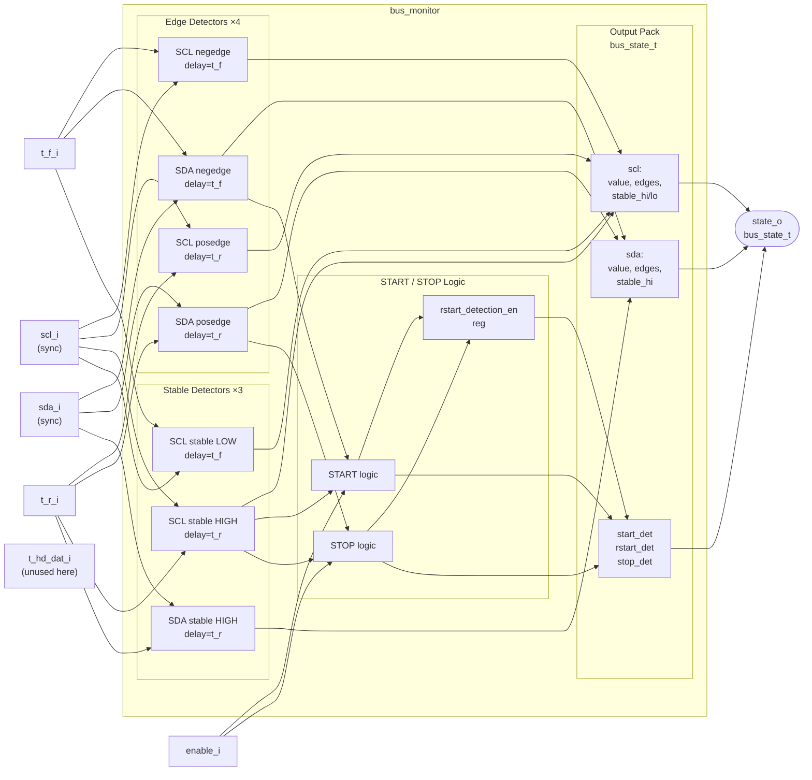

# Module: bus_monitor

> Status: Reuse
> Reference: `i3c-core/src/ctrl/bus_monitor.sv` (229 lines)
> Estimated LoC: ~230 lines

## 1. Purpose

The bus monitor detects bus events (START, Repeated START, STOP) by observing transitions on synchronized SCL and SDA lines. It also provides edge detection signals and stable-level indicators for both lines, packaged into a `bus_state_t` output structure. This module is the "eyes" of the controller — all other modules depend on its output to know what is happening on the bus.

## 2. Dependencies

### Sub-modules

- `edge_detector` — Timing-aware edge detector (parameterized for rising/falling)
- `stable_high_detector` — Detects stable HIGH/LOW level for a configurable duration

### Parent modules

- `controller_active`

### Packages

- `i3c_pkg` — Defines `bus_state_t`, `signal_state_t`

### Shared Types (from `i3c_pkg`)

```systemverilog
typedef struct packed {
  logic value;
  logic pos_edge;
  logic neg_edge;
  logic stable_high;
  logic stable_low;
} signal_state_t;

typedef struct packed {
  signal_state_t sda;
  signal_state_t scl;
  logic start_det;
  logic rstart_det;
  logic stop_det;
} bus_state_t;
```

## 3. Parameters

None (timing is configured via input ports).

## 4. Ports / Interfaces

### Clock and Reset

| Signal   | Direction | Width | Description            |
| -------- | --------- | ----- | ---------------------- |
| `clk_i`  | Input     | 1     | System clock           |
| `rst_ni` | Input     | 1     | Active-low async reset |

### Control

| Signal     | Direction | Width | Description                    |
| ---------- | --------- | ----- | ------------------------------ |
| `enable_i` | Input     | 1     | Enable bus monitoring (gating) |

### Bus Inputs (synchronized by PHY)

| Signal  | Direction | Width | Description               |
| ------- | --------- | ----- | ------------------------- |
| `scl_i` | Input     | 1     | Synchronized SCL from PHY |
| `sda_i` | Input     | 1     | Synchronized SDA from PHY |

### Timing Configuration

| Signal       | Direction | Width | Description                          |
| ------------ | --------- | ----- | ------------------------------------ |
| `t_hd_dat_i` | Input     | 20    | Data hold time (system clock cycles) |
| `t_r_i`      | Input     | 20    | Rise time (system clock cycles)      |
| `t_f_i`      | Input     | 20    | Fall time (system clock cycles)      |

### Output

| Signal    | Direction | Width         | Description                           |
| --------- | --------- | ------------- | ------------------------------------- |
| `state_o` | Output    | `bus_state_t` | Complete bus state (see struct above) |

## 5. Block Diagram



## 6. Functional Description

### 6.1. Edge Detection

The module instantiates 4 `edge_detector` instances and 3 `stable_high_detector` instances:

| Instance                    | Detects          | Delay   | Output            |
| --------------------------- | ---------------- | ------- | ----------------- |
| `edge_detector_scl_negedge` | SCL falling edge | `t_f_i` | `scl_negedge`     |
| `edge_detector_scl_posedge` | SCL rising edge  | `t_r_i` | `scl_posedge`     |
| `edge_detector_sda_negedge` | SDA falling edge | `t_f_i` | `sda_negedge`     |
| `edge_detector_sda_posedge` | SDA rising edge  | `t_r_i` | `sda_posedge`     |
| `stable_detector_sda_high`  | SDA stable HIGH  | `t_r_i` | `sda_stable_high` |
| `stable_detector_scl_high`  | SCL stable HIGH  | `t_r_i` | `scl_stable_high` |
| `stable_detector_scl_low`   | SCL stable LOW   | `t_f_i` | `scl_stable_low`  |

The timing delays account for rise/fall times on the physical bus — an edge is only confirmed after the signal has been stable for the specified duration.

### 6.2. Edge Detector Sub-module (`edge_detector`)

```systemverilog
module edge_detector #(
  parameter bit DETECT_NEGEDGE = 1'b0  // 0=posedge, 1=negedge
)(
  input  logic        clk_i,
  input  logic        rst_ni,
  input  logic        trigger,      // Raw edge detection pulse
  input  logic        line,         // Current line value (registered)
  input  logic [19:0] delay_count,  // Rise/fall time in clock cycles
  output logic        detect        // Confirmed edge pulse
);
```

**Behavior:**

- `trigger` fires on raw edge (combinational from previous/current sample)
- If `delay_count == 0`: `detect = trigger` (immediate)
- If `delay_count > 0`: Start counter, confirm edge only if `line` remains stable for `delay_count` cycles

### 6.3. Stable High Detector Sub-module (`stable_high_detector`)

```systemverilog
module stable_high_detector (
  input  logic        clk_i,
  input  logic        rst_ni,
  input  logic        line_i,         // Signal to monitor
  input  logic [19:0] delay_count_i,  // Required stable duration
  output logic        stable_o        // Asserted when stable
);
```

**Behavior:**

- Counter increments each cycle while `line_i` is HIGH
- Counter resets when `line_i` goes LOW
- `stable_o` asserted when counter reaches `delay_count_i`
- If `delay_count_i == 0`: `stable_o = line_i` (immediate)

### 6.4. START/STOP Detection

**START condition (SDA falls while SCL is stable HIGH):**

```
start_det_trigger = enable & scl_stable_high & sda_negedge & !scl_negedge & !simultaneous_negedge
start_det = enable & start_det_pending
```

**STOP condition (SDA rises while SCL is stable HIGH):**

```
stop_det_trigger = enable & scl_stable_high & sda_posedge & !scl_negedge & !simultaneous_posedge
stop_det = enable & stop_det_pending
```

The `_pending` registers ensure the detection signal stays asserted until consumed.

### 6.5. START vs Repeated START Discrimination

A tracking register `rstart_detection_en` distinguishes between initial START and Repeated START:

```
- On reset: rstart_detection_en = 0
- On stop_det: rstart_detection_en = 0  (next START is fresh)
- On start_det: rstart_detection_en = 1 (next START is repeated)
```

Output mapping:

```
state_o.start_det  = start_det & ~rstart_detection_en  (first START only)
state_o.rstart_det = start_det &  rstart_detection_en  (subsequent STARTs)
```

### 6.6. Output Assignment

```systemverilog
// SDA state
state_o.sda.value       = sda;          // Filtered SDA value
state_o.sda.pos_edge    = sda_posedge;
state_o.sda.neg_edge    = sda_negedge;
state_o.sda.stable_high = sda_stable_high;
state_o.sda.stable_low  = '0;           // Unused

// SCL state
state_o.scl.value       = scl;          // Filtered SCL value
state_o.scl.pos_edge    = scl_posedge;
state_o.scl.neg_edge    = scl_negedge;
state_o.scl.stable_high = scl_stable_high;
state_o.scl.stable_low  = scl_stable_low;

// Bus conditions
state_o.start_det  = start_det & ~rstart_detection_en;
state_o.rstart_det = start_det &  rstart_detection_en;
state_o.stop_det   = stop_det;
```

Note: `sda.stable_low` is permanently `'0` (unused in the reference design).

## 7. Timing Requirements

| Aspect               | Requirement                                       |
| -------------------- | ------------------------------------------------- |
| Detection latency    | `t_r_i` or `t_f_i` cycles after physical edge     |
| START/STOP detection | Requires SCL stable HIGH for `t_r_i` cycles first |
| Minimum system clock | Must sample faster than I3C bus transitions       |

### Timing Register Values (at 333 MHz system clock, T_clk = 3 ns)

| Parameter    | I3C SDR Value | I2C FM Value | Unit   |
| ------------ | ------------- | ------------ | ------ |
| `t_r_i`      | 4 (12 ns)     | 100 (300 ns) | cycles |
| `t_f_i`      | 4 (12 ns)     | 100 (300 ns) | cycles |
| `t_hd_dat_i` | 4 (12 ns)     | 0            | cycles |

## 8. Changes from Reference Design

None. This module is reused as-is from the reference design. The sub-modules (`edge_detector`, `stable_high_detector`) are also reused unchanged.

## 9. Error Handling

- No explicit error outputs
- If `enable_i` is deasserted, all detection outputs are suppressed (pending flags cleared)
- Simultaneous edge conditions (SCL and SDA transitioning in the same cycle) are explicitly filtered to prevent false START/STOP detection

## 10. Test Plan

### Scenarios

1. **START detection:** Drive SDA LOW while SCL is HIGH; verify `state_o.start_det` asserts after `t_r_i` delay
2. **STOP detection:** Drive SDA HIGH while SCL is HIGH; verify `state_o.stop_det` asserts
3. **Repeated START detection:** After a START (without STOP), issue another START; verify `state_o.rstart_det` asserts (not `start_det`)
4. **START/Sr sequence:** START → data → Sr → data → STOP; verify correct `start_det` / `rstart_det` / `stop_det` sequence
5. **Glitch rejection:** Brief glitch on SDA while SCL HIGH that doesn't last `t_r_i` cycles — should NOT trigger detection
6. **Enable gating:** With `enable_i = 0`, bus events should not generate detection outputs
7. **Simultaneous edge filtering:** Drive SCL and SDA to transition in the same cycle; verify no false START/STOP
8. **Edge signals:** Verify `scl.pos_edge`, `scl.neg_edge`, `sda.pos_edge`, `sda.neg_edge` pulse for exactly 1 cycle after confirmed edge

### UVM Test Structure

```
verification/uvm/
  tb_top.sv                    # DUT instantiation + clock/reset generation
  i3c_if.sv                    # SystemVerilog interface (SCL, SDA, register bus)
  i3c_env.sv                   # UVM environment (agent + scoreboard + coverage)
  i3c_agent.sv                 # UVM agent (sequencer + driver + monitor)
  i3c_driver.sv                # Drives SCL/SDA and register bus
  i3c_monitor.sv               # Samples bus transactions
  i3c_scoreboard.sv            # Checks responses vs expected
  i3c_coverage.sv              # Functional coverage groups
  sequences/
    i3c_base_seq.sv
    i3c_entdaa_seq.sv
    i3c_private_write_seq.sv
    i3c_private_read_seq.sv
    i3c_i2c_write_seq.sv
    i3c_enec_disec_seq.sv
  tests/
    i3c_base_test.sv
    i3c_entdaa_test.sv
    i3c_private_rw_test.sv
    i3c_i2c_test.sv
    i3c_error_test.sv
```

**Module coverage note:** `bus_monitor` is exercised by all tests — START/STOP condition detection is required for every transaction regardless of type.

## 11. Implementation Notes

- The `sda` and `scl` internal signals (used for output `.value`) are registered versions that update only on confirmed edges — they are NOT the raw `sda_i`/`sda_i_q` signals. This provides additional filtering.
- The pending mechanism (`start_det_pending`, `stop_det_pending`) creates a 1-cycle pulse. The pending flag is cleared when: the detection fires, `enable` is deasserted, `scl` goes LOW, or the opposite condition triggers.
- The `t_hd_dat_i` input is accepted but not used within this module — it is only needed by `bus_tx_flow`. It exists in the port list for interface consistency with the parent module.
