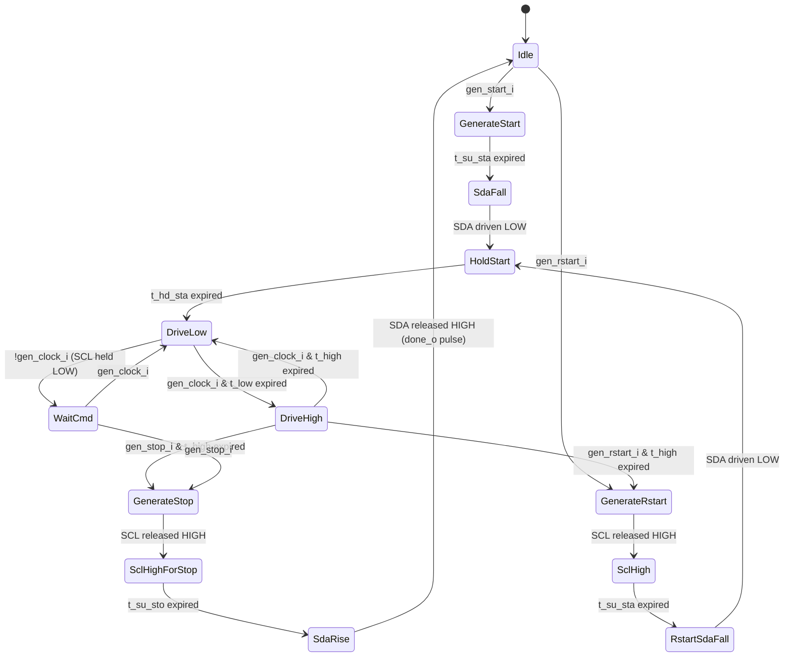

# Module: scl_generator

> Status: New
> Reference: N/A (SCL generation is scattered across `i2c_controller_fsm.sv` and `i3c_controller_fsm.sv` in reference; neither is directly reusable)
> Estimated LoC: ~200 lines

## 1. Purpose

The SCL generator produces the serial clock for the I3C bus. It handles:

- Clock generation for I3C SDR mode (up to 12.5 MHz) and I2C FM mode (400 kHz)
- START condition generation (SDA falls while SCL HIGH)
- STOP condition generation (SDA rises while SCL HIGH)
- Repeated START (Sr) generation
- Idle state management (both lines HIGH)
- Proper timing of setup/hold times for all bus conditions

This module does NOT exist as a standalone component in the reference design — it is a **new module** that consolidates clock generation logic that was previously embedded in the I2C and I3C controller FSMs.

## 2. Dependencies

### Sub-modules
- None

### Parent modules
- `controller_active`

### Packages
- `i3c_pkg` — For `bus_state_t` (bus monitor feedback)

## 3. Parameters

| Parameter        | Type | Default | Description                      |
|-----------------|------|---------|----------------------------------|
| `CounterWidth`  | int  | 20      | Width of timing counters         |

## 4. Ports / Interfaces

### Clock and Reset
| Signal   | Direction | Width | Description              |
|----------|-----------|-------|--------------------------|
| `clk_i`  | Input     | 1     | System clock (min 333 MHz) |
| `rst_ni` | Input     | 1     | Active-low async reset   |

### Control Interface (from flow_active)
| Signal           | Direction | Width | Description                                |
|------------------|-----------|-------|--------------------------------------------|
| `gen_start_i`    | Input     | 1     | Request START condition                    |
| `gen_rstart_i`   | Input     | 1     | Request Repeated START condition           |
| `gen_stop_i`     | Input     | 1     | Request STOP condition                     |
| `gen_clock_i`    | Input     | 1     | Enable continuous clock generation         |
| `gen_idle_i`     | Input     | 1     | Return to idle state (both lines HIGH)     |
| `sel_i3c_i2c_i`  | Input     | 1     | 0 = I2C FM timing, 1 = I3C SDR timing     |
| `done_o`         | Output    | 1     | Pulse: requested operation completed       |
| `busy_o`         | Output    | 1     | Generator is in non-Idle state             |

### Timing Configuration (from CSR, in system clock cycles)
| Signal          | Direction | Width | Description                 |
|-----------------|-----------|-------|-----------------------------|
| `t_low_i`       | Input     | 20    | SCL LOW period              |
| `t_high_i`      | Input     | 20    | SCL HIGH period             |
| `t_su_sta_i`    | Input     | 20    | START setup time            |
| `t_hd_sta_i`    | Input     | 20    | START hold time             |
| `t_su_sto_i`    | Input     | 20    | STOP setup time             |
| `t_r_i`         | Input     | 20    | Rise time allowance         |
| `t_f_i`         | Input     | 20    | Fall time allowance         |

### Bus Monitor Feedback
| Signal           | Direction | Width | Description                         |
|------------------|-----------|-------|-------------------------------------|
| `scl_i`          | Input     | 1     | Synchronized SCL readback           |

### Bus Output
| Signal     | Direction | Width | Description                            |
|------------|-----------|-------|----------------------------------------|
| `scl_o`    | Output    | 1     | SCL drive output                       |
| `sda_o`    | Output    | 1     | SDA drive output (for START/STOP only) |

## 5. Functional Description

### 5.1. FSM States



### 5.2. State Descriptions

| State              | SCL | SDA | Description                                |
|--------------------|-----|-----|--------------------------------------------|
| `Idle`             | Z/H | Z/H | Both lines released, bus idle              |
| `GenerateStart`    | H   | H   | Ensure SCL is HIGH, wait t_su_sta          |
| `SdaFall`          | H   | L   | Pull SDA LOW (START condition)             |
| `HoldStart`        | H   | L   | Hold SDA LOW for t_hd_sta                  |
| `DriveLow`         | L   | -   | Drive SCL LOW, count t_low                 |
| `DriveHigh`        | H   | -   | Release SCL HIGH, count t_high             |
| `WaitCmd`          | L   | -   | Hold SCL LOW, wait for next command        |
| `GenerateRstart`   | L→H | L→H | From clock LOW, release SDA HIGH first     |
| `SclHigh`          | H   | H   | SCL goes HIGH, wait t_su_sta for Sr        |
| `RstartSdaFall`    | H   | L   | Pull SDA LOW (Repeated START)              |
| `GenerateStop`     | L   | L   | SDA LOW, then release SCL HIGH             |
| `SclHighForStop`   | H   | L   | SCL HIGH, wait t_su_sto                    |
| `SdaRise`          | H   | H   | Release SDA HIGH (STOP condition)          |

### 5.3. Timing Counter

A single countdown counter `tcount` manages all timing delays:

```systemverilog
always_ff @(posedge clk_i or negedge rst_ni) begin
  if (!rst_ni)
    tcount <= '0;
  else if (load_tcount)
    tcount <= tcount_load_value;
  else if (tcount != '0)
    tcount <= tcount - 1'b1;
end
```

The `tcount_load_value` is selected based on the current state transition:
- Entering `GenerateStart`/`SclHigh`: load `t_su_sta_i`
- Entering `HoldStart`: load `t_hd_sta_i`
- Entering `DriveLow`: load `t_low_i + t_f_i`
- Entering `DriveHigh`: load `t_high_i + t_r_i`
- Entering `SclHighForStop`: load `t_su_sto_i`

### 5.4. Output Logic

```systemverilog
always_comb begin
  scl_o = 1'b1;  // Default: release HIGH
  sda_o = 1'b1;  // Default: release HIGH

  case (state)
    DriveLow, WaitCmd:          scl_o = 1'b0;
    SdaFall, HoldStart:         sda_o = 1'b0;  // SCL stays HIGH
    GenerateStop, SclHighForStop: begin
      sda_o = 1'b0;                             // SDA LOW during stop setup
    end
    RstartSdaFall: begin
      sda_o = 1'b0;                             // Sr: SDA falls while SCL HIGH
    end
    default: ;
  endcase
end
```

### 5.5. Done Signal

The `done_o` output pulses for 1 cycle to indicate completion of the requested operation:
- After START/Sr: when entering `DriveLow` (clock generation begins)
- After STOP: when entering `Idle`
- After each clock cycle: on SCL negedge (entering `DriveLow`)

## 6. Timing Requirements

### I3C SDR Mode (at 333 MHz, T_clk = 3 ns)

| Parameter    | Min Spec | Register Value | Actual Time |
|-------------|----------|----------------|-------------|
| `t_low_i`   | 24 ns    | 8              | 24 ns       |
| `t_high_i`  | 24 ns    | 8              | 24 ns       |
| `t_su_sta_i`| -        | 8              | 24 ns       |
| `t_hd_sta_i`| -        | 8              | 24 ns       |
| `t_su_sto_i`| 12 ns    | 4              | 12 ns       |
| `t_r_i`     | 12 ns    | 4              | 12 ns       |
| `t_f_i`     | 12 ns    | 4              | 12 ns       |

Resulting SCL frequency: 1 / ((8+4+8+4) * 3ns) = ~13.9 MHz (meets 12.5 MHz target with some margin — actual values should be tuned to hit 12.5 MHz precisely).

### I2C FM Mode (at 333 MHz, T_clk = 3 ns)

| Parameter    | Min Spec | Register Value | Actual Time |
|-------------|----------|----------------|-------------|
| `t_low_i`   | 1300 ns  | 434            | 1302 ns     |
| `t_high_i`  | 600 ns   | 200            | 600 ns      |
| `t_su_sta_i`| 600 ns   | 200            | 600 ns      |
| `t_hd_sta_i`| 600 ns   | 200            | 600 ns      |
| `t_su_sto_i`| 600 ns   | 200            | 600 ns      |
| `t_r_i`     | 300 ns   | 100            | 300 ns      |
| `t_f_i`     | 300 ns   | 100            | 300 ns      |

Resulting SCL frequency: 1 / ((434+100+200+100) * 3ns) = ~400 kHz.

## 7. Changes from Reference Design

This is a completely new module. In the reference design:

| Aspect | Reference | This Design |
|--------|-----------|-------------|
| I2C clock gen | Embedded in `i2c_controller_fsm.sv` (~900 lines) | Extracted into `scl_generator` |
| I3C clock gen | `i3c_controller_fsm.sv` is a stub (TODO) | Implemented in `scl_generator` |
| Dual bus | Two separate bus instances (I2C bus + I3C bus) | Single bus, mode-switched |
| Timing source | Hardcoded constants | CSR-driven timing registers |

## 8. Error Handling

- **SCL stuck LOW:** If `scl_i` does not go HIGH after releasing `scl_o`, the module will wait indefinitely in `DriveHigh`. The `flow_active` module should implement a timeout and issue `gen_idle_i` to abort.
- **Bus contention:** Not explicitly detected. The flow_active module should monitor for unexpected bus states via bus_monitor.

## 9. Test Plan

### Scenarios

1. **START generation:** Assert `gen_start_i`; verify SDA falls while SCL is HIGH with correct t_su_sta and t_hd_sta timing
2. **STOP generation:** Assert `gen_stop_i`; verify SDA rises while SCL is HIGH with correct t_su_sto timing
3. **Repeated START:** During clock generation, assert `gen_rstart_i`; verify Sr condition with correct timing
4. **I3C SDR clock:** Set I3C timing values; verify SCL frequency of ~12.5 MHz with correct duty cycle
5. **I2C FM clock:** Set I2C timing values; verify SCL frequency of ~400 kHz
6. **Mode switching:** Switch between I3C and I2C timing during idle; verify correct frequencies
7. **Clock gating:** Deassert `gen_clock_i` during DriveLow; verify SCL stays LOW until re-asserted
8. **Full transaction:** START → 9 clock cycles → Sr → 9 clock cycles → STOP; verify complete waveform
9. **Done signal:** Verify `done_o` pulses at the correct moments
10. **Reset behavior:** Verify both outputs go HIGH (idle) immediately on reset

### cocotb Test Structure
```
tests/
  test_scl_generator/
    test_scl_generator.py
    Makefile
```

## 10. Implementation Notes

- The `sda_o` output of this module is ONLY used for START/STOP/Sr conditions. During data phases, SDA is driven by `bus_tx_flow`. The `controller_active` module must MUX between `scl_generator.sda_o` and `bus_tx_flow.sda_o` based on the current phase.
- The counter width of 20 bits supports up to 2^20 = ~1M cycles, which at 333 MHz is ~3 ms — more than sufficient for any I3C/I2C timing parameter.
- For Repeated START: the module must first release SDA HIGH (if it was LOW from data), then release SCL HIGH, then pull SDA LOW. This 3-step sequence is critical for proper Sr generation.
- The `sel_i3c_i2c_i` input is informational — the actual timing comes from the register values. However, it can be used internally to select between different counter presets if register-based configuration is not desired.
