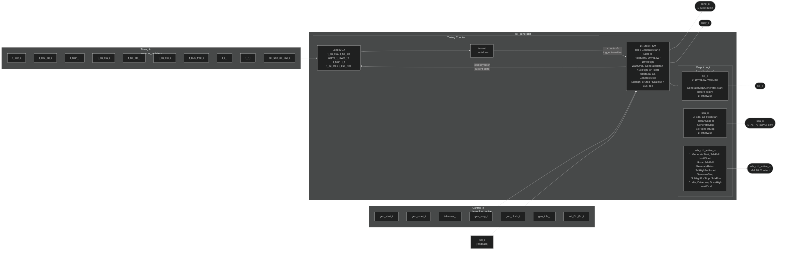
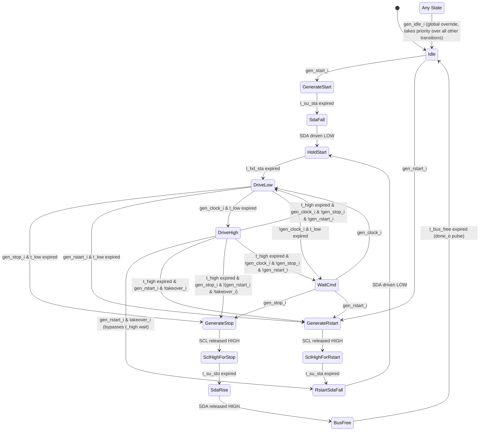

# Module: scl_generator

> Status: Complete
> Reference: N/A (SCL generation is scattered across `i2c_controller_fsm.sv` and `i3c_controller_fsm.sv` in reference; neither is directly reusable)
> Estimated LoC: ~270 lines

## 1. Purpose

The SCL generator produces the serial clock for the I3C bus. It handles:

- Clock generation for I3C SDR mode (up to 12.5 MHz) and I2C FM mode (400 kHz)
- START condition generation (SDA falls while SCL HIGH)
- STOP condition generation (SDA rises while SCL HIGH)
- Repeated START (Sr) generation, both from `flow_active` commands and from ENTDAA restart requests
- Idle state management (both lines HIGH)
- Proper timing of setup/hold times for all bus conditions

This module does NOT exist as a standalone component in the reference design — it is a **new module** that consolidates clock generation logic previously embedded in the I2C and I3C controller FSMs.

## 2. Dependencies

### Sub-modules

- None

### Parent modules

- `controller_active`

### Packages

- `i3c_pkg` — For `bus_state_t` (bus monitor feedback)

## 3. Parameters

| Parameter      | Type | Default | Description              |
| -------------- | ---- | ------- | ------------------------ |
| `CounterWidth` | int  | 20      | Width of timing counters |

## 4. Ports / Interfaces

### Clock and Reset

| Signal   | Direction | Width | Description                |
| -------- | --------- | ----- | -------------------------- |
| `clk_i`  | Input     | 1     | System clock (min 333 MHz) |
| `rst_ni` | Input     | 1     | Active-low async reset     |

### Control Interface (from flow_active)

| Signal          | Direction | Width | Description                                       |
| --------------- | --------- | ----- | ------------------------------------------------- |
| `gen_start_i`   | Input     | 1     | Request START condition                           |
| `gen_rstart_i`  | Input     | 1     | Request Repeated START condition                  |
| `takeover_i`    | Input     | 1     | ENTDAA restart fast-path: bypass tcount wait in `DriveHigh` and jump straight to `RstartSdaFall` |
| `gen_stop_i`    | Input     | 1     | Request STOP condition                            |
| `gen_clock_i`   | Input     | 1     | Enable continuous clock generation                |
| `gen_idle_i`    | Input     | 1     | Return to idle state (both lines HIGH)            |
| `sel_i3c_i2c_i` | Input     | 1     | 0 = I2C FM timing, 1 = I3C SDR timing (informational) |
| `done_o`        | Output    | 1     | Pulse: requested operation completed              |
| `busy_o`        | Output    | 1     | Generator is in non-Idle state                    |

### ENTDAA Restart Handling

DAA restart requests are folded into `gen_rstart_i` upstream in `controller_active` — there is no separate restart-request interface on this module. See `takeover_i` below for the fast-path this module exposes to ENTDAA.

### Timing Configuration (from CSR, in system clock cycles)

| Signal             | Direction | Width        | Description                                      |
| ------------------ | --------- | ------------ | ------------------------------------------------ |
| `t_low_i`          | Input     | CounterWidth | SCL LOW period for push-pull-capable phases      |
| `t_low_od_i`       | Input     | CounterWidth | SCL LOW period for open-drain low phases         |
| `t_high_i`         | Input     | CounterWidth | SCL HIGH period                                  |
| `t_su_sta_i`       | Input     | CounterWidth | START setup time                                 |
| `t_hd_sta_i`       | Input     | CounterWidth | START hold time                                  |
| `t_su_sto_i`       | Input     | CounterWidth | STOP setup time                                  |
| `t_bus_free_i`     | Input     | CounterWidth | Bus-free delay after STOP before returning idle  |
| `t_r_i`            | Input     | CounterWidth | Rise time allowance                              |
| `t_f_i`            | Input     | CounterWidth | Fall time allowance                              |
| `scl_use_od_low_i` | Input     | 1            | Select `t_low_od_i` instead of `t_low_i` for LOW |

### Bus Monitor Feedback

| Signal  | Direction | Width | Description               |
| ------- | --------- | ----- | ------------------------- |
| `scl_i` | Input     | 1     | Synchronized SCL readback |

### Bus Output

| Signal              | Direction | Width | Description                                          |
| ------------------- | --------- | ----- | ---------------------------------------------------- |
| `scl_o`             | Output    | 1     | SCL drive output                                     |
| `sda_o`             | Output    | 1     | SDA drive output (for START/STOP/Sr conditions only) |
| `sda_ctrl_active_o` | Output    | 1     | 1 when this module is driving SDA (M-2 MUX signal)   |

## 5. Block Diagram


```mermaid
%%{init: {"theme": "dark"}}%%
flowchart LR
    %% ── Inputs ───────────────────────────────────────────────────────────────
    subgraph CI["Control In\nfrom flow_active"]
        direction TB
        gen_start_i
        gen_rstart_i
        takeover_i
        gen_stop_i
        gen_clock_i
        gen_idle_i
        sel_i3c_i2c_i
    end

    subgraph TI["Timing In\nfrom csr_registers"]
        direction TB
        t_low_i
        t_low_od_i
        t_high_i
        t_su_sta_i
        t_hd_sta_i
        t_su_sto_i
        t_bus_free_i
        t_r_i
        t_f_i
        scl_use_od_low_i
    end

    scl_fb["scl_i\n(readback)"]

    %% ── scl_generator boundary ───────────────────────────────────────────────
    subgraph SG["scl_generator"]
        direction TB

        FSM["14-State FSM\nIdle / GenerateStart / SdaFall\nHoldStart / DriveLow / DriveHigh\nWaitCmd / GenerateRstart / SclHighForRstart\nRstartSdaFall / GenerateStop\nSclHighForStop / SdaRise / BusFree"]

        subgraph CNT["Timing Counter"]
            direction LR
            MUX["Load MUX\nt_su_sta / t_hd_sta\nactive_t_low+t_f / t_high+t_r\nt_su_sto / t_bus_free"]
            TC["tcount\ncountdown"]
            MUX --> TC
        end

        subgraph OL["Output Logic\n(combinational)"]
            direction TB
            SCL_DRV["scl_o\n0: DriveLow, WaitCmd\n   GenerateStop/GenerateRstart before expiry\n1: otherwise"]
            SDA_DRV["sda_o\n0: SdaFall, HoldStart\n   RstartSdaFall\n   GenerateStop, SclHighForStop\n1: otherwise"]
            SDA_ACT["sda_ctrl_active_o\n1: GenerateStart, SdaFall, HoldStart\n   RstartSdaFall, GenerateRstart\n   SclHighForRstart, GenerateStop\n   SclHighForStop, SdaRise\n0: Idle, DriveLow, DriveHigh\n   WaitCmd"]
        end

        FSM -->|"load keyed on\ncurrent state"| MUX
        TC  -->|"tcount==0\ntrigger transition"| FSM
        FSM --> OL
    end

    %% ── Connections ──────────────────────────────────────────────────────────
    CI     --> FSM
    TI     --> MUX
    scl_fb --> FSM

    %% ── Outputs ──────────────────────────────────────────────────────────────
    SCL_DRV --> scl_o(["scl_o"])
    SDA_DRV --> sda_o(["sda_o\nSTART/STOP/Sr only"])
    SDA_ACT --> sda_ctrl_active_o(["sda_ctrl_active_o\nM-2 MUX select"])
    FSM     --> done_o(["done_o\n1-cycle pulse"])
    FSM     --> busy_o(["busy_o"])
```

## 6. Functional Description

### 6.1. FSM States

```systemverilog
typedef enum logic [3:0] {
  Idle           = 4'd0,
  GenerateStart  = 4'd1,
  SdaFall        = 4'd2,
  HoldStart      = 4'd3,
  DriveLow       = 4'd4,
  DriveHigh      = 4'd5,
  WaitCmd        = 4'd6,
  GenerateRstart = 4'd7,
  SclHighForRstart        = 4'd8,
  RstartSdaFall  = 4'd9,
  GenerateStop   = 4'd10,
  SclHighForStop = 4'd11,
  SdaRise        = 4'd12,
  BusFree        = 4'd13
} state_e;
```


```mermaid
stateDiagram-v2
    [*] --> Idle

    Idle --> GenerateStart: gen_start_i
    Idle --> GenerateRstart: gen_rstart_i

    GenerateStart --> SdaFall: t_su_sta expired
    SdaFall --> HoldStart: SDA driven LOW
    HoldStart --> DriveLow: t_hd_sta expired

    GenerateRstart --> SclHighForRstart: SCL released HIGH
    SclHighForRstart --> RstartSdaFall: t_su_sta expired
    RstartSdaFall --> HoldStart: SDA driven LOW

    DriveLow --> GenerateStop: gen_stop_i & t_low expired
    DriveLow --> GenerateRstart: gen_rstart_i & t_low expired
    DriveLow --> DriveHigh: gen_clock_i & t_low expired
    DriveLow --> WaitCmd: !gen_clock_i & t_low expired

    DriveHigh --> RstartSdaFall: gen_rstart_i & takeover_i (bypasses t_high wait)
    DriveHigh --> GenerateRstart: t_high expired & gen_rstart_i & !takeover_i
    DriveHigh --> GenerateStop: t_high expired & gen_stop_i & !(gen_rstart_i & !takeover_i)
    DriveHigh --> DriveLow: t_high expired & gen_clock_i & !gen_stop_i & !gen_rstart_i
    DriveHigh --> WaitCmd: t_high expired & !gen_clock_i & !gen_stop_i & !gen_rstart_i

    WaitCmd --> DriveLow: gen_clock_i
    WaitCmd --> GenerateStop: gen_stop_i
    WaitCmd --> GenerateRstart: gen_rstart_i

    GenerateStop --> SclHighForStop: SCL released HIGH
    SclHighForStop --> SdaRise: t_su_sto expired
    SdaRise --> BusFree: SDA released HIGH
    BusFree --> Idle: t_bus_free expired (done_o pulse)

    state "Any State" as AnyState
    AnyState --> Idle: gen_idle_i (global override, takes priority over all other transitions)
```

### 6.2. State Descriptions

| State            | SCL | SDA | `sda_ctrl_active_o` | Description                            |
| ---------------- | --- | --- | ------------------- | -------------------------------------- |
| `Idle`           | Z/H | Z/H | 0                   | Both lines released, bus idle          |
| `GenerateStart`  | H   | H   | 1                   | Own SDA mux and release SDA HIGH while waiting t_su_sta |
| `SdaFall`        | H   | L   | 1                   | Pull SDA LOW (START condition)         |
| `HoldStart`      | H   | L   | 1                   | Hold SDA LOW for t_hd_sta              |
| `DriveLow`       | L   | -   | 0                   | Drive SCL LOW, count active_t_low      |
| `DriveHigh`      | H   | -   | 0                   | Release SCL HIGH, count t_high         |
| `WaitCmd`        | L   | -   | 0                   | Hold SCL LOW, wait for next command    |
| `GenerateRstart` | L→H | L→H | 1                   | From clock LOW, release SDA HIGH first |
| `SclHighForRstart`        | H   | H   | 1                   | SCL goes HIGH, wait t_su_sta for Sr    |
| `RstartSdaFall`  | H   | L   | 1                   | Pull SDA LOW (Repeated START)          |
| `GenerateStop`   | L→H | L   | 1                   | Hold SDA LOW, then release SCL HIGH    |
| `SclHighForStop` | H   | L   | 1                   | SCL HIGH, wait t_su_sto                |
| `SdaRise`        | H   | H   | 1                   | Release SDA HIGH (STOP condition)      |
| `BusFree`        | H   | H   | 0                   | Wait t_bus_free before returning idle  |

### 6.3. `sda_ctrl_active_o` (M-2 MUX Signal)

`controller_active` uses `sda_ctrl_active_o` to determine SDA priority:

```systemverilog
// In controller_active:
assign ctrl_sda_o = scl_gen_driving_sda ? scl_gen_sda
                  : !tx_flow_idle       ? tx_flow_sda
                  :                      1'b1;
```

`sda_ctrl_active_o` is asserted in all states where `scl_generator` owns the SDA mux for START/STOP/Sr generation. In `GenerateStart`, the generator owns the SDA mux but keeps `sda_o` released HIGH so the START setup window is protected from `bus_tx_flow`. It is deasserted during `DriveLow`, `DriveHigh`, `WaitCmd`, and `Idle` — phases when `bus_tx_flow` may drive data.

### 6.4. ENTDAA Restart Takeover (`takeover_i`)

DAA restart requests are folded into `gen_rstart_i` upstream in `controller_active` — there is no separate restart-request port on `scl_generator`. Instead, `takeover_i` lets `controller_active` fast-path an ENTDAA-driven repeated START directly out of `DriveHigh`, bypassing the normal `t_high` countdown wait that a `flow_active`-driven `gen_rstart_i` would otherwise have to wait through:

```systemverilog
// In DriveHigh, a takeover request jumps straight to RstartSdaFall,
// skipping the tcount_expired check entirely:
DriveHigh: begin
  if (gen_rstart_i && takeover_i) begin
    state_d = RstartSdaFall;
  end else if (tcount_expired) begin
    ...
  end
end
```

When `takeover_i` is asserted together with `gen_rstart_i`, the `DriveHigh` tcount-load (§6.5) is also suppressed (`!takeover_i` guard), since the state is about to be exited immediately rather than timing out normally.

### 6.5. Timing Counter

A single countdown counter `tcount` manages all timing delays:

```systemverilog
always_ff @(posedge clk_i or negedge rst_ni) begin
  if (!rst_ni)
    tcount <= '0;
  else if (load_tcount)
    tcount <= tcount_load_value;
  else if (tcount != '0)
    tcount <= tcount - 1'b1;
end
```

The `tcount_load_value` is computed combinationally and keyed on the **current** state (`state_q`) and its live condition inputs — not on which state is about to be entered. The full current-state scheme is:

| Current state (`state_q`)  | Load condition                              | Load value                  |
| --------------------------- | -------------------------------------------- | ---------------------------- |
| `Idle`                      | `gen_start_i`                                | `t_su_sta_i`                 |
| `Idle`                      | `gen_rstart_i` (else, if not `gen_start_i`)  | `active_t_low + t_f_i`        |
| `GenerateRstart`            | `tcount_expired && scl_i`                    | `t_su_sta_i`                  |
| `SdaFall`, `RstartSdaFall`  | always (unconditional)                       | `t_hd_sta_i`                  |
| `HoldStart`                 | `tcount_expired`                             | `active_t_low + t_f_i`        |
| `WaitCmd`                   | `gen_stop_i \|\| gen_rstart_i \|\| gen_clock_i` | `active_t_low + t_f_i`     |
| `DriveHigh`                 | `tcount_expired && (gen_stop_i \|\| (gen_rstart_i && !takeover_i) \|\| gen_clock_i)` | `active_t_low + t_f_i` |
| `DriveLow`                  | `tcount_expired && gen_stop_i`               | `active_t_low + t_f_i`        |
| `DriveLow`                  | `tcount_expired && gen_rstart_i` (else)      | `active_t_low + t_f_i`        |
| `DriveLow`                  | `tcount_expired && gen_clock_i && !gen_rstart_i` (else) | `t_high_i + t_r_i`  |
| `GenerateStop`              | `tcount_expired && scl_i`                    | `t_su_sto_i`                  |
| `SdaRise`                   | always (unconditional)                       | `t_bus_free_i`                |

`active_t_low` is `t_low_od_i` when `scl_use_od_low_i` is 1, otherwise `t_low_i`. Note that the load happens one cycle *before* the corresponding state transition (e.g. the `DriveLow` load of `t_high_i + t_r_i` is what `DriveHigh` will count down once entered), and that `DriveHigh`'s own tcount-load (re-arming `active_t_low + t_f_i` for the next `DriveLow`/`GenerateRstart`/`GenerateStop`) is itself gated by `!takeover_i` — a `takeover_i` exit skips this load because the FSM jumps straight to `RstartSdaFall` instead.

### 6.6. Output Logic

`scl_o` and `sda_o` are driven by a combinational block keyed on `state_q`:

```systemverilog
always_comb begin
  scl_o = 1'b1;  // Default: release HIGH
  sda_o = 1'b1;  // Default: release HIGH

  case (state_q)
    DriveLow, WaitCmd: scl_o = 1'b0;

    GenerateStop: begin
      sda_o = 1'b0;
      if (!tcount_expired) begin
        scl_o = 1'b0;
      end
    end

    GenerateRstart: begin
      if (!tcount_expired) begin
        scl_o = 1'b0;  // Hold SCL LOW until t_low has fully elapsed
      end
    end

    SdaFall, HoldStart, RstartSdaFall, SclHighForStop: sda_o = 1'b0;

    default: ;
  endcase
end
```

`GenerateRstart` therefore *does* pull `scl_o` LOW for as long as `tcount` has not yet expired (it only releases SCL HIGH once `t_low + t_f` has elapsed and the bus monitor reports `scl_i` HIGH) — it does not simply leave SCL released the whole time it occupies `GenerateRstart`.

`sda_ctrl_active_o` is **not** part of this `case` block — it is a separate continuous assignment, OR-ing together every state in which `scl_generator` owns the SDA mux:

```systemverilog
assign sda_ctrl_active_o = (state_q == GenerateStart)     |
                            (state_q == SdaFall)           |
                            (state_q == HoldStart)         |
                            (state_q == GenerateRstart)    |
                            (state_q == SclHighForRstart)  |
                            (state_q == RstartSdaFall)     |
                            (state_q == GenerateStop)      |
                            (state_q == SclHighForStop)    |
                            (state_q == SdaRise);
```

## 7. Timing Requirements

### I3C SDR Mode (at 333 MHz, T_clk = 3 ns)

| Parameter    | Min Spec | Register Value | Actual Time |
| ------------ | -------- | -------------- | ----------- |
| `t_low_i`    | 48 ns    | 16             | 48 ns       |
| `t_low_od_i` | 200 ns   | 67             | 201 ns      |
| `t_high_i`   | 32 ns    | 11             | 33 ns       |
| `t_su_sta_i` | 20 ns    | 7              | 21 ns       |
| `t_hd_sta_i` | 39 ns    | 13             | 39 ns       |
| `t_su_sto_i` | 20 ns    | 7              | 21 ns       |
| `t_r_i`      | 12 ns    | 4              | 12 ns       |
| `t_f_i`      | 12 ns    | 4              | 12 ns       |
| `t_bus_free_i` | 39 ns  | 13             | 39 ns       |

### I2C FM Mode (at 333 MHz, T_clk = 3 ns)

| Parameter    | Min Spec | Register Value | Actual Time |
| ------------ | -------- | -------------- | ----------- |
| `t_low_i`    | 1600 ns  | 534            | 1602 ns     |
| `t_low_od_i` | N/A      | Unused         | N/A         |
| `t_high_i`   | 900 ns   | 300            | 900 ns      |
| `t_su_sta_i` | 600 ns   | 200            | 600 ns      |
| `t_hd_sta_i` | 600 ns   | 200            | 600 ns      |
| `t_su_sto_i` | 1300 ns  | 434            | 1302 ns     |
| `t_r_i`      | 300 ns   | 100            | 300 ns      |
| `t_f_i`      | 300 ns   | 100            | 300 ns      |
| `t_bus_free_i` | 1300 ns | 434           | 1302 ns     |

## 8. Changes from Reference Design

This is a completely new module. In the reference design:

| Aspect                  | Reference                                        | This Design                              |
| ----------------------- | ------------------------------------------------ | ---------------------------------------- |
| I2C clock gen           | Embedded in `i2c_controller_fsm.sv` (~900 lines) | Extracted into `scl_generator`           |
| I3C clock gen           | `i3c_controller_fsm.sv` is a stub (TODO)         | Implemented in `scl_generator`           |
| Dual bus                | Two separate bus instances (I2C bus + I3C bus)   | Single bus, mode-switched                |
| Timing source           | Hardcoded constants                              | CSR-driven timing registers              |
| `sda_ctrl_active_o`     | Not present                                      | Added for M-2 SDA priority MUX          |
| ENTDAA restart           | Not present                                      | `gen_rstart_i` + `takeover_i` fast-path for M-7 multi-device restart |

## 9. Error Handling

- **SCL stuck LOW:** Normal clock generation advances from `DriveHigh` by counter expiry and does not wait for `scl_i`. STOP and repeated-START sequencing do check `scl_i` while releasing SCL HIGH, so a stuck-low bus can still stall those bus-condition flows. Timeout/recovery is outside this block and should be handled by higher-level control.
- **Bus contention:** Not explicitly detected. `flow_active` should monitor for unexpected bus states via `bus_monitor`.
- **Global idle override:** `gen_idle_i` is checked first in the next-state block and, when asserted, forces `state_d = Idle` unconditionally — overriding every other transition from every state, including mid-sequence START/STOP/Sr generation. Callers must ensure `gen_idle_i` is only asserted when an abrupt return to `Idle` is actually intended (e.g. abort/reset flows), since it does not wait for any in-progress condition to complete cleanly.

## 10. Test Plan

### Scenarios

1. **START generation:** Assert `gen_start_i`; verify SDA falls while SCL is HIGH with correct t_su_sta and t_hd_sta timing
2. **STOP generation:** Assert `gen_stop_i`; verify SDA rises while SCL is HIGH with correct t_su_sto timing
3. **Repeated START (from flow_active):** During clock generation, assert and hold `gen_rstart_i` (with `takeover_i` LOW) until the generator services it from a low-phase state (`DriveLow`/`WaitCmd`) or from `DriveHigh` on tcount expiry; verify Sr condition with correct timing
4. **Repeated START takeover (from ENTDAA):** Assert `gen_rstart_i` together with `takeover_i` while in `DriveHigh`; verify the FSM jumps immediately to `RstartSdaFall` without waiting for `t_high` to expire
5. **I3C SDR clock:** Set I3C timing values; verify SCL frequency of ~12.5 MHz with correct duty cycle
6. **I2C FM clock:** Set I2C timing values; verify SCL frequency of ~400 kHz
7. **Clock gating:** Deassert `gen_clock_i` during DriveLow; verify SCL stays LOW until re-asserted
8. **Full transaction:** START → 9 clock cycles → Sr → 9 clock cycles → STOP; verify complete waveform
9. **`sda_ctrl_active_o`:** Verify asserted during GenerateStart, SdaFall, HoldStart, GenerateRstart, SclHighForRstart, RstartSdaFall, GenerateStop, SclHighForStop, SdaRise; deasserted during Idle, DriveLow, DriveHigh, WaitCmd
10. **Reset behavior:** Verify both outputs go HIGH (idle) immediately on reset

### UVM Test Structure

```
src/verification/uvm_i3c/
  sequences/
    i3c_base_vseq.sv
    i3c_entdaa_vseq.sv
    i3c_private_write_vseq.sv
    i3c_private_read_vseq.sv
    i3c_i2c_write_vseq.sv
  tests/
    i3c_base_test.sv
    i3c_entdaa_test.sv
    i3c_private_rw_test.sv
    i3c_i2c_test.sv
    i3c_error_test.sv
```

**Module coverage note:** `scl_generator` is exercised by all tests — SCL clock generation and START/STOP/Sr condition signaling are required for every transaction.

## 11. Implementation Notes

- The `sda_o` output of this module is ONLY used for START/STOP/Sr conditions. During data phases, SDA is driven by `bus_tx_flow`. `controller_active` MUXes between `scl_generator.sda_o` and `bus_tx_flow.sda_o` using `sda_ctrl_active_o` as the select signal (M-2 fix).
- The counter width of 20 bits supports up to 2^20 = ~1M cycles, which at 333 MHz is ~3 ms — more than sufficient for any I3C/I2C timing parameter.
- STOP, repeated-START, and clock-deassertion requests are all serviced from `DriveLow` or `WaitCmd` on tcount expiry. `DriveHigh` ALSO directly services `gen_rstart_i`, `gen_stop_i`, and `gen_clock_i` on its own tcount expiry (it is not limited to transitioning only to `DriveLow`) — and additionally exposes the `takeover_i` fast-path described below, which exits `DriveHigh` to `RstartSdaFall` immediately, without waiting on tcount at all. Callers must hold `gen_stop_i` or `gen_rstart_i` until the generator reaches one of these states and reports completion (or, for ENTDAA, assert `takeover_i` to short-circuit the wait).
- For Repeated START: the module first releases SDA HIGH (from data LOW), then releases SCL HIGH, then pulls SDA LOW. This 3-step sequence is critical for proper Sr generation. The `takeover_i` fast-path skips directly to the SDA-LOW step (`RstartSdaFall`) from `DriveHigh`, since SCL is already released HIGH in that state.
- `done_o` pulses on three distinct transitions, not just one: (1) `HoldStart → DriveLow` (START/Sr hold-time complete), (2) `DriveHigh → DriveLow` specifically when caused by `gen_clock_i` continuing and neither `gen_stop_i` nor `gen_rstart_i` is asserted (i.e. an ordinary clock low-phase re-entry, not a STOP/Sr branch), and (3) `BusFree → Idle` (STOP sequence fully complete).
- The `sel_i3c_i2c_i` input is informational only — the actual timing comes from the register values. The module does not use it to select different counter presets; the caller must write correct timing values for the active mode.
- `takeover_i` lets `controller_active` fast-path an ENTDAA-driven repeated START out of `DriveHigh`: when `gen_rstart_i && takeover_i`, the FSM transitions straight to `RstartSdaFall` regardless of `tcount_expired`, and the `DriveHigh` tcount-load is itself suppressed while `takeover_i` is asserted (see §6.5). DAA restart requests are otherwise folded into the ordinary `gen_rstart_i` signal — there is no separate restart-request handshake into this module.
- `gen_idle_i` is a global override checked ahead of the per-state `case` in the next-state block: whenever asserted, `state_d` is forced to `Idle` from any current state, taking priority over every other transition (see §9).
