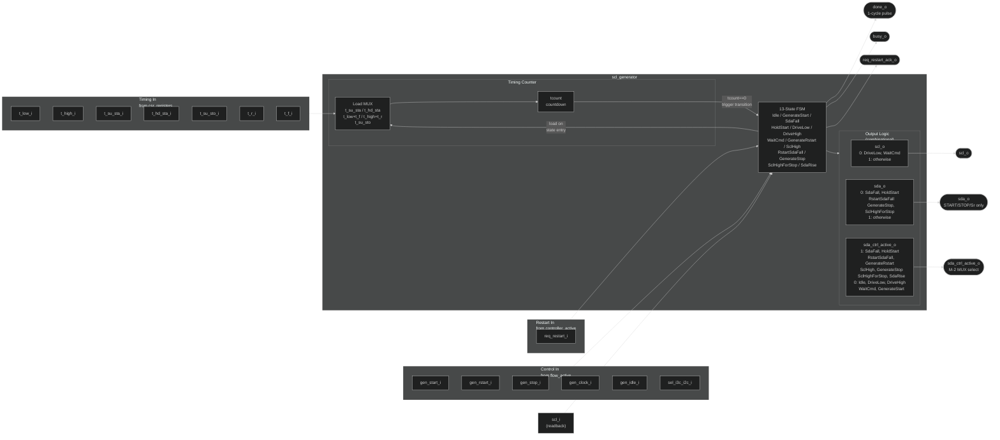
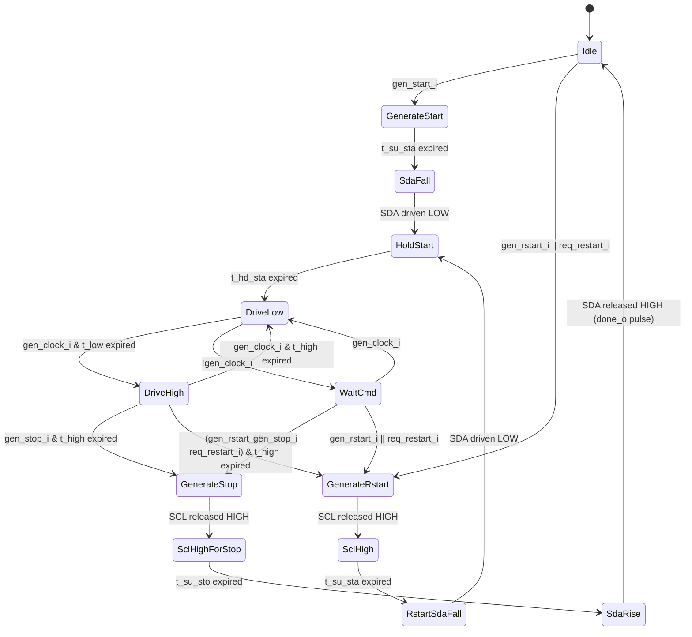

# Module: scl_generator

> Status: Complete
> Reference: N/A (SCL generation is scattered across `i2c_controller_fsm.sv` and `i3c_controller_fsm.sv` in reference; neither is directly reusable)
> Estimated LoC: ~270 lines

## 1. Purpose

The SCL generator produces the serial clock for the I3C bus. It handles:

- Clock generation for I3C SDR mode (up to 12.5 MHz) and I2C FM mode (400 kHz)
- START condition generation (SDA falls while SCL HIGH)
- STOP condition generation (SDA rises while SCL HIGH)
- Repeated START (Sr) generation, both from `flow_active` commands and from ENTDAA restart requests
- Idle state management (both lines HIGH)
- Proper timing of setup/hold times for all bus conditions

This module does NOT exist as a standalone component in the reference design — it is a **new module** that consolidates clock generation logic previously embedded in the I2C and I3C controller FSMs.

## 2. Dependencies

### Sub-modules

- None

### Parent modules

- `controller_active`

### Packages

- `i3c_pkg` — For `bus_state_t` (bus monitor feedback)

## 3. Parameters

| Parameter      | Type | Default | Description              |
| -------------- | ---- | ------- | ------------------------ |
| `CounterWidth` | int  | 20      | Width of timing counters |

## 4. Ports / Interfaces

### Clock and Reset

| Signal   | Direction | Width | Description                |
| -------- | --------- | ----- | -------------------------- |
| `clk_i`  | Input     | 1     | System clock (min 333 MHz) |
| `rst_ni` | Input     | 1     | Active-low async reset     |

### Control Interface (from flow_active)

| Signal          | Direction | Width | Description                                       |
| --------------- | --------- | ----- | ------------------------------------------------- |
| `gen_start_i`   | Input     | 1     | Request START condition                           |
| `gen_rstart_i`  | Input     | 1     | Request Repeated START condition                  |
| `gen_stop_i`    | Input     | 1     | Request STOP condition                            |
| `gen_clock_i`   | Input     | 1     | Enable continuous clock generation                |
| `gen_idle_i`    | Input     | 1     | Return to idle state (both lines HIGH)            |
| `sel_i3c_i2c_i` | Input     | 1     | 0 = I2C FM timing, 1 = I3C SDR timing (informational) |
| `done_o`        | Output    | 1     | Pulse: requested operation completed              |
| `busy_o`        | Output    | 1     | Generator is in non-Idle state                    |

### ENTDAA Restart Interface (from controller_active `daa_restart_pending_q`)

| Signal               | Direction | Width | Description                                                    |
| -------------------- | --------- | ----- | -------------------------------------------------------------- |
| `req_restart_i`      | Input     | 1     | Extended restart request from `daa_restart_pending_q` latch    |
| `req_restart_ack_o`  | Output    | 1     | Pulse: scl_generator has acted on the restart request          |

### Timing Configuration (from CSR, in system clock cycles)

| Signal       | Direction | Width        | Description         |
| ------------ | --------- | ------------ | ------------------- |
| `t_low_i`    | Input     | CounterWidth | SCL LOW period      |
| `t_high_i`   | Input     | CounterWidth | SCL HIGH period     |
| `t_su_sta_i` | Input     | CounterWidth | START setup time    |
| `t_hd_sta_i` | Input     | CounterWidth | START hold time     |
| `t_su_sto_i` | Input     | CounterWidth | STOP setup time     |
| `t_r_i`      | Input     | CounterWidth | Rise time allowance |
| `t_f_i`      | Input     | CounterWidth | Fall time allowance |

### Bus Monitor Feedback

| Signal  | Direction | Width | Description               |
| ------- | --------- | ----- | ------------------------- |
| `scl_i` | Input     | 1     | Synchronized SCL readback |

### Bus Output

| Signal              | Direction | Width | Description                                          |
| ------------------- | --------- | ----- | ---------------------------------------------------- |
| `scl_o`             | Output    | 1     | SCL drive output                                     |
| `sda_o`             | Output    | 1     | SDA drive output (for START/STOP/Sr conditions only) |
| `sda_ctrl_active_o` | Output    | 1     | 1 when this module is driving SDA (M-2 MUX signal)   |

## 5. Block Diagram


```mermaid
%%{init: {"theme": "dark"}}%%
flowchart LR
    %% ── Inputs ───────────────────────────────────────────────────────────────
    subgraph CI["Control In\nfrom flow_active"]
        direction TB
        gen_start_i
        gen_rstart_i
        gen_stop_i
        gen_clock_i
        gen_idle_i
        sel_i3c_i2c_i
    end

    subgraph RI["Restart In\nfrom controller_active"]
        req_restart_i
    end

    subgraph TI["Timing In\nfrom csr_registers"]
        direction TB
        t_low_i
        t_high_i
        t_su_sta_i
        t_hd_sta_i
        t_su_sto_i
        t_r_i
        t_f_i
    end

    scl_fb["scl_i\n(readback)"]

    %% ── scl_generator boundary ───────────────────────────────────────────────
    subgraph SG["scl_generator"]
        direction TB

        FSM["13-State FSM\nIdle / GenerateStart / SdaFall\nHoldStart / DriveLow / DriveHigh\nWaitCmd / GenerateRstart / SclHigh\nRstartSdaFall / GenerateStop\nSclHighForStop / SdaRise"]

        subgraph CNT["Timing Counter"]
            direction LR
            MUX["Load MUX\nt_su_sta / t_hd_sta\nt_low+t_f / t_high+t_r\nt_su_sto"]
            TC["tcount\ncountdown"]
            MUX --> TC
        end

        subgraph OL["Output Logic\n(combinational)"]
            direction TB
            SCL_DRV["scl_o\n0: DriveLow, WaitCmd\n1: otherwise"]
            SDA_DRV["sda_o\n0: SdaFall, HoldStart\n   RstartSdaFall\n   GenerateStop, SclHighForStop\n1: otherwise"]
            SDA_ACT["sda_ctrl_active_o\n1: SdaFall, HoldStart\n   RstartSdaFall, GenerateRstart\n   SclHigh, GenerateStop\n   SclHighForStop, SdaRise\n0: Idle, DriveLow, DriveHigh\n   WaitCmd, GenerateStart"]
        end

        FSM -->|"load on\nstate entry"| MUX
        TC  -->|"tcount==0\ntrigger transition"| FSM
        FSM --> OL
    end

    %% ── Connections ──────────────────────────────────────────────────────────
    CI     --> FSM
    RI     --> FSM
    TI     --> MUX
    scl_fb --> FSM

    %% ── Outputs ──────────────────────────────────────────────────────────────
    SCL_DRV --> scl_o(["scl_o"])
    SDA_DRV --> sda_o(["sda_o\nSTART/STOP/Sr only"])
    SDA_ACT --> sda_ctrl_active_o(["sda_ctrl_active_o\nM-2 MUX select"])
    FSM     --> done_o(["done_o\n1-cycle pulse"])
    FSM     --> busy_o(["busy_o"])
    FSM     --> req_restart_ack_o(["req_restart_ack_o"])
```

## 6. Functional Description

### 6.1. FSM States

```systemverilog
typedef enum logic [3:0] {
  Idle           = 4'd0,
  GenerateStart  = 4'd1,
  SdaFall        = 4'd2,
  HoldStart      = 4'd3,
  DriveLow       = 4'd4,
  DriveHigh      = 4'd5,
  WaitCmd        = 4'd6,
  GenerateRstart = 4'd7,
  SclHigh        = 4'd8,
  RstartSdaFall  = 4'd9,
  GenerateStop   = 4'd10,
  SclHighForStop = 4'd11,
  SdaRise        = 4'd12
} state_e;
```


```mermaid
stateDiagram-v2
    [*] --> Idle

    Idle --> GenerateStart: gen_start_i
    Idle --> GenerateRstart: gen_rstart_i || req_restart_i

    GenerateStart --> SdaFall: t_su_sta expired
    SdaFall --> HoldStart: SDA driven LOW
    HoldStart --> DriveLow: t_hd_sta expired

    GenerateRstart --> SclHigh: SCL released HIGH
    SclHigh --> RstartSdaFall: t_su_sta expired
    RstartSdaFall --> HoldStart: SDA driven LOW

    DriveLow --> DriveHigh: gen_clock_i & t_low expired
    DriveHigh --> DriveLow: gen_clock_i & t_high expired
    DriveHigh --> GenerateStop: gen_stop_i & t_high expired
    DriveHigh --> GenerateRstart: (gen_rstart_i || req_restart_i) & t_high expired

    DriveLow --> WaitCmd: !gen_clock_i

    WaitCmd --> DriveLow: gen_clock_i
    WaitCmd --> GenerateStop: gen_stop_i
    WaitCmd --> GenerateRstart: gen_rstart_i || req_restart_i

    GenerateStop --> SclHighForStop: SCL released HIGH
    SclHighForStop --> SdaRise: t_su_sto expired
    SdaRise --> Idle: SDA released HIGH (done_o pulse)
```

### 6.2. State Descriptions

| State            | SCL | SDA | `sda_ctrl_active_o` | Description                            |
| ---------------- | --- | --- | ------------------- | -------------------------------------- |
| `Idle`           | Z/H | Z/H | 0                   | Both lines released, bus idle          |
| `GenerateStart`  | H   | H   | 0                   | Ensure SCL is HIGH, wait t_su_sta      |
| `SdaFall`        | H   | L   | 1                   | Pull SDA LOW (START condition)         |
| `HoldStart`      | H   | L   | 1                   | Hold SDA LOW for t_hd_sta              |
| `DriveLow`       | L   | -   | 0                   | Drive SCL LOW, count t_low             |
| `DriveHigh`      | H   | -   | 0                   | Release SCL HIGH, count t_high         |
| `WaitCmd`        | L   | -   | 0                   | Hold SCL LOW, wait for next command    |
| `GenerateRstart` | L→H | L→H | 1                   | From clock LOW, release SDA HIGH first |
| `SclHigh`        | H   | H   | 1                   | SCL goes HIGH, wait t_su_sta for Sr    |
| `RstartSdaFall`  | H   | L   | 1                   | Pull SDA LOW (Repeated START)          |
| `GenerateStop`   | L   | L   | 1                   | SDA LOW, then release SCL HIGH         |
| `SclHighForStop` | H   | L   | 1                   | SCL HIGH, wait t_su_sto                |
| `SdaRise`        | H   | H   | 1                   | Release SDA HIGH (STOP condition)      |

### 6.3. `sda_ctrl_active_o` (M-2 MUX Signal)

`controller_active` uses `sda_ctrl_active_o` to determine SDA priority:

```systemverilog
// In controller_active:
assign ctrl_sda_o = scl_gen_driving_sda ? scl_gen_sda
                  : !tx_flow_idle       ? tx_flow_sda
                  :                      1'b1;
```

`sda_ctrl_active_o` is asserted in all states where `scl_generator` owns SDA (START/STOP/Sr generation). It is deasserted during `DriveLow`, `DriveHigh`, `WaitCmd`, `Idle`, and `GenerateStart` — phases when `bus_tx_flow` may drive data.

### 6.4. ENTDAA Restart Handling (`req_restart_i` / `req_restart_ack_o`)

During ENTDAA multi-device rounds, `entdaa_controller` pulses `req_restart_o` for one cycle. `controller_active`'s `daa_restart_pending_q` extends this to a held signal (`req_restart_i` into `scl_generator`). When `scl_generator` sees `req_restart_i` and acts on it (entering `GenerateRstart`), it pulses `req_restart_ack_o` to clear the latch.

```systemverilog
// scl_generator asserts ack when it begins servicing the restart:
assign req_restart_ack_o = (state_q == GenerateRstart) && req_restart_i;
```

### 6.5. Timing Counter

A single countdown counter `tcount` manages all timing delays:

```systemverilog
always_ff @(posedge clk_i or negedge rst_ni) begin
  if (!rst_ni)
    tcount <= '0;
  else if (load_tcount)
    tcount <= tcount_load_value;
  else if (tcount != '0)
    tcount <= tcount - 1'b1;
end
```

The `tcount_load_value` is selected based on the current state transition:

- Entering `GenerateStart` / `SclHigh`: load `t_su_sta_i`
- Entering `HoldStart`: load `t_hd_sta_i`
- Entering `DriveLow`: load `t_low_i + t_f_i`
- Entering `DriveHigh`: load `t_high_i + t_r_i`
- Entering `SclHighForStop`: load `t_su_sto_i`

### 6.6. Output Logic

```systemverilog
always_comb begin
  scl_o = 1'b1;  // Default: release HIGH
  sda_o = 1'b1;  // Default: release HIGH
  sda_ctrl_active_o = 1'b0;  // Default: not controlling SDA

  case (state)
    DriveLow, WaitCmd: scl_o = 1'b0;
    SdaFall, HoldStart: begin
      sda_o = 1'b0;
      sda_ctrl_active_o = 1'b1;
    end
    GenerateRstart, SclHigh, RstartSdaFall: begin
      sda_o = (state == RstartSdaFall) ? 1'b0 : 1'b1;
      sda_ctrl_active_o = 1'b1;
    end
    GenerateStop, SclHighForStop, SdaRise: begin
      sda_o = (state == SdaRise) ? 1'b1 : 1'b0;
      sda_ctrl_active_o = 1'b1;
    end
    default: ;
  endcase
end
```

## 7. Timing Requirements

### I3C SDR Mode (at 333 MHz, T_clk = 3 ns)

| Parameter    | Min Spec | Register Value | Actual Time |
| ------------ | -------- | -------------- | ----------- |
| `t_low_i`    | 24 ns    | 8              | 24 ns       |
| `t_high_i`   | 24 ns    | 8              | 24 ns       |
| `t_su_sta_i` | -        | 8              | 24 ns       |
| `t_hd_sta_i` | -        | 8              | 24 ns       |
| `t_su_sto_i` | 12 ns    | 4              | 12 ns       |
| `t_r_i`      | 12 ns    | 4              | 12 ns       |
| `t_f_i`      | 12 ns    | 4              | 12 ns       |

### I2C FM Mode (at 333 MHz, T_clk = 3 ns)

| Parameter    | Min Spec | Register Value | Actual Time |
| ------------ | -------- | -------------- | ----------- |
| `t_low_i`    | 1300 ns  | 434            | 1302 ns     |
| `t_high_i`   | 600 ns   | 200            | 600 ns      |
| `t_su_sta_i` | 600 ns   | 200            | 600 ns      |
| `t_hd_sta_i` | 600 ns   | 200            | 600 ns      |
| `t_su_sto_i` | 600 ns   | 200            | 600 ns      |
| `t_r_i`      | 300 ns   | 100            | 300 ns      |
| `t_f_i`      | 300 ns   | 100            | 300 ns      |

## 8. Changes from Reference Design

This is a completely new module. In the reference design:

| Aspect                  | Reference                                        | This Design                              |
| ----------------------- | ------------------------------------------------ | ---------------------------------------- |
| I2C clock gen           | Embedded in `i2c_controller_fsm.sv` (~900 lines) | Extracted into `scl_generator`           |
| I3C clock gen           | `i3c_controller_fsm.sv` is a stub (TODO)         | Implemented in `scl_generator`           |
| Dual bus                | Two separate bus instances (I2C bus + I3C bus)   | Single bus, mode-switched                |
| Timing source           | Hardcoded constants                              | CSR-driven timing registers              |
| `sda_ctrl_active_o`     | Not present                                      | Added for M-2 SDA priority MUX          |
| ENTDAA restart (`req_restart_i`) | Not present                           | Added for M-7 multi-device restart       |

## 9. Error Handling

- **SCL stuck LOW:** If `scl_i` does not go HIGH after releasing `scl_o`, the module will wait indefinitely in `DriveHigh`. `flow_active` should implement a timeout and issue `gen_idle_i` to abort.
- **Bus contention:** Not explicitly detected. `flow_active` should monitor for unexpected bus states via `bus_monitor`.

## 10. Test Plan

### Scenarios

1. **START generation:** Assert `gen_start_i`; verify SDA falls while SCL is HIGH with correct t_su_sta and t_hd_sta timing
2. **STOP generation:** Assert `gen_stop_i`; verify SDA rises while SCL is HIGH with correct t_su_sto timing
3. **Repeated START (from flow_active):** During clock generation, assert `gen_rstart_i`; verify Sr condition with correct timing
4. **Repeated START (from ENTDAA):** Assert `req_restart_i` via `daa_restart_pending_q`; verify Sr generation and `req_restart_ack_o` pulse
5. **I3C SDR clock:** Set I3C timing values; verify SCL frequency of ~12.5 MHz with correct duty cycle
6. **I2C FM clock:** Set I2C timing values; verify SCL frequency of ~400 kHz
7. **Clock gating:** Deassert `gen_clock_i` during DriveLow; verify SCL stays LOW until re-asserted
8. **Full transaction:** START → 9 clock cycles → Sr → 9 clock cycles → STOP; verify complete waveform
9. **`sda_ctrl_active_o`:** Verify asserted during SdaFall, HoldStart, GenerateRstart, SclHigh, RstartSdaFall, GenerateStop, SclHighForStop, SdaRise; deasserted during DriveLow, DriveHigh, WaitCmd
10. **Reset behavior:** Verify both outputs go HIGH (idle) immediately on reset

### UVM Test Structure

```
src/verification/uvm_i3c/
  sequences/
    i3c_base_vseq.sv
    i3c_entdaa_vseq.sv
    i3c_private_write_vseq.sv
    i3c_private_read_vseq.sv
    i3c_i2c_write_vseq.sv
  tests/
    i3c_base_test.sv
    i3c_entdaa_test.sv
    i3c_private_rw_test.sv
    i3c_i2c_test.sv
    i3c_error_test.sv
```

**Module coverage note:** `scl_generator` is exercised by all tests — SCL clock generation and START/STOP/Sr condition signaling are required for every transaction.

## 11. Implementation Notes

- The `sda_o` output of this module is ONLY used for START/STOP/Sr conditions. During data phases, SDA is driven by `bus_tx_flow`. `controller_active` MUXes between `scl_generator.sda_o` and `bus_tx_flow.sda_o` using `sda_ctrl_active_o` as the select signal (M-2 fix).
- The counter width of 20 bits supports up to 2^20 = ~1M cycles, which at 333 MHz is ~3 ms — more than sufficient for any I3C/I2C timing parameter.
- For Repeated START: the module first releases SDA HIGH (from data LOW), then releases SCL HIGH, then pulls SDA LOW. This 3-step sequence is critical for proper Sr generation.
- The `sel_i3c_i2c_i` input is informational only — the actual timing comes from the register values. The module does not use it to select different counter presets; the caller must write correct timing values for the active mode.
- The `req_restart_i` / `req_restart_ack_o` handshake ensures the 1-cycle pulse from `entdaa_controller` is not missed. The latch in `controller_active` holds `req_restart_i` until `scl_generator` acknowledges via `req_restart_ack_o`.
