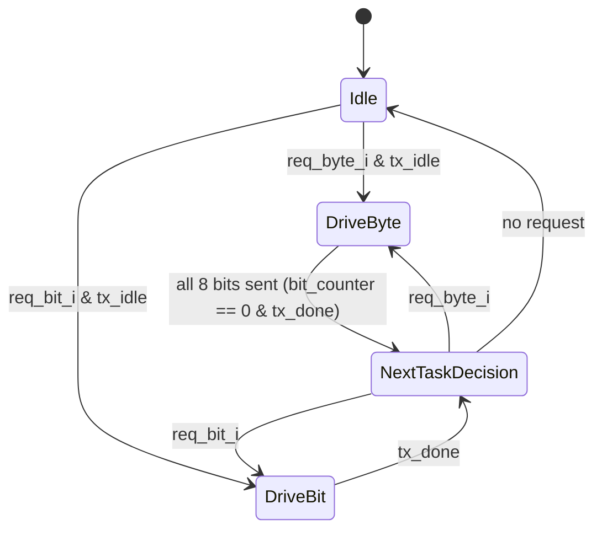
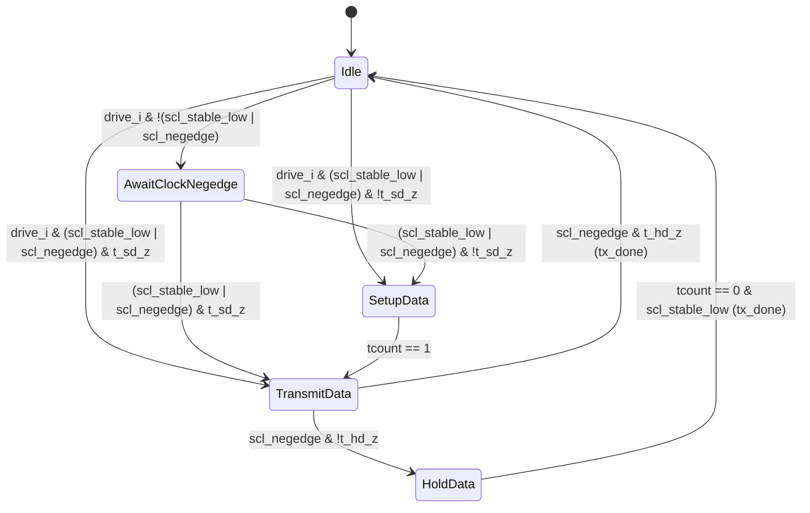

# Module: bus_tx_flow + bus_tx

> Status: Reuse
> Reference: `i3c-core/src/ctrl/bus_tx_flow.sv` (214 lines) + `i3c-core/src/ctrl/bus_tx.sv` (202 lines)
> Estimated LoC: ~400 lines (combined)

## 1. Purpose

The TX flow module serializes byte-level and bit-level data onto the SDA bus line, synchronized to the SCL clock. It is the primary data output path for the controller.

The module is split into two layers:

- **`bus_tx_flow`** — High-level FSM that manages byte/bit request arbitration, bit counting, and shift register
- **`bus_tx`** — Low-level timing engine that drives a single bit onto SDA with correct setup/hold timing relative to SCL edges

## 2. Dependencies

### Sub-modules

- `bus_tx` — Instantiated by `bus_tx_flow` as `xbus_tx`

### Parent modules

- `controller_active` (via `ccc` and `flow_active` control signals)

### Packages

- None (standalone)

## 3. Parameters

None.

## 4. Ports / Interfaces

### bus_tx_flow (Top-Level TX Interface)

#### Clock and Reset

| Signal   | Direction | Width | Description            |
| -------- | --------- | ----- | ---------------------- |
| `clk_i`  | Input     | 1     | System clock           |
| `rst_ni` | Input     | 1     | Active-low async reset |

#### Timing Configuration

| Signal       | Direction | Width | Description                    |
| ------------ | --------- | ----- | ------------------------------ |
| `t_r_i`      | Input     | 20    | Rise time (clock cycles)       |
| `t_su_dat_i` | Input     | 20    | Data setup time (clock cycles) |
| `t_hd_dat_i` | Input     | 20    | Data hold time (clock cycles)  |

#### Bus Events (from bus_monitor)

| Signal             | Direction | Width | Description             |
| ------------------ | --------- | ----- | ----------------------- |
| `scl_negedge_i`    | Input     | 1     | SCL falling edge        |
| `scl_posedge_i`    | Input     | 1     | SCL rising edge         |
| `scl_stable_low_i` | Input     | 1     | SCL stable in LOW state |

#### Request Interface (from flow_active / ccc)

| Signal          | Direction | Width | Description                               |
| --------------- | --------- | ----- | ----------------------------------------- |
| `req_byte_i`    | Input     | 1     | Request to transmit a full byte           |
| `req_bit_i`     | Input     | 1     | Request to transmit a single bit          |
| `req_value_i`   | Input     | 8     | Byte value (byte mode) or bit in [0]      |
| `bus_tx_done_o` | Output    | 1     | Pulse: transmission complete              |
| `bus_tx_idle_o` | Output    | 1     | TX flow is idle and ready                 |
| `req_error_o`   | Output    | 1     | Error: both req_byte and req_bit asserted |
| `bus_error_o`   | Output    | 1     | Bus error (currently tied to '0)          |

#### OD/PP Pass-through

| Signal        | Direction | Width | Description                |
| ------------- | --------- | ----- | -------------------------- |
| `sel_od_pp_i` | Input     | 1     | OD/PP mode from controller |
| `sel_od_pp_o` | Output    | 1     | Pass-through to bus driver |

#### Bus Output

| Signal  | Direction | Width | Description      |
| ------- | --------- | ----- | ---------------- |
| `sda_o` | Output    | 1     | SDA drive output |

### bus_tx (Low-Level Bit Driver)

#### Clock and Reset

Same as `bus_tx_flow`.

#### Timing Configuration

Same as `bus_tx_flow`.

#### Drive Interface (from bus_tx_flow)

| Signal          | Direction | Width | Description                      |
| --------------- | --------- | ----- | -------------------------------- |
| `drive_i`       | Input     | 1     | Enable bit transmission          |
| `drive_value_i` | Input     | 1     | Bit value to drive on SDA        |
| `tx_idle_o`     | Output    | 1     | Bit driver is idle               |
| `tx_done_o`     | Output    | 1     | Pulse: bit transmission complete |

#### Bus Events

Same as `bus_tx_flow` (passed through).

#### OD/PP and Bus Output

Same as `bus_tx_flow` (passed through).

## 5. Functional Description

### 5.1. bus_tx_flow FSM



**State outputs:**

| State            | bus_tx_idle | bus_tx_done | bit_counter_en | drive_bit_value     |
| ---------------- | ----------- | ----------- | -------------- | ------------------- |
| Idle             | tx_idle     | 0           | 0              | req_byte? [7] : [0] |
| DriveByte        | 0           | on last bit | 1              | req_value[7] (MSB)  |
| DriveBit         | 0           | on tx_done  | 0              | req_value[0] (LSB)  |
| NextTaskDecision | 0           | 0           | 0              | req_value_i[0]      |

**Request protocol:**

1. Assert `req_byte_i` or `req_bit_i` (never both simultaneously)
2. Set `req_value_i` to the byte/bit value
3. Hold request signals until `bus_tx_done_o` pulses
4. Then either deassert for idle, or change to next request immediately

**Byte transmission:** The `bit_counter` starts at 7 and decrements on each `tx_done`. A shift register shifts `req_value` left after each bit. When `bit_counter` reaches 0 and `tx_done` fires, `bus_tx_done` is asserted.

**Error detection:** If both `req_byte_i` and `req_bit_i` are asserted simultaneously:

```systemverilog
assign reqs = {req_byte_i, req_bit_i};
assign req_error = ~(~|(reqs & (reqs - 1)));  // More than one bit set
```

On error, the FSM returns to Idle.

### 5.2. bus_tx FSM (Bit-Level Timing Engine)



**Timing sequence for one bit:**

```
SCL: _____|‾‾‾‾‾‾‾‾‾|_________
SDA: XXXXX|==VALID===|XXXXXXXXX
     ^    ^          ^         ^
     |    |          |         |
     |    |          |         HoldData ends (tx_done)
     |    |          SCL negedge → HoldData
     |    SetupData ends → TransmitData
     SCL negedge → SetupData (load t_sd = t_r + t_su_dat)
```

**Timing counter (`tcount`):**

| Selection    | Load Value           | Purpose                     |
| ------------ | -------------------- | --------------------------- |
| `tSetupData` | `t_r_i + t_su_dat_i` | Setup time before SCL rises |
| `tHoldData`  | `t_hd_dat_i` (min 1) | Hold time after SCL falls   |
| `tNoDelay`   | 1                    | Minimum delay               |

**SDA output logic:**

- `Idle`: HIGH (pull-up default) unless `drive_i` and zero-delay
- `SetupData`: `drive_value_i` when `tcount == 1` (just before TransmitData)
- `TransmitData`: `drive_value_i` (stable during SCL HIGH period)
- `HoldData`: `drive_value_i` while `tcount > 0`, then release

## 6. Timing Requirements

| Aspect          | Requirement                                |
| --------------- | ------------------------------------------ |
| Data setup time | `t_su_dat_i` cycles before SCL rising edge |
| Data hold time  | `t_hd_dat_i` cycles after SCL falling edge |
| Bit rate        | One bit per SCL cycle                      |
| Byte transfer   | 8 SCL cycles per byte (MSB first)          |

## 7. Changes from Reference Design

| Aspect                  | Reference                 | This Design                                                    |
| ----------------------- | ------------------------- | -------------------------------------------------------------- |
| One-hot check (line 73) | `~(~\|(reqs & (reqs-1)))` | Keep as-is (functionally correct for 2 signals; comment added) |
| `bus_error_o`           | Tied to `'0` (TODO)       | Keep as `'0` initially; errors detected at flow_active level   |
| `sel_od_pp` handling    | Pass-through only         | Same (pass-through)                                            |

## 8. Error Handling

| Error        | Detection                            | Action                            |
| ------------ | ------------------------------------ | --------------------------------- |
| Dual request | `req_byte_i & req_bit_i` both HIGH   | `req_error_o` = 1, return to Idle |
| Abort        | `~req` (request deasserted)          | Return to Idle                    |
| Bus error    | Not implemented (`bus_error_o = '0`) | Future enhancement                |

## 9. Test Plan

### Scenarios

1. **Single byte TX:** Request byte 0xA5; verify MSB-first serialization on SDA (1,0,1,0,0,1,0,1)
2. **Single bit TX:** Request bit value 0; verify SDA driven LOW for one SCL cycle
3. **T-bit after byte:** Transmit byte → immediately transmit 1 bit (parity); verify continuous operation through NextTaskDecision
4. **Back-to-back bytes:** Request byte1 → byte2 without returning to Idle; verify seamless transition
5. **Timing verification:** Measure SDA transitions relative to SCL edges; verify t_su_dat and t_hd_dat compliance
6. **Request error:** Assert both req_byte and req_bit; verify req_error_o and return to Idle
7. **Abort mid-byte:** Deassert request during byte 5th bit; verify immediate return to Idle
8. **Zero-delay timing:** Set t_r=0, t_su_dat=0; verify immediate data setup
9. **OD/PP pass-through:** Verify sel_od_pp_o tracks sel_od_pp_i
10. **Idle state:** Verify SDA is HIGH and bus_tx_idle_o is asserted when no request

### UVM Test Structure

```
verification/uvm/
  tb_top.sv                    # DUT instantiation + clock/reset generation
  i3c_if.sv                    # SystemVerilog interface (SCL, SDA, register bus)
  i3c_env.sv                   # UVM environment (agent + scoreboard + coverage)
  i3c_agent.sv                 # UVM agent (sequencer + driver + monitor)
  i3c_driver.sv                # Drives SCL/SDA and register bus
  i3c_monitor.sv               # Samples bus transactions
  i3c_scoreboard.sv            # Checks responses vs expected
  i3c_coverage.sv              # Functional coverage groups
  sequences/
    i3c_base_seq.sv
    i3c_entdaa_seq.sv
    i3c_private_write_seq.sv
    i3c_private_read_seq.sv
    i3c_i2c_write_seq.sv
    i3c_enec_disec_seq.sv
  tests/
    i3c_base_test.sv
    i3c_entdaa_test.sv
    i3c_private_rw_test.sv
    i3c_i2c_test.sv
    i3c_error_test.sv
```

**Module coverage note:** `bus_tx_flow` is exercised by `i3c_private_rw_test` (address + write data transmission), `i3c_entdaa_test` (broadcast header + CCC code + dynamic address), and `i3c_i2c_test` (I2C address + data bytes in OD mode).

## 10. Implementation Notes

- The `bus_tx_flow` module drives `bus_tx` via `drive_bit_en` and `drive_bit_value`. The naming in the reference (`drive_i` / `drive_value_i`) is the bus_tx port names; the flow module maps to these.
- When transmitting a byte, the shift register shifts left on each `tx_done`, exposing the next MSB at position [7].
- The `NextTaskDecision` state allows zero-overhead transition between byte and bit requests without returning to Idle.
- The `bus_tx` module's `sda_o` defaults to HIGH (pull-up) — this is the idle/release state for open-drain signaling.
- The OD/PP signal passes through both modules unchanged — the actual driving behavior depends on the external pad/driver configuration.
