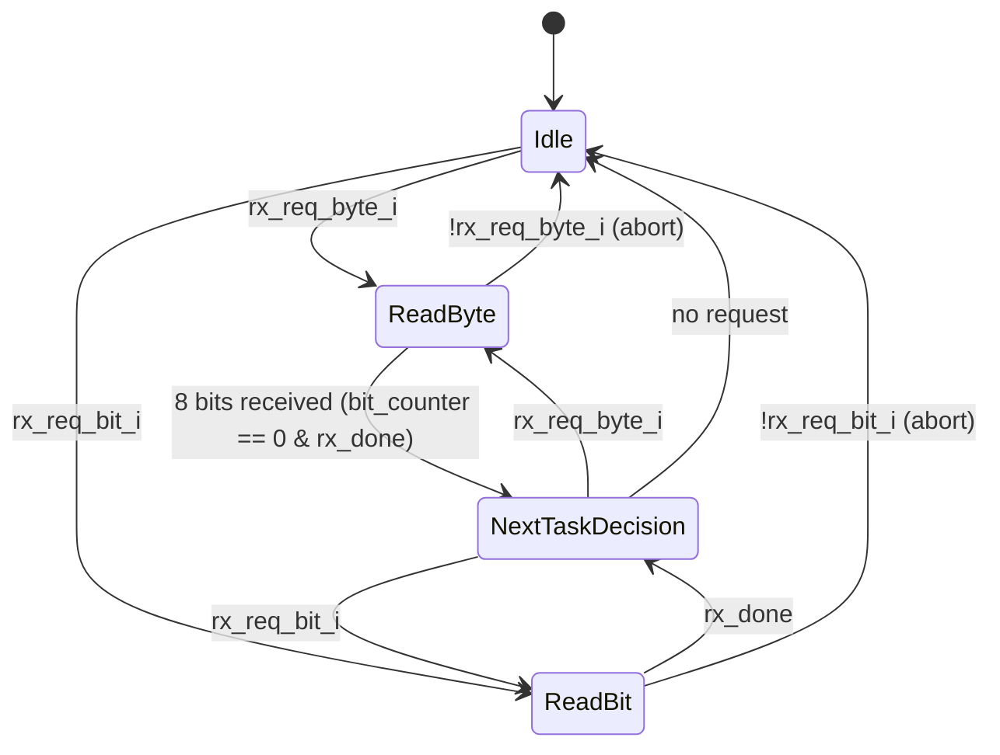

# Module: bus_rx_flow

> Status: Reuse
> Reference: `i3c-core/src/ctrl/bus_rx_flow.sv` (169 lines)
> Estimated LoC: ~170 lines

## 1. Purpose

The RX flow module deserializes data from the SDA bus line into bytes and individual bits, synchronized to SCL positive edges. It is the primary data input path for the controller — used for reading target ACK/NACK responses, receiving data bytes during Private Read transfers, and reading PID/BCR/DCR during ENTDAA.

## 2. Dependencies

### Sub-modules

- None (single-module implementation, unlike TX which has bus_tx sub-module)

### Parent modules

- `controller_active` (via `ccc` and `flow_active` control signals)

### Packages

- None (standalone)

## 3. Parameters

None.

## 4. Ports / Interfaces

### Clock and Reset

| Signal   | Direction | Width | Description            |
| -------- | --------- | ----- | ---------------------- |
| `clk_i`  | Input     | 1     | System clock           |
| `rst_ni` | Input     | 1     | Active-low async reset |

### Bus Events (from bus_monitor)

| Signal              | Direction | Width | Description     |
| ------------------- | --------- | ----- | --------------- |
| `scl_posedge_i`     | Input     | 1     | SCL rising edge |
| `scl_stable_high_i` | Input     | 1     | SCL stable HIGH |

### Bus Data Input

| Signal  | Direction | Width | Description               |
| ------- | --------- | ----- | ------------------------- |
| `sda_i` | Input     | 1     | Synchronized SDA from PHY |

### Request Interface (from flow_active / ccc)

| Signal          | Direction | Width | Description                        |
| --------------- | --------- | ----- | ---------------------------------- |
| `rx_req_bit_i`  | Input     | 1     | Request to receive a single bit    |
| `rx_req_byte_i` | Input     | 1     | Request to receive a full byte     |
| `rx_data_o`     | Output    | 8     | Received data (byte or bit in [0]) |
| `rx_done_o`     | Output    | 1     | Pulse: reception complete          |
| `rx_idle_o`     | Output    | 1     | RX flow is idle and ready          |

## 5. Functional Description

### 5.1. FSM States



### 5.2. State Transitions

| Current State      | Condition                 | Next State         |
| ------------------ | ------------------------- | ------------------ |
| `Idle`             | `rx_req_byte_i`           | `ReadByte`         |
| `Idle`             | `rx_req_bit_i`            | `ReadBit`          |
| `Idle`             | neither                   | `Idle`             |
| `ReadByte`         | `!rx_req_byte_i`          | `Idle` (abort)     |
| `ReadByte`         | `rx_done_o` (8 bits done) | `NextTaskDecision` |
| `ReadBit`          | `!rx_req_bit_i`           | `Idle` (abort)     |
| `ReadBit`          | `rx_done` (1 bit done)    | `NextTaskDecision` |
| `NextTaskDecision` | `rx_req_byte_i`           | `ReadByte`         |
| `NextTaskDecision` | `rx_req_bit_i`            | `ReadBit`          |
| `NextTaskDecision` | neither                   | `Idle`             |

Global abort: if `~req` (neither request asserted), always transition to `Idle`.

### 5.3. Output Logic

| State              | rx_idle_o | rx_done_o                   | rx_bit_en | bit_counter_en |
| ------------------ | --------- | --------------------------- | --------- | -------------- |
| `Idle`             | 1         | 0                           | 0         | 0              |
| `ReadByte`         | 0         | 1 when counter==0 & rx_done | ~rx_done  | 1              |
| `ReadBit`          | 0         | 1 when rx_done              | ~rx_done  | 0              |
| `NextTaskDecision` | 0         | 0                           | req       | 0              |

### 5.4. Bit Sampling

Bits are sampled on SCL positive edge:

```systemverilog
always_ff @(posedge clk_i or negedge rst_ni) begin
  if (~rst_ni) begin
    rx_done <= '0;
    rx_bit  <= '0;
  end else begin
    if (rx_bit_en & scl_posedge_i) begin
      rx_done <= 1'b1;
      rx_bit  <= sda_i;
    end else begin
      rx_done <= '0;
      rx_bit  <= '0;
    end
  end
end
```

Key: `rx_bit_en` gates sampling. It is asserted when the FSM is in ReadByte/ReadBit and `rx_done` has not yet fired for the current bit.

### 5.5. Byte Assembly

Bits are assembled MSB-first using a 7-bit shift register:

```systemverilog
always_ff @(posedge clk_i or negedge rst_ni) begin
  if (~rst_ni) begin
    rx_data <= '0;
  end else begin
    if (bit_counter_en) begin
      if (rx_done) rx_data[6:0] <= {rx_data[5:0], sda_i};
    end else begin
      rx_data <= '0;
    end
  end
end
```

The bit counter starts at 7 and decrements on each `rx_done`. When it reaches 0, the full byte is assembled.

### 5.6. Output Data Multiplexing

```systemverilog
always_comb begin
  if (rx_req_bit_i) begin
    rx_data_o = {7'b0, rx_bit};  // Single bit in LSB
  end else begin
    rx_data_o = {rx_data[6:0], sda_i};  // Full byte (combinational last bit)
  end
end
```

Note: The output uses combinational `sda_i` for the last bit to avoid an extra cycle of latency. The 7-bit shift register holds bits [7:1], and `sda_i` provides bit [0] at the moment `rx_done_o` fires.

## 6. Timing Requirements

| Aspect        | Requirement                               |
| ------------- | ----------------------------------------- |
| Sampling edge | SDA sampled on SCL positive edge          |
| Bit order     | MSB first (bit [7] received first)        |
| Byte rate     | 8 SCL cycles per byte                     |
| Output valid  | `rx_data_o` valid when `rx_done_o` pulses |

## 7. Changes from Reference Design

| Aspect                     | Reference                                                   | This Design                                                                                              |
| -------------------------- | ----------------------------------------------------------- | -------------------------------------------------------------------------------------------------------- |
| `rx_req_bit` latch         | Stored in FF but uses `rx_req_bit_i` directly in output mux | Keep as-is (registered copy used in FSM transitions, direct input used for output — consistent behavior) |
| Assertion `RxBitAndByte_A` | Uses `` `I3C_ASSERT `` macro                                | Replace with standard `assert` or SVA                                                                    |
| `scl_stable_high_i`        | Port exists but unused internally                           | Keep port for interface consistency                                                                      |

## 8. Error Handling

| Error            | Detection                                  | Action                  |
| ---------------- | ------------------------------------------ | ----------------------- |
| Simultaneous req | `rx_req_bit_i & rx_req_byte_i`             | Assertion (design rule) |
| Abort            | Request deasserted during reception        | Return to Idle          |
| Parity error     | NOT detected here — checked by flow_active | N/A                     |

The module does not validate parity or T-bit semantics. It simply delivers raw received data. Parity checking is the responsibility of `flow_active` or `ccc`.

## 9. Test Plan

### Scenarios

1. **Single byte RX:** Drive 8 bits on SDA (0xA5 = 10100101); verify `rx_data_o == 0xA5` and `rx_done_o` pulses after 8th SCL posedge
2. **Single bit RX (ACK):** Drive SDA=0; verify `rx_data_o[0] == 0` (ACK)
3. **Single bit RX (NACK):** Drive SDA=1; verify `rx_data_o[0] == 1` (NACK)
4. **Back-to-back bytes:** Receive byte1 → byte2 without returning to Idle; verify seamless transition through NextTaskDecision
5. **Byte then bit (T-bit):** Receive 8-bit byte → 1 bit T-bit; verify correct data for both
6. **MSB-first order:** Drive bits 1,0,1,0,0,1,0,1 sequentially; verify assembled byte is 0xA5 (not 0xA5 reversed)
7. **Abort mid-byte:** Deassert `rx_req_byte_i` after 4 bits; verify return to Idle and `rx_data` reset
8. **Idle assertion:** Verify `rx_idle_o == 1` when in Idle state, `== 0` otherwise
9. **SCL edge alignment:** Verify that SDA is sampled at the exact cycle of `scl_posedge_i` assertion

### cocotb Test Structure

```
tests/
  test_bus_rx/
    test_bus_rx_flow.py
    Makefile
```

## 10. Implementation Notes

- Unlike `bus_tx_flow` which has a sub-module (`bus_tx`) for bit-level timing, `bus_rx_flow` is self-contained. RX is simpler because the controller only needs to sample on SCL posedge — there are no setup/hold timing concerns on the receive side.
- The `scl_stable_high_i` port exists in the interface but is not used in the current implementation. It is kept for forward compatibility (could be used for clock stretching detection in future).
- The `rx_req_bit` FF (line 31-37 in reference) registers the bit request but the FSM transition uses the registered copy while the output mux uses the direct input. This is intentional — the registered copy provides a stable signal for FSM decisions while the direct input ensures the output mux reflects the current request type.
- The assertion `` `I3C_ASSERT(RxBitAndByte_A, ~rx_req_bit_i | ~rx_req_byte_i) `` should be replaced with a standard SystemVerilog assertion since we don't use the Caliptra assertion macros.
