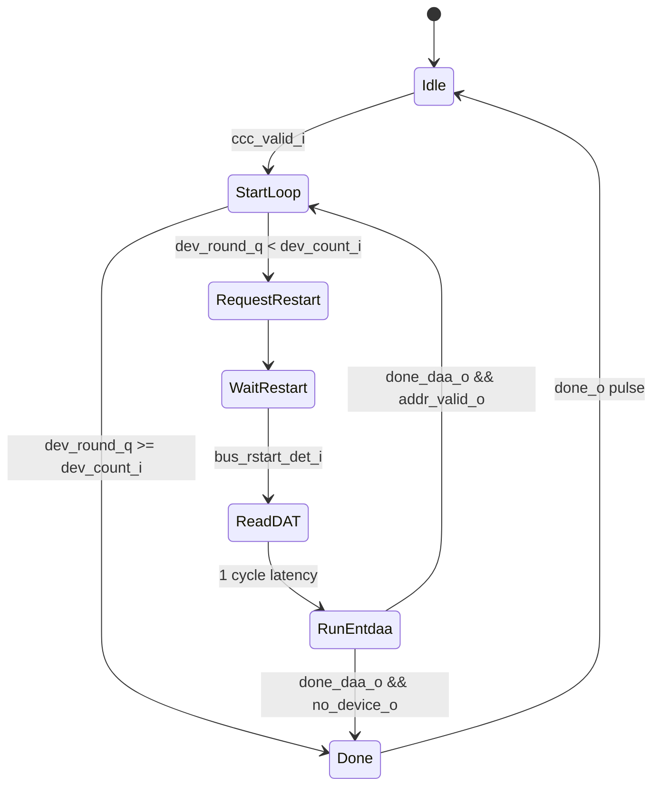
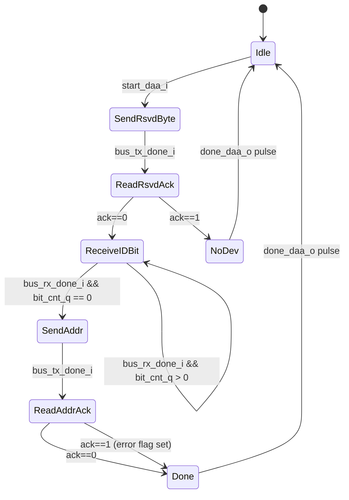

# Module: entdaa_controller + entdaa_fsm (ENTDAA Engine)

> Status: Implement (New design — master-only)
> Reference: `i3c-core/src/ctrl/ccc.sv` (1,406 lines, target-side) + `i3c-core/src/ctrl/ccc_entdaa.sv` (238 lines, target-side)
> **Important:** Both reference modules live in `controller_standby_i3c.sv` and implement the **target (standby) perspective**. They are not used by `controller_active` at all. This design creates master-only equivalents from scratch.
> Estimated LoC: ~270 lines (combined)

## 1. Purpose

The `entdaa_controller` + `entdaa_fsm` pair implements the master-side **ENTDAA (Enter Dynamic Address Assignment)** procedure, the only CCC requiring a dedicated sub-FSM.

**ENEC (0x00/0x80) and DISEC (0x01/0x81) are handled entirely by `flow_active`** via the `I3CWriteImmediate` state using `ImmediateDataTransfer` command descriptors (`cp=1`, CCC code in `cmd`, defining byte in `def_or_data_byte1`). They do not go through this module.

The split of responsibilities:

| Module               | Role                                                                                                    |
| -------------------- | ------------------------------------------------------------------------------------------------------- |
| `entdaa_controller`  | ENTDAA loop manager: multi-device iteration, DAT lookup, bus mux                                        |
| `entdaa_fsm`         | Per-device ENTDAA round: sends `0x7E+R`, reads 64 raw PID/BCR/DCR bits, sends address+parity, reads ACK |

## 2. Dependencies

### Sub-modules

- `entdaa_fsm` — Instantiated by `entdaa_controller`

### Parent modules

- `controller_active` (connects to `bus_tx_flow`, `bus_rx_flow`, `bus_monitor`, and `flow_active`)

### Packages

- `controller_pkg` — For `dat_entry_t` (to extract `dynamic_address` field)
- `i3c_pkg` — For `I3C_RSVD_ADDR` (7'h7E), `I3C_RSVD_BYTE` (8'hFC)

## 3. Parameters

| Parameter  | Type | Default | Description                                          |
| ---------- | ---- | ------- | ---------------------------------------------------- |
| `DatDepth` | int  | 16      | DAT table depth (inherited from `i3c_pkg::DatDepth`) |

## 4. Ports / Interfaces

### 4.1. entdaa_controller (ENTDAA Loop Manager)

#### Clock and Reset

| Signal   | Direction | Width | Description            |
| -------- | --------- | ----- | ---------------------- |
| `clk_i`  | Input     | 1     | System clock           |
| `rst_ni` | Input     | 1     | Active-low async reset |

#### Command Interface (from flow_active)

| Signal        | Direction | Width | Description                                                               |
| ------------- | --------- | ----- | ------------------------------------------------------------------------- |
| `daa_valid_i` | Input     | 1     | Assert to start ENTDAA; held high until `done_o`                          |
| `dev_count_i` | Input     | 4     | Number of devices to address (from `addr_assign_desc_t.dev_count`)        |
| `dev_idx_i`   | Input     | 5     | Starting DAT index for address lookup (from `addr_assign_desc_t.dev_idx`) |
| `done_o`      | Output    | 1     | ENTDAA execution complete (all devices addressed or no device responded)  |

#### Repeated-Start Request (to flow_active)

| Signal          | Direction | Width | Description                                               |
| --------------- | --------- | ----- | --------------------------------------------------------- |
| `req_restart_o` | Output    | 1     | Pulse: request `flow_active` to issue Repeated START (Sr) |

#### Bus TX Interface (to bus_tx_flow)

| Signal               | Direction | Width | Description                                       |
| -------------------- | --------- | ----- | ------------------------------------------------- |
| `bus_tx_done_i`      | Input     | 1     | TX completed current request                      |
| `bus_tx_idle_i`      | Input     | 1     | TX is idle                                        |
| `bus_tx_req_byte_o`  | Output    | 1     | Request byte transmission                         |
| `bus_tx_req_bit_o`   | Output    | 1     | Unused; tied `0` (ENTDAA uses byte-level TX only) |
| `bus_tx_req_value_o` | Output    | 8     | Value to transmit                                 |
| `bus_tx_sel_od_pp_o` | Output    | 1     | Always `0` (Open-Drain) during ENTDAA             |

#### Bus RX Interface (to bus_rx_flow)

| Signal              | Direction | Width | Description                                            |
| ------------------- | --------- | ----- | ------------------------------------------------------ |
| `bus_rx_data_i`     | Input     | 8     | Received data (only bit [0] used for single-bit reads) |
| `bus_rx_done_i`     | Input     | 1     | RX completed current request                           |
| `bus_rx_req_bit_o`  | Output    | 1     | Request single-bit reception                           |
| `bus_rx_req_byte_o` | Output    | 1     | Request byte reception (unused; tied `0`)              |

#### Bus Monitor Interface

| Signal             | Direction | Width | Description             |
| ------------------ | --------- | ----- | ----------------------- |
| `bus_start_det_i`  | Input     | 1     | START detected          |
| `bus_rstart_det_i` | Input     | 1     | Repeated START detected |
| `bus_stop_det_i`   | Input     | 1     | STOP detected           |

#### DAT Read Port (to csr_registers)

| Signal             | Direction | Width              | Description                              |
| ------------------ | --------- | ------------------ | ---------------------------------------- |
| `dat_read_valid_o` | Output    | 1                  | Request DAT read (1-cycle pulse)         |
| `dat_index_o`      | Output    | `$clog2(DatDepth)` | DAT entry index: `dev_idx_i + dev_round` |
| `dat_rdata_i`      | Input     | 32                 | DAT entry (`dat_entry_t`)                |

#### DAA Outputs (to flow_active)

| Signal                | Direction | Width | Description                             |
| --------------------- | --------- | ----- | --------------------------------------- |
| `daa_address_o`       | Output    | 7     | Dynamic address just assigned           |
| `daa_address_valid_o` | Output    | 1     | Pulse: one valid assignment captured    |
| `daa_pid_o`           | Output    | 48    | Provisioned ID received from the target |
| `daa_bcr_o`           | Output    | 8     | BCR received from the target            |
| `daa_dcr_o`           | Output    | 8     | DCR received from the target            |

---

### 4.2. entdaa_fsm (Per-Device ENTDAA Round)

#### Clock and Reset

| Signal   | Direction | Width | Description            |
| -------- | --------- | ----- | ---------------------- |
| `clk_i`  | Input     | 1     | System clock           |
| `rst_ni` | Input     | 1     | Active-low async reset |

#### DAA Control (from entdaa_controller)

| Signal         | Direction | Width | Description                                                    |
| -------------- | --------- | ----- | -------------------------------------------------------------- |
| `start_daa_i`  | Input     | 1     | Pulse: start one ENTDAA device round                           |
| `daa_addr_i`   | Input     | 7     | Dynamic address to assign, from DAT entry                      |
| `done_daa_o`   | Output    | 1     | Pulse: round complete (check `addr_valid_o` or `no_device_o`)  |
| `addr_valid_o` | Output    | 1     | High with `done_daa_o`: address was accepted (ACK)             |
| `no_device_o`  | Output    | 1     | High with `done_daa_o`: no target responded (NACK on `0x7E+R`) |

#### Received Device Information (to entdaa_controller)

| Signal  | Direction | Width | Description                           |
| ------- | --------- | ----- | ------------------------------------- |
| `pid_o` | Output    | 48    | Provisioned ID shifted in (MSB first) |
| `bcr_o` | Output    | 8     | Bus Characteristics Register          |
| `dcr_o` | Output    | 8     | Device Characteristics Register       |

#### Bus TX Interface

| Signal               | Direction | Width | Description                  |
| -------------------- | --------- | ----- | ---------------------------- |
| `bus_tx_done_i`      | Input     | 1     | TX completed current request |
| `bus_tx_req_byte_o`  | Output    | 1     | Request byte transmission    |
| `bus_tx_req_bit_o`   | Output    | 1     | Unused; tied `0`             |
| `bus_tx_req_value_o` | Output    | 8     | Byte value to transmit       |
| `bus_tx_sel_od_pp_o` | Output    | 1     | Always `0` (Open-Drain)      |

#### Bus RX Interface

| Signal              | Direction | Width | Description                  |
| ------------------- | --------- | ----- | ---------------------------- |
| `bus_rx_data_i`     | Input     | 8     | `[0]` = single received bit  |
| `bus_rx_done_i`     | Input     | 1     | RX completed                 |
| `bus_rx_req_bit_o`  | Output    | 1     | Request single-bit reception |
| `bus_rx_req_byte_o` | Output    | 1     | Unused; tied `0`             |

#### Bus Monitor Interface

| Signal           | Direction | Width | Description           |
| ---------------- | --------- | ----- | --------------------- |
| `bus_stop_det_i` | Input     | 1     | STOP detected (abort) |

## 5. Functional Description

### 5.1. Division of Work with flow_active

`flow_active` performs the opening frame and final STOP; `entdaa_controller` owns the multi-device loop:

```
flow_active:  [S]  [0x7E+W]  [ACK]  [0x07]  [ACK]
              ^^^  open-drain broadcast header + ENTDAA code
              → then sets ccc_valid_o=1, ccc_dev_count_o, ccc_dev_idx_o

entdaa_controller (per round):
              →  pulse req_restart_o  →  flow_active drives [Sr]
              →  wait bus_rstart_det_i
              →  read DAT[dev_idx + round].dynamic_address
              →  start entdaa_fsm round

  entdaa_fsm:   [0x7E+R]  [ACK/NoDev]  [64 raw bits]  [Addr+P]  [ACK]

              → if addr_valid_o: latch PID/BCR/DCR, pulse daa_address_valid_o
              → if no_device_o:  all devices assigned, exit loop

flow_active:  [P]  ← STOP on done_o
```

**Why raw bits?** The 64-bit PID+BCR+DCR are received bit-by-bit because per-target arbitration happens simultaneously across all unaddressed targets. There are no byte boundaries, T-bits, or framing — the master reads 64 individual `bus_rx_req_bit` cycles.

### 5.2. entdaa_controller FSM (Loop Manager) — 7 States

```systemverilog
typedef enum logic [2:0] {
  Idle           = 3'd0,
  StartLoop      = 3'd1,
  RequestRestart = 3'd2,
  WaitRestart    = 3'd3,
  ReadDAT        = 3'd4,
  RunEntdaa      = 3'd5,
  Done           = 3'd6
} ccc_state_e;
```



#### State Descriptions

**Idle:** Wait for `ccc_valid_i`. On entry, clear `dev_round_q` counter.

**StartLoop:** Check `dev_round_q < dev_count_i`. Route to `RequestRestart` to run the next device, or to `Done` when all `dev_count_i` devices have been addressed.

**RequestRestart:** Assert `req_restart_o` for one cycle. `flow_active` receives this and drives `gen_rstart_o` to the SCL generator, which generates the Sr bus condition.

**WaitRestart:** Deassert `req_restart_o`. Hold until `bus_rstart_det_i` confirms Sr was emitted. Simultaneously assert `dat_read_valid_o` and `dat_index_o = dev_idx_i + dev_round_q` so the DAT read arrives before entdaa_fsm begins.

**ReadDAT:** Capture `dat_rdata_i` into `dat_entry_t`. Extract `dynamic_address[22:16]` as `daa_addr_next`. Advance to `RunEntdaa` after one cycle.

**RunEntdaa:** Assert `start_daa_i` and provide `daa_addr_i`. Wait for `done_daa_o` from `entdaa_fsm`.

- If `addr_valid_o`: latch `pid_o`, `bcr_o`, `dcr_o`; pulse `daa_address_valid_o` and `daa_address_o`; increment `dev_round_q`; return to `StartLoop`.
- If `no_device_o`: no more responsive targets; go to `Done` immediately regardless of remaining count.

**Done:** Assert `done_o` for one cycle. Return to `Idle`.

On `bus_stop_det_i` in any active state: forced transition to `Done` (synchronous override in the FF block).

---

### 5.3. entdaa_fsm FSM (Per-Device Round) — 8 States

```systemverilog
typedef enum logic [2:0] {
  Idle           = 3'd0,
  SendRsvdByte   = 3'd1,
  ReadRsvdAck    = 3'd2,
  ReceiveIDBit   = 3'd3,
  SendAddr       = 3'd4,
  ReadAddrAck    = 3'd5,
  Done           = 3'd6,
  NoDev          = 3'd7
} entdaa_state_e;
```



#### State Descriptions

**Idle:** Wait for `start_daa_i`. On entry reset `bit_cnt_q` to 63 and clear `id_shift_q`.

**SendRsvdByte:** Transmit the reserved address with read bit:

```systemverilog
bus_tx_req_byte_o  = 1'b1;
bus_tx_req_value_o = {I3C_RSVD_ADDR, 1'b1};  // 8'hFD
bus_tx_sel_od_pp_o = 1'b0;                    // Open-Drain
```

Advance to `ReadRsvdAck` when `bus_tx_done_i`.

**ReadRsvdAck:** Request one bit read (`bus_rx_req_bit_o = 1`). When `bus_rx_done_i`:

- `bus_rx_data_i[0] == 0` (ACK) → at least one target responded → `ReceiveIDBit`
- `bus_rx_data_i[0] == 1` (NACK) → no target on bus → `NoDev`

**ReceiveIDBit:** Read one bit per cycle (`bus_rx_req_bit_o = 1`). Shift into `id_shift_q`:

```systemverilog
id_shift_q <= {id_shift_q[62:0], bus_rx_data_i[0]};
bit_cnt_q  <= bit_cnt_q - 1;
```

When `bit_cnt_q` reaches 0, all 64 bits (PID[47:0] = `id_shift_q[63:16]`, BCR = `id_shift_q[15:8]`, DCR = `id_shift_q[7:0]`) are captured. Advance to `SendAddr`.

**SendAddr:** Compute odd parity over 7 address bits:

```systemverilog
parity = ~^daa_addr_i;   // odd parity: XOR of all bits, then invert
bus_tx_req_byte_o  = 1'b1;
bus_tx_req_value_o = {daa_addr_i, parity};
bus_tx_sel_od_pp_o = 1'b0;
```

Advance to `ReadAddrAck` when `bus_tx_done_i`.

**ReadAddrAck:** Read one bit (`bus_rx_req_bit_o = 1`). When `bus_rx_done_i`:

- `bus_rx_data_i[0] == 0` → target accepted address → `Done` with `addr_valid = 1`
- `bus_rx_data_i[0] == 1` → target rejected address → `Done` with `addr_valid = 0`

Both cases go to `Done`; the error flag distinguishes them for the parent `entdaa_controller` module.

**Done:** Outputs are valid for one cycle:

```systemverilog
done_daa_o  = 1'b1;
addr_valid_o = addr_valid_q;
no_device_o  = 1'b0;
pid_o        = id_shift_q[63:16];
bcr_o        = id_shift_q[15:8];
dcr_o        = id_shift_q[7:0];
```

Return to `Idle` next cycle.

**NoDev:** No target responded:

```systemverilog
done_daa_o   = 1'b1;
no_device_o  = 1'b1;
addr_valid_o = 1'b0;
```

Return to `Idle` next cycle.

On `bus_stop_det_i` in any non-Idle state: synchronous override → `NoDev` (cleanly terminates the current round).

---

### 5.4. Bus TX/RX Multiplexing (in controller_active)

The `entdaa_controller` module takes exclusive control of `bus_tx_flow` and `bus_rx_flow` while `daa_valid_i` is high. `controller_active` implements a simple mux using `daa_valid_i` as the select signal (same pattern as the old design, but without the ENEC/DISEC branch):

```systemverilog
always_comb begin
  // ccc_active = ccc_valid_i held by flow_active during ENTDAA
  if (ccc_valid_i) begin
    tx_req_byte  = daa_tx_req_byte;   // always from entdaa_fsm submodule
    tx_req_bit   = daa_tx_req_bit;
    tx_req_value = daa_tx_req_value;
    tx_sel_od_pp = 1'b0;              // always OD during ENTDAA
    rx_req_bit   = ccc_rx_req_bit;
    rx_req_byte  = 1'b0;
  end else begin
    tx_req_byte  = flow_tx_req_byte;
    tx_req_bit   = flow_tx_req_bit;
    tx_req_value = flow_tx_req_value;
    tx_sel_od_pp = flow_sel_od_pp;
    rx_req_bit   = flow_rx_req_bit;
    rx_req_byte  = flow_rx_req_byte;
  end
end
```

The `entdaa_controller` module itself muxes between its own requests and `entdaa_fsm`'s requests:

```systemverilog
assign bus_tx_req_bit_o  = 1'b0;  // never used
assign bus_rx_req_byte_o = 1'b0;  // never used
assign bus_tx_sel_od_pp_o = 1'b0; // always Open-Drain

always_comb begin
  if (state_q == RunEntdaa) begin
    bus_tx_req_byte_o  = entdaa_tx_req_byte;
    bus_tx_req_value_o = entdaa_tx_req_value;
    bus_rx_req_bit_o   = entdaa_rx_req_bit;
  end else begin
    bus_tx_req_byte_o  = 1'b0;
    bus_tx_req_value_o = 8'h00;
    bus_rx_req_bit_o   = 1'b0;
  end
end
```

### 5.5. DAT Address Lookup

During `WaitRestart`, the `entdaa_controller` module issues a DAT read request. The `dat_entry_t` struct (from `controller_pkg`) provides the pre-configured dynamic address:

```systemverilog
// During WaitRestart:
dat_read_valid_o = 1'b1;
dat_index_o      = dev_idx_i + dev_round_q;  // saturate at DatDepth-1

// During ReadDAT (capture):
dat_entry_t entry;
assign entry = dat_entry_t'(dat_rdata_i);
daa_addr_next = entry.dynamic_address;  // bits [22:16]
```

Software must pre-populate DAT entries `[dev_idx .. dev_idx + dev_count - 1]` with the addresses to assign before issuing the ENTDAA command.

### 5.6. DAA Output Routing

`flow_active` receives DAA outputs to update the DAT:

```
entdaa_controller.daa_address_valid_o → flow_active.daa_address_valid_i
entdaa_controller.daa_address_o       → flow_active.daa_address_i
entdaa_controller.daa_pid_o           → flow_active.daa_pid_i
entdaa_controller.daa_bcr_o           → flow_active.daa_bcr_i
entdaa_controller.daa_dcr_o           → flow_active.daa_dcr_i
```

On each `daa_address_valid_i` pulse, `flow_active` forwards the PID/BCR/DCR and assigned address to the RX FIFO for software readback. No DAT write-back is required — SW pre-populates the dynamic addresses in the DAT before issuing the ENTDAA command.

## 6. Timing Requirements

| Aspect              | Requirement                                                                                                                     |
| ------------------- | ------------------------------------------------------------------------------------------------------------------------------- |
| Per-device round    | 2 bytes TX (`0x7E+R`, `Addr+P`) + 65 bit RX (ACK + 64 ID bits) = ~74 SCL cycles minimum                                         |
| DAT read latency    | 1 system clock cycle (registered synchronous read)                                                                              |
| Sr-to-`0x7E+R` gap  | DAT read (1 cycle) + `start_daa_i` → `SendRsvdByte` (1 cycle); SCL generator Sr takes many SCL cycles — no bus timing violation |
| No-device detection | NACK detected on the ACK bit after `0x7E+R` = 1 RX bit cycle                                                                    |
| Address parity      | Computed combinationally (`~^daa_addr_i`) in `SendAddr`                                                                         |

## 7. Changes from Reference Design

| Aspect                           | Reference (`i3c-core`)                                                                                                                                   | This Design                                                                                  |
| -------------------------------- | -------------------------------------------------------------------------------------------------------------------------------------------------------- | -------------------------------------------------------------------------------------------- |
| Location in design               | `controller_standby_i3c.sv` (target/standby path)                                                                                                        | `controller_active` (master path — new module)                                               |
| entdaa_controller.sv: CCCs handled | 40+ CCCs (23 FSM states, both broadcast and direct)                                                                                                      | ENTDAA only (7 FSM states)                                                                   |
| entdaa_controller.sv: perspective  | Target receives CCC commands from a master                                                                                                               | Master issues ENTDAA; manages per-device loop                                                |
| entdaa_fsm: perspective          | Target sends its own PID, receives assigned address                                                                                                      | Master receives PID/BCR/DCR, sends the address                                               |
| entdaa_fsm: states               | 13 states (Idle, WaitStart, ReceiveRsvdByte, AckRsvdByte, SendNack, SendID, PrepareIDBit, SendIDBit, LostArbitration, ReceiveAddr, AckAddr, Done, Error) | 8 states (Idle, SendRsvdByte, ReadRsvdAck, ReceiveIDBit, SendAddr, ReadAddrAck, Done, NoDev) |
| entdaa_fsm: `id_i/bcr_i/dcr_i`   | Inputs: target's own identity to send to master                                                                                                          | Removed (master does not send its identity)                                                  |
| entdaa_fsm: `arbitration_lost_i` | Target detects arbitration loss on SDA during PID transmission                                                                                           | Removed (master reads bus, arbitration is among targets)                                     |
| entdaa_fsm: `process_virtual_i`  | Caliptra virtual device support                                                                                                                          | Removed                                                                                      |
| entdaa_fsm: `address_o`          | Output: address received FROM master                                                                                                                     | Replaced by `daa_addr_i` (input: address TO assign)                                          |
| ENEC/DISEC                       | Full FSM dispatch in reference ccc.sv                                                                                                                    | Handled by `flow_active` (`I3CWriteImmediate` state)                                         |
| HDR mode                         | `ent_hdr_*` outputs, `is_in_hdr_mode_i`                                                                                                                  | Removed (SDR only)                                                                           |
| CSR side-effects                 | Extensive: MWL, MRL, DASA, AASA, RSTACT, GETCAPS, etc.                                                                                                   | Removed entirely                                                                             |
| DAT integration                  | None (controller_standby has no DAT write)                                                                                                               | Added: DAT read port for address lookup per round                                            |
| LoC (`entdaa_controller.sv`)     | 1,406 lines                                                                                                                                              | ~120 lines                                                                                   |
| LoC (`entdaa_fsm.sv`)            | 238 lines                                                                                                                                                | ~150 lines                                                                                   |

## 8. Error Handling

| Error                       | Detection                                        | Action                                                 |
| --------------------------- | ------------------------------------------------ | ------------------------------------------------------ |
| No target on bus (NoDev)    | NACK after `0x7E+R` (`bus_rx_data_i[0] == 1`)    | `no_device_o` pulse; `entdaa_controller` exits loop early; `done_o`  |
| Target rejects address      | NACK after `Addr+P` (`bus_rx_data_i[0] == 1`)    | `addr_valid_o = 0` in `Done`; `entdaa_controller` can skip DAT write |
| Unexpected STOP during loop | `bus_stop_det_i` in any active state             | `entdaa_fsm` → `NoDev`; `entdaa_controller` → `Done`   |
| dev_count exhausted         | `dev_round_q >= dev_count_i` in `StartLoop`      | Normal termination → `Done`                            |
| DAT index out of range      | SW must ensure `dev_idx + dev_count <= DatDepth` | No hardware check; SW responsibility                   |

Error status (`Nack`) is propagated to the response descriptor by `flow_active` when it detects that `ccc_done_i` fires but fewer devices were assigned than `dev_count_i`.

## 9. Test Plan

### Scenarios

1. **ENTDAA single device:** One target on bus; verify `0x7E+R` + 64 bits received + `Addr+P` sent + ACK read; check `daa_address_valid_o` pulse with correct PID/BCR/DCR
2. **ENTDAA multiple devices (sequential):** 3 targets assigned in 3 rounds; verify unique addresses and PID/BCR/DCR per device; verify `dev_round_q` increments
3. **ENTDAA all assigned:** After `dev_count` rounds, verify `done_o` fires with `dev_round_q == dev_count_i`
4. **ENTDAA no device (first round):** First `0x7E+R` gets NACK; verify `no_device_o`, `done_o` immediately
5. **ENTDAA fewer devices than count:** 2 targets, `dev_count=4`; verify loop exits after second round when NoDev
6. **Address NACK:** Target NACKs assigned address; verify `addr_valid_o = 0`, `done_daa_o` fires, loop continues (or reports error)
7. **STOP during ReceiveIDBit:** External STOP mid-PID; verify `entdaa_fsm` → `NoDev` → `entdaa_controller` → `Done`
8. **DAT address correctness:** `dev_idx=2`, round 1: verify `dat_index_o = 3`; round 2: `dat_index_o = 4`
9. **Multiple ENTDAA commands:** Issue two consecutive `AddressAssignment` descriptors; verify second round starts cleanly
10. **Parity calculation:** Verify `Addr+P` byte has correct odd parity for various 7-bit addresses

### UVM Test Structure

```
verification/uvm/
  sequences/
    i3c_entdaa_seq.sv        # ENTDAA sequence: stimulates CCC + simulates target responses
  tests/
    i3c_entdaa_test.sv       # Exercises all ENTDAA scenarios above
```

**Module coverage note:** `entdaa_controller` and `entdaa_fsm` are exercised exclusively by `i3c_entdaa_test` and `i3c_entdaa_seq`. The sequence driver must simulate target behavior: pull SDA low on `0x7E+R` ACK slot, drive 64-bit PID/BCR/DCR bits one at a time, and ACK/NACK the assigned address.

## 10. Implementation Notes

- **No `ccc_i` port:** The `entdaa_controller` module handles only ENTDAA, so there is no command code input. The `flow_active` spec (09) has already removed `ccc_code_o`, `ccc_def_byte_o`, `ccc_dev_addr_o`, and `ccc_invalid_i` from its port list.

- **64-bit reception is bit-serial:** `ReceiveIDBit` uses `bus_rx_req_bit_o` for 64 consecutive cycles. The `id_shift_q` register is 64 bits wide (MSB first per I3C spec). After all bits are received: `pid_o = id_shift_q[63:16]`, `bcr_o = id_shift_q[15:8]`, `dcr_o = id_shift_q[7:0]`.

- **Arbitration transparency:** The master does not detect arbitration — it simply reads whatever bit combination the wired-AND of all competing targets produces. The target that loses arbitration (drives `1` but sees `0`) will stop participating in subsequent bits. The master reads the arbitration result naturally.

- **No `ccc_i` or `invalid_ccc_o`:** Since ENTDAA is the only operation, there is no dispatch or decode logic. The `ccc_valid_i` handshake is sufficient.

- **`req_restart_o` handshake:** `flow_active` must add a new input port `daa_req_restart_i` and drive `gen_rstart_o` when it is asserted. The `entdaa_controller` module asserts `req_restart_o` for one cycle and then transitions to `WaitRestart`; it does not need a ready signal back — the `bus_rstart_det_i` from `bus_monitor` confirms the Sr was placed on the bus.

- **OD/PP mode:** `bus_tx_sel_od_pp_o = 1'b0` (Open-Drain) throughout all ENTDAA bus activity. This is required because targets drive the ACK slots and PID bits (wired-AND with master). Push-Pull is never used in `entdaa_controller` or `entdaa_fsm`.

- **DAT pre-population:** Software must fill DAT entries `[dev_idx .. dev_idx + dev_count - 1]` with valid dynamic addresses before issuing the ENTDAA `AddressAssignment` command. The `entdaa_controller` module reads these sequentially without validating them.

- **Address parity:** I3C requires odd parity: the 8th bit is set such that the total number of `1`s across all 8 bits is odd. In SystemVerilog: `parity = ~^daa_addr_i` (XOR-reduce over 7 bits, then invert gives odd parity).

- **STOP override:** Both `entdaa_controller` and `entdaa_fsm` synchronously force a terminal state on `bus_stop_det_i`. In `entdaa_controller`, any active state transitions to `Done`; in `entdaa_fsm`, any non-Idle state transitions to `NoDev`. This avoids hanging when a STOP occurs unexpectedly (e.g., due to a bus error or SW abort).
