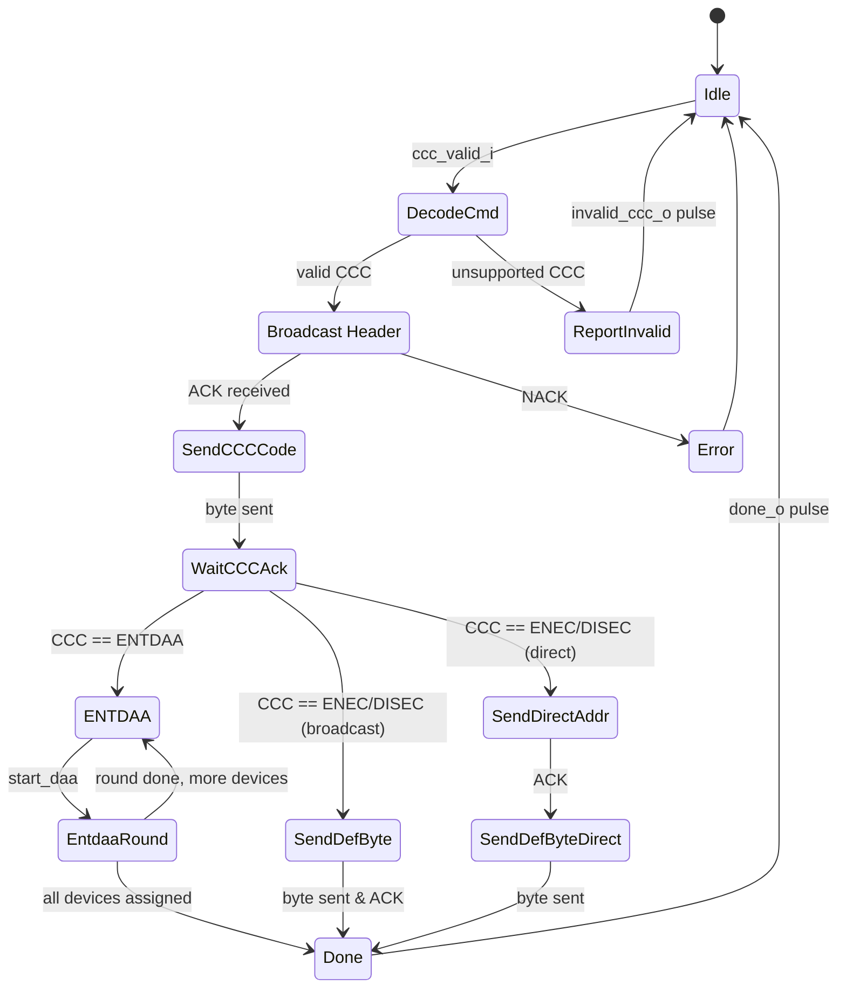
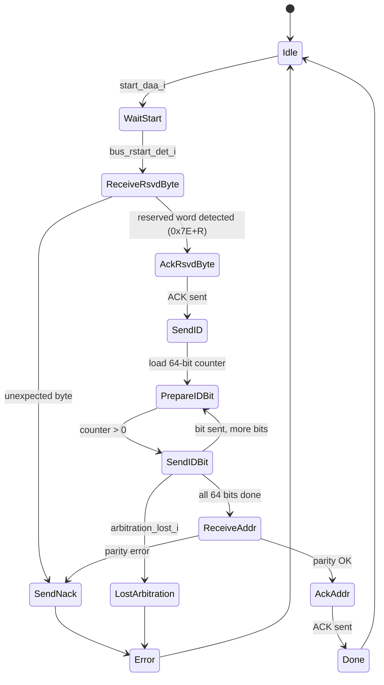

# Module: ccc + ccc_entdaa (CCC Processor)

> Status: Simplify
> Reference: `i3c-core/src/ctrl/ccc.sv` (1,406 lines) + `i3c-core/src/ctrl/ccc_entdaa.sv` (238 lines)
> Estimated LoC: ~400 lines (combined)

## 1. Purpose

The CCC (Common Command Code) processor handles the execution of CCC commands on the I3C bus. In this simplified design, it supports only 3 CCCs:

| CCC Code | Mnemonic | Type      | Description                          |
|----------|----------|-----------|--------------------------------------|
| 0x07     | ENTDAA   | Broadcast | Enter Dynamic Address Assignment     |
| 0x00     | ENEC     | Broadcast | Enable Events (broadcast)            |
| 0x80     | ENEC     | Direct    | Enable Events (specific target)      |
| 0x01     | DISEC    | Broadcast | Disable Events (broadcast)           |
| 0x81     | DISEC    | Direct    | Disable Events (specific target)     |

The module is split into two tightly coupled components:
- **`ccc`** — Top-level CCC dispatcher FSM that handles ENEC/DISEC and delegates ENTDAA
- **`ccc_entdaa`** — Dedicated sub-FSM for the ENTDAA arbitration procedure

## 2. Dependencies

### Sub-modules
- `ccc_entdaa` — Instantiated by `ccc`

### Parent modules
- `controller_active` (connected to bus_tx_flow, bus_rx_flow, bus_monitor)

### Packages
- `controller_pkg` — For `dat_entry_t`
- `i3c_pkg` — For bus state types

## 3. Parameters

None.

## 4. Ports / Interfaces

### ccc (Top-Level CCC Processor)

#### Clock and Reset
| Signal   | Direction | Width | Description              |
|----------|-----------|-------|--------------------------|
| `clk_i`  | Input     | 1     | System clock             |
| `rst_ni` | Input     | 1     | Active-low async reset   |

#### Command Interface (from flow_active)
| Signal         | Direction | Width | Description                         |
|----------------|-----------|-------|-------------------------------------|
| `ccc_i`        | Input     | 8     | CCC command code                    |
| `ccc_valid_i`  | Input     | 1     | Assert to start CCC execution       |
| `def_byte_i`   | Input     | 8     | Defining byte (for ENEC/DISEC)      |
| `dev_addr_i`   | Input     | 7     | Target address (for Direct CCCs)    |
| `dev_count_i`  | Input     | 4     | Number of devices (for ENTDAA)      |
| `done_o`       | Output    | 1     | CCC execution complete              |
| `invalid_ccc_o`| Output    | 1     | Unsupported CCC code received       |

#### Bus TX Interface
| Signal               | Direction | Width | Description                  |
|----------------------|-----------|-------|------------------------------|
| `bus_tx_done_i`      | Input     | 1     | TX completed current request |
| `bus_tx_idle_i`      | Input     | 1     | TX is idle                   |
| `bus_tx_req_byte_o`  | Output    | 1     | Request byte transmission    |
| `bus_tx_req_bit_o`   | Output    | 1     | Request bit transmission     |
| `bus_tx_req_value_o` | Output    | 8     | Value to transmit            |
| `bus_tx_sel_od_pp_o` | Output    | 1     | OD/PP mode for this TX       |

#### Bus RX Interface
| Signal               | Direction | Width | Description                  |
|----------------------|-----------|-------|------------------------------|
| `bus_rx_data_i`      | Input     | 8     | Received data                |
| `bus_rx_done_i`      | Input     | 1     | RX completed current request |
| `bus_rx_req_bit_o`   | Output    | 1     | Request bit reception        |
| `bus_rx_req_byte_o`  | Output    | 1     | Request byte reception       |

#### Bus Monitor Interface
| Signal              | Direction | Width | Description                   |
|---------------------|-----------|-------|-------------------------------|
| `bus_start_det_i`   | Input     | 1     | START detected                |
| `bus_rstart_det_i`  | Input     | 1     | Repeated START detected       |
| `bus_stop_det_i`    | Input     | 1     | STOP detected                 |

#### DAA Output (for ENTDAA)
| Signal              | Direction | Width | Description                    |
|---------------------|-----------|-------|--------------------------------|
| `daa_address_o`     | Output    | 7     | Assigned dynamic address       |
| `daa_address_valid_o`| Output   | 1     | Address assignment valid pulse |
| `daa_pid_o`         | Output    | 48    | Provisioned ID of assigned device |
| `daa_bcr_o`         | Output    | 8     | BCR of assigned device         |
| `daa_dcr_o`         | Output    | 8     | DCR of assigned device         |

### ccc_entdaa (ENTDAA Sub-FSM)

#### Identity Inputs (from master — addresses to assign)
| Signal          | Direction | Width | Description                         |
|-----------------|-----------|-------|-------------------------------------|
| `id_i`          | Input     | 48    | Provisioned ID (unused in master mode; for target) |
| `dcr_i`         | Input     | 8     | DCR (unused in master mode)         |
| `bcr_i`         | Input     | 8     | BCR (unused in master mode)         |

#### DAA Control
| Signal              | Direction | Width | Description                    |
|---------------------|-----------|-------|--------------------------------|
| `start_daa_i`       | Input     | 1     | Start DAA procedure            |
| `done_daa_o`        | Output    | 1     | DAA round complete             |
| `process_virtual_i` | Input     | 1     | Use virtual ID (tied to '0)   |

#### Bus TX/RX/Monitor
Same as `ccc` TX/RX/Monitor interfaces (directly connected).

#### Address Output
| Signal            | Direction | Width | Description                      |
|-------------------|-----------|-------|----------------------------------|
| `address_o`       | Output    | 7     | Received dynamic address (from master to target) |
| `address_valid_o` | Output    | 1     | Address valid pulse              |
| `arbitration_lost_i` | Input  | 1     | Arbitration lost signal          |

## 5. Functional Description

### 5.1. CCC Dispatcher FSM (ccc module)

The simplified CCC module handles three paths:



### 5.2. Broadcast CCC Frame (ENEC/DISEC)

```
[S] [0x7E + W] [ACK] [CCC Code] [ACK] [Defining Byte] [ACK] [P]
```

The CCC module drives this sequence by:
1. Requesting bus_tx to send broadcast address byte `{7'h7E, 1'b0}` (0xFC)
2. Reading ACK via bus_rx (1-bit)
3. Sending CCC code byte
4. Reading ACK
5. Sending defining byte
6. Reading ACK
7. Signaling done (flow_active generates STOP)

**Defining byte for ENEC/DISEC:**

| Bit | Meaning                    |
|-----|----------------------------|
| [0] | Interrupt Request (IBI)    |
| [1] | Controller Role Request    |
| [2] | Hot-Join                   |
| [7:3] | Reserved                 |

### 5.3. Direct CCC Frame (ENEC/DISEC)

```
[S] [0x7E + W] [ACK] [CCC Code] [ACK] [Sr] [Target Addr + W] [ACK] [Defining Byte] [T] [P]
```

Additional steps for direct CCC:
1. After CCC code ACK: signal flow_active to generate Repeated START
2. Send target address byte `{dev_addr_i, 1'b0}`
3. Read ACK
4. Send defining byte
5. Signal done

### 5.4. ENTDAA Procedure

ENTDAA is handled by the `ccc_entdaa` sub-FSM. The master-side flow differs from the reference (which is target-side):

**Master-side ENTDAA sequence:**
1. Send broadcast header `[S] [0x7E + W]`
2. Read ACK
3. Send ENTDAA code (0x07)
4. Read ACK
5. **Loop for each device:**
   a. Send `[Sr] [0x7E + R]` (Repeated START with read)
   b. Read ACK
   c. Receive 48-bit PID (6 bytes, MSB first) — arbitration happens here
   d. Receive 8-bit BCR
   e. Receive 8-bit DCR
   f. Send 7-bit dynamic address + parity bit
   g. Read ACK (target accepts address)
   h. Output `daa_address_valid_o` with address and PID/BCR/DCR
6. Send `[P]` STOP

### 5.5. ccc_entdaa FSM (Reused — Adapted for Master)



**Note:** The `ccc_entdaa` module in the reference is designed from the TARGET perspective (it sends its own PID and receives an address). For master-side operation, the roles are reversed:
- Master RECEIVES the 64-bit PID+BCR+DCR (via bus_rx)
- Master SENDS the dynamic address (via bus_tx)

The reuse requires adapting the data flow direction while keeping the FSM structure.

### 5.6. Output Logic

The `ccc` module multiplexes bus_tx/bus_rx control between its own logic and the `ccc_entdaa` sub-module based on the current CCC being executed:

```systemverilog
always_comb begin
  if (entdaa_active) begin
    bus_tx_req_byte_o  = entdaa_tx_req_byte;
    bus_tx_req_bit_o   = entdaa_tx_req_bit;
    bus_tx_req_value_o = entdaa_tx_req_value;
    bus_rx_req_byte_o  = entdaa_rx_req_byte;
    bus_rx_req_bit_o   = entdaa_rx_req_bit;
  end else begin
    // CCC module's own TX/RX control for ENEC/DISEC
    bus_tx_req_byte_o  = ccc_tx_req_byte;
    // ...
  end
end
```

## 6. Timing Requirements

| Aspect                 | Requirement                                         |
|------------------------|-----------------------------------------------------|
| ENTDAA per-device      | 64 SCL cycles (PID+BCR+DCR) + 9 cycles (addr+ACK) + overhead |
| ENEC/DISEC             | 3 bytes + ACKs = ~27 SCL cycles + START/STOP        |
| Arbitration detection  | Must detect within 1 SCL cycle (SDA readback)       |

## 7. Changes from Reference Design

| Aspect                     | Reference                              | This Design                       |
|----------------------------|----------------------------------------|-----------------------------------|
| CCC count                  | 40+ CCCs (23 FSM states)               | 3 CCCs (ENTDAA, ENEC, DISEC)     |
| Target-side CCC handling   | Full decode/response for all CCCs      | Removed (master only)             |
| Virtual device support     | `process_virtual_i` logic              | Tied to '0 (removed)             |
| HDR mode outputs           | 8 `ent_hdr_*` signals                  | Removed                           |
| ccc.sv FSM states          | 23 states                              | ~8 states                         |
| ccc_entdaa                 | 13 states (target perspective)         | Adapted for master perspective    |
| MWL/MRL/SETDASA outputs    | Full set of CSR write ports            | Removed                           |
| Error handling             | NACK detection, timeout                | Basic NACK detection              |

### CCC Module Size Reduction

```
Reference ccc.sv:    1,406 lines, 23 states, handles both controller and target CCCs
This design:         ~200 lines, ~8 states, master-side only, 3 CCCs

Reference ccc_entdaa.sv: 238 lines (reused with adaptation)
This design:             ~200 lines (adapted for master perspective)
```

## 8. Error Handling

| Error                   | Detection                              | Action                        |
|-------------------------|----------------------------------------|-------------------------------|
| NACK on broadcast addr  | ACK bit == 1 after 0x7E+W             | `err_status = AddrHeader`     |
| NACK on CCC code        | ACK bit == 1 after CCC byte           | `err_status = Nack`           |
| NACK on ENTDAA address  | ACK bit == 1 after dynamic addr       | Retry with different address  |
| Parity error (ENTDAA)   | Calculated parity != received parity  | NACK, retry round             |
| Arbitration lost         | SDA readback != SDA driven            | End round, try next device    |
| Unsupported CCC          | CCC code not in {0x00,0x01,0x07,0x80,0x81} | `invalid_ccc_o` pulse    |
| STOP during ENTDAA      | `bus_stop_det_i` during active DAA    | End DAA, go to Done           |

## 9. Test Plan

### Scenarios

1. **ENEC broadcast:** Send ENEC with defining byte 0x01; verify complete frame on bus
2. **DISEC broadcast:** Send DISEC with defining byte 0x07; verify frame
3. **ENEC direct:** Send ENEC to specific target; verify Sr + target address + defining byte
4. **DISEC direct:** Same as ENEC direct but with DISEC code
5. **ENTDAA single device:** One target responds; verify PID/BCR/DCR capture and address assignment
6. **ENTDAA multiple devices:** 3 targets respond; verify all get unique addresses across 3 rounds
7. **ENTDAA arbitration:** Two targets with different PIDs; verify only winner gets addressed per round
8. **ENTDAA NACK:** Target NACKs assigned address; verify retry behavior
9. **ENTDAA parity error:** Send address with bad parity; verify NACK and error state
10. **Invalid CCC:** Send unsupported CCC code; verify `invalid_ccc_o` pulses
11. **NACK on broadcast header:** No targets on bus; verify AddrHeader error
12. **STOP during ENTDAA:** External STOP; verify clean termination

### cocotb Test Structure
```
tests/
  test_ccc/
    test_ccc_enec_disec.py  # ENEC/DISEC tests
    test_ccc_entdaa.py      # ENTDAA tests
    test_ccc_errors.py      # Error handling tests
    Makefile
```

## 10. Implementation Notes

- The reference `ccc_entdaa.sv` is written from the TARGET perspective. For the master, the data flow reverses: the master receives PID/BCR/DCR (using bus_rx) and sends the dynamic address (using bus_tx). The FSM structure (states, transitions) remains similar but the bus_tx/bus_rx assignments in each state must be swapped.
- The `id_i`, `dcr_i`, `bcr_i` inputs of `ccc_entdaa` are unused in master mode (they represent the target's own identity). For master mode, these can be tied to '0.
- The `process_virtual_i` input is tied to '0 (no virtual target support).
- ENTDAA's `arbitration_lost_i` signal is derived by the master by reading back SDA after driving: if `sda_readback != sda_driven`, arbitration is lost. This logic is in `controller_active`.
- The `done_o` output from `ccc` should trigger `flow_active` to either continue (next device in ENTDAA) or generate STOP and write response.
- For ENEC/DISEC, the defining byte value comes from the command descriptor's data fields, passed through `flow_active`.
