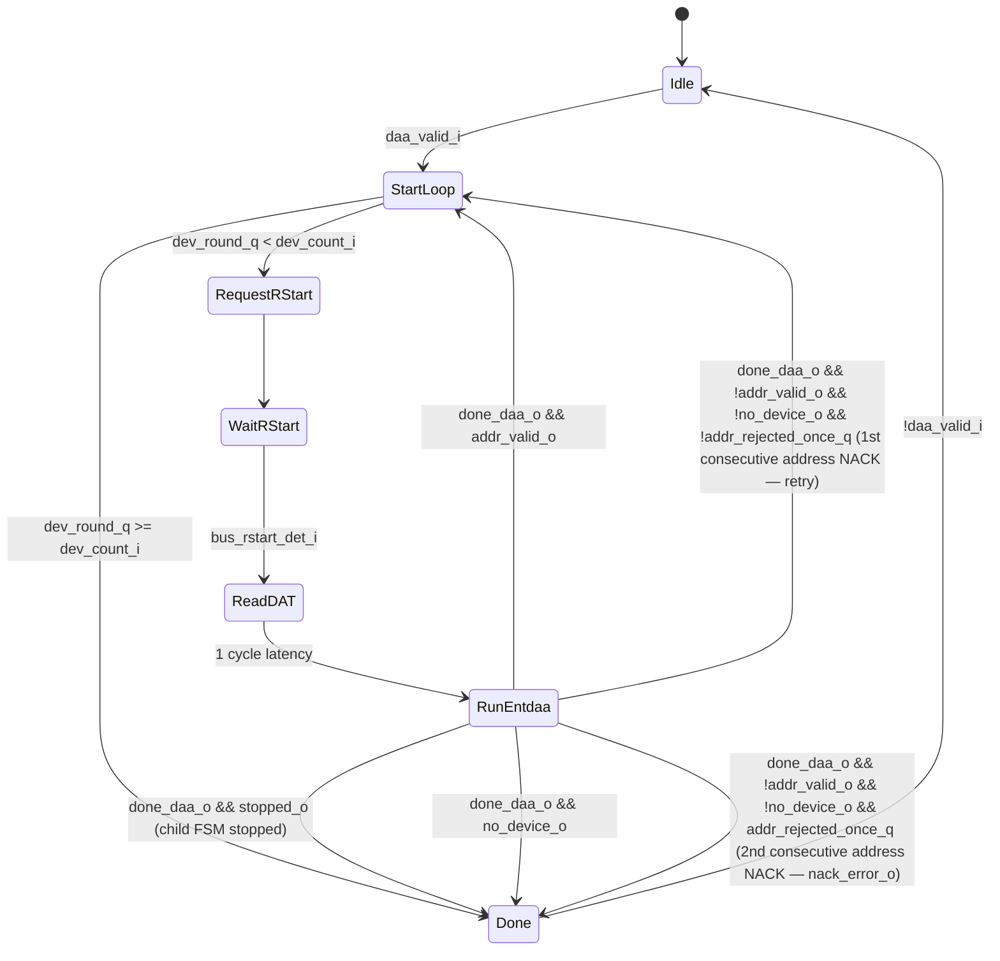

# Module: entdaa_controller (ENTDAA Loop Manager)

> Status: Complete
> Reference: `i3c-core/src/ctrl/ccc.sv` (1,406 lines, target-side) — replaced by master-side design from scratch
> Estimated LoC: ~120 lines

## 1. Purpose

The `entdaa_controller` module is the master-side ENTDAA loop manager. It drives the multi-device iteration for the **ENTDAA (Enter Dynamic Address Assignment)** procedure:

1. For each device round, request a Repeated START from `scl_generator` (via `controller_active`'s `daa_restart_pending_q` latch)
2. Read the pre-assigned dynamic address from DAT
3. Delegate the per-device round to `entdaa_fsm` (which sends `0x7E+R`, receives 64 PID/BCR/DCR bits, sends `Addr+P`, reads ACK)
4. Collect results and loop until all `dev_count` devices are addressed or no device responds

`entdaa_controller` is activated exclusively by `flow_active` for `AddressAssignment` command descriptors. **ENEC and DISEC are handled entirely by `flow_active`** via `IssueImmediateCcc` and do not go through this module.

See `08b_entdaa_fsm_spec.md` for the per-device round FSM.

## 2. Dependencies

### Sub-modules

| Module        | Instance    | Role                            |
| ------------- | ----------- | ------------------------------- |
| `entdaa_fsm`  | `u_daa_fsm` | Per-device ENTDAA round (8-state FSM) |

### Parent modules

- `controller_active` (MUXes TX/RX bus access and extends `req_rstart_o` via `daa_restart_pending_q`)

### Packages

- `controller_pkg` — `dat_entry_t` (to extract `dynamic_address` field)
- `i3c_pkg` — `I3C_RSVD_ADDR` (7'h7E), `I3C_RSVD_BYTE` (8'hFC)

## 3. Parameters

| Parameter  | Type | Default | Description     |
| ---------- | ---- | ------- | --------------- |
| `DatDepth` | int  | 32      | DAT table depth |

## 4. Ports / Interfaces

### Clock and Reset

| Signal   | Direction | Width | Description            |
| -------- | --------- | ----- | ---------------------- |
| `clk_i`  | Input     | 1     | System clock           |
| `rst_ni` | Input     | 1     | Active-low async reset |

### Command Interface (from flow_active)

| Signal          | Direction | Width | Description                                                               |
| --------------- | --------- | ----- | ------------------------------------------------------------------------- |
| `daa_valid_i`   | Input     | 1     | Assert to start ENTDAA; held high until `done_o`                          |
| `stop_i`        | Input     | 1     | Forced-stop request (e.g. host abort); latched into `stop_pending_q` and forwarded to `entdaa_fsm.stop_pending_i`, causing the in-progress per-device round to terminate early via a bus STOP |
| `dev_count_i`   | Input     | 4     | Number of devices to address (from `addr_assign_desc_t.dev_count`)        |
| `dev_idx_i`     | Input     | 5     | Starting DAT index for address lookup (from `addr_assign_desc_t.dev_idx`) |
| `done_o`        | Output    | 1     | ENTDAA execution complete (all devices addressed, no device responded, NACK-escalated, or stopped) |
| `nack_error_o`  | Output    | 1     | Sticky NACK-escalation flag: set when a device NACKs its assigned address twice in a row (the retry-once policy in `RunEntdaa` is exhausted); held until `Done` sees `daa_valid_i` deasserted |
| `req_stop_o`    | Output    | 1     | Forwarded from `entdaa_fsm.req_stop_o` while in `RunEntdaa`; requests the host-facing flow issue a bus STOP to end the current round cleanly |
| `stopped_o`     | Output    | 1     | Asserted in `Done` (driven by `completed_by_stop_q`) when ENTDAA terminated because of a STOP condition rather than normal loop completion |

### Repeated-Start Request (to controller_active / scl_generator)

| Signal          | Direction | Width | Description                                                                       |
| --------------- | --------- | ----- | ----------------------------------------------------------------------------------- |
| `req_rstart_o`  | Output    | 1     | 1-cycle pulse: request Repeated START; `controller_active` extends via latch      |

### Bus TX Interface (to bus_tx_flow via controller_active MUX)

| Signal               | Direction | Width | Description                                       |
| -------------------- | --------- | ----- | ------------------------------------------------- |
| `bus_tx_done_i`      | Input     | 1     | TX completed current request                      |
| `bus_tx_idle_i`      | Input     | 1     | TX is idle                                        |
| `bus_tx_req_byte_o`  | Output    | 1     | Request byte transmission                         |
| `bus_tx_req_bit_o`   | Output    | 1     | Forwarded from `entdaa_fsm`; reads `0` in practice (ENTDAA uses byte-level TX only) |
| `bus_tx_req_value_o` | Output    | 8     | Value to transmit                                 |
| `bus_tx_sel_od_pp_o` | Output    | 1     | Forwarded from `entdaa_fsm`; reads `0` in practice (Open-Drain throughout ENTDAA) |

### Bus RX Interface (to bus_rx_flow via controller_active MUX)

| Signal              | Direction | Width | Description                                            |
| ------------------- | --------- | ----- | ------------------------------------------------------ |
| `bus_rx_data_i`             | Input     | 8     | Received data (only bit [0] used for single-bit reads)                                 |
| `bus_rx_done_i`             | Input     | 1     | RX completed current request                                                            |
| `bus_rx_req_bit_o`          | Output    | 1     | Request single-bit reception                                                             |
| `bus_rx_req_bit_handoff_o`  | Output    | 1     | Forwarded from `entdaa_fsm.bus_rx_req_bit_handoff_o`: marks the low-bit handoff cycle of bit-bang RX (transfers drive of the bit's low phase between RX and the FSM during the wired-AND ACK/PID sampling) |
| `bus_rx_req_byte_o`         | Output    | 1     | Always `0` (unused; byte-level RX not used in ENTDAA)                                   |

### Bus Monitor Interface

| Signal             | Direction | Width | Description             |
| ------------------ | --------- | ----- | ----------------------- |
| `bus_start_det_i`  | Input     | 1     | START detected          |
| `bus_rstart_det_i` | Input     | 1     | Repeated START detected |
| `bus_stop_det_i`   | Input     | 1     | STOP detected           |

### DAT Read Port (muxed by controller_active to csr_registers)

| Signal             | Direction | Width              | Description                              |
| ------------------ | --------- | ------------------ | ---------------------------------------- |
| `dat_read_valid_o` | Output    | 1                  | Request DAT read (1-cycle pulse)         |
| `dat_index_o`      | Output    | `$clog2(DatDepth)` | DAT entry index: `dev_idx_i + dev_round` |
| `dat_rdata_i`      | Input     | 32                 | DAT entry (`dat_entry_t`)                |

### DAA Outputs (to flow_active)

| Signal                | Direction | Width | Description                             |
| --------------------- | --------- | ----- | --------------------------------------- |
| `daa_address_o`       | Output    | 7     | Dynamic address just assigned           |
| `daa_address_valid_o` | Output    | 1     | Pulse: one valid assignment captured    |
| `daa_pid_o`           | Output    | 48    | Provisioned ID received from the target |
| `daa_bcr_o`           | Output    | 8     | BCR received from the target            |
| `daa_dcr_o`           | Output    | 8     | DCR received from the target            |

## 5. Functional Description

### 5.1. Division of Work with flow_active

`flow_active` performs the opening frame and final STOP; `entdaa_controller` owns the multi-device loop:

```
flow_active:  [S]  [0x7E+W]  [ACK]  [0x07]  [ACK]
              ^^^  open-drain broadcast header + ENTDAA code
              → then sets ccc_valid_o=1, ccc_dev_count_o, daa_dev_idx_o

entdaa_controller (per round):
              →  pulse req_rstart_o  →  controller_active extends via daa_restart_pending_q
              →  scl_generator issues [Sr] on bus
              →  wait bus_rstart_det_i
              →  read DAT[dev_idx + round].dynamic_address
              →  start entdaa_fsm round

  entdaa_fsm:   [0x7E+R]  [ACK/NoDev]  [64 raw bits]  [Addr+P]  [ACK]

              → if addr_valid_o: latch PID/BCR/DCR, pulse daa_address_valid_o
              → if no_device_o:  all devices assigned, exit loop

flow_active:  [P]  ← STOP on done_o
```

### 5.2. FSM — 7 States

```systemverilog
typedef enum logic [2:0] {
  Idle          = 3'd0,
  StartLoop     = 3'd1,
  RequestRStart = 3'd2,
  WaitRStart    = 3'd3,
  ReadDAT       = 3'd4,
  RunEntdaa     = 3'd5,
  Done          = 3'd6
} ccc_state_e;
```



#### State Descriptions

**Idle:** Wait for `daa_valid_i`. On entry, clear `dev_round_q` counter.

**StartLoop:** Check `dev_round_q < dev_count_i`. Route to `RequestRStart` to run the next device, or to `Done` when all `dev_count_i` devices have been addressed.

**RequestRStart:** Assert `req_rstart_o` for one cycle. `controller_active` latches this via `daa_restart_pending_q` and forwards it to `scl_generator`, which generates the Sr bus condition.

**WaitRStart:** Deassert `req_rstart_o`. Hold until `bus_rstart_det_i` confirms Sr was emitted. Simultaneously assert `dat_read_valid_o` and `dat_index_o = dev_idx_i + dev_round_q` so the DAT read arrives before `entdaa_fsm` begins.

**ReadDAT:** Capture `dat_rdata_i` into `dat_entry_t`. Extract `dynamic_address[22:16]` as `daa_addr_next`. Advance to `RunEntdaa` after one cycle.

**RunEntdaa:** Assert `start_daa_i` and provide `daa_addr_i` to `entdaa_fsm`. Wait for `done_daa_o`, then branch on the child FSM's result:

- **Stopped:** if the child FSM reports `stopped_o` (a STOP occurred during the round, e.g. due to `stop_i`), latch `completed_by_stop_q` and go to `Done`.
- **Address accepted (`addr_valid_o`):** latch `pid_o`, `bcr_o`, `dcr_o`; pulse `daa_address_valid_o` and `daa_address_o`; increment `dev_round_q`; clear `addr_rejected_once_q`; return to `StartLoop`.
- **No device (`no_device_o`):** no responsive target answered `0x7E+R` — clear `addr_rejected_once_q` and go to `Done` regardless of remaining count.
- **Address rejected, retry-once policy:** if the assigned address is NACKed (`!addr_valid_o && !no_device_o`):
  - First occurrence (`addr_rejected_once_q == 0`): set `addr_rejected_once_d = 1` and return to `StartLoop` to retry the same device/round.
  - Second consecutive occurrence (`addr_rejected_once_q == 1`): set `nack_error_d = 1` (sticky `nack_error_o`) and go to `Done` — the controller gives up after one retry.

**Done:** Assert `done_o` for one cycle (combinationally, every cycle `state_q == Done`). Assert `stopped_o = completed_by_stop_q`. Wait for `daa_valid_i` to deassert before returning to `Idle` — `Done` is a handshake state, not a single-cycle pulse-and-return; it persists as long as the host holds `daa_valid_i` high, clearing `addr_rejected_once_q`, `nack_error_q`, `stop_pending_q`, and `completed_by_stop_q` once `daa_valid_i` drops.

On `bus_stop_det_i`: forced transition to `Done` in every active state **except `RunEntdaa`** (and except `Idle`/`Done`, which are not "active"). During `RunEntdaa`, a STOP is instead handled inside the child `entdaa_fsm` (via `stop_pending_i`), which reports back through `done_daa_o`/`stopped_o` as described above — this avoids double-counting the STOP and lets the child FSM unwind its byte/bit-level transfer cleanly before `entdaa_controller` reacts.

### 5.3. Bus MUX Within entdaa_controller

`entdaa_controller` passes bus access to `entdaa_fsm` only during `RunEntdaa`. Unlike earlier revisions of this spec, the RTL forwards **all** TX/RX signals produced by the child FSM (not just byte-TX and bit-RX) — `bus_tx_req_bit_o`, `bus_tx_sel_od_pp_o`, `bus_rx_req_bit_handoff_o`, and `bus_rx_req_byte_o` are forwarded too, even though `entdaa_fsm` itself never drives them non-zero in practice (it only uses byte-level TX and bit-level RX). Net behavior is identical to a narrower MUX, but the actual RTL structure forwards the full bundle uniformly:

```systemverilog
unique case (state_q)
  ...
  RunEntdaa: begin
    start_daa                = 1'b1;
    req_stop_o               = req_stop;               // from entdaa_fsm
    stopped_o                = stopped;                 // from entdaa_fsm
    bus_tx_req_byte_o        = entdaa_tx_req_byte;
    bus_tx_req_bit_o         = entdaa_tx_req_bit;        // forwarded; entdaa_fsm ties to 0
    bus_tx_req_value_o       = entdaa_tx_req_value;
    bus_tx_sel_od_pp_o       = entdaa_tx_sel_od_pp;      // forwarded; entdaa_fsm ties to 0
    bus_rx_req_bit_o         = entdaa_rx_req_bit;
    bus_rx_req_bit_handoff_o = entdaa_rx_req_bit_handoff;
    bus_rx_req_byte_o        = entdaa_rx_req_byte;       // forwarded; entdaa_fsm ties to 0
  end
  ...
endcase
// All bus_tx_*/bus_rx_* outputs default to 0 in every other state
// via the always_comb block's reset block at the top of drive_data_and_outputs.
```

### 5.4. DAT Address Lookup

During `WaitRStart` and `ReadDAT`, `entdaa_controller` reads the pre-populated dynamic address:

```systemverilog
// During WaitRStart:
dat_read_valid_o = 1'b1;
dat_index_o      = dev_idx_i + dev_round_q;  // saturate at DatDepth-1

// During ReadDAT (capture):
dat_entry_t entry;
assign entry = dat_entry_t'(dat_rdata_i);
daa_addr_next = entry.dynamic_address;  // bits [22:16]
```

Software must pre-populate DAT entries `[dev_idx .. dev_idx + dev_count - 1]` with the addresses to assign before issuing the ENTDAA command.
The controller must not assign reserved I3C dynamic addresses. Before starting each ENTDAA round, the address read from the DAT entry for that round is checked with `is_i3c_rsvd_addr()`. If it is reserved, the ENTDAA loop requests the normal STOP path and terminates without sending that round's `7'h7E+R` frame or `Addr+P` byte.

## 6. Timing Requirements

| Aspect              | Requirement                                                                                                                     |
| ------------------- | ------------------------------------------------------------------------------------------------------------------------------- |
| Per-device round    | 2 bytes TX (`0x7E+R`, `Addr+P`) + 65 bit RX (ACK + 64 ID bits) = ~74 SCL cycles minimum                                         |
| DAT read latency    | 1 system clock cycle (registered synchronous read)                                                                              |
| Sr-to-`0x7E+R` gap  | DAT read (1 cycle) + `start_daa_i` → `SendDAAHeader` (1 cycle); SCL generator Sr takes many SCL cycles — no bus timing violation |
| No-device detection | NACK detected on the ACK bit after `0x7E+R` = 1 RX bit cycle                                                                    |

## 7. Changes from Reference Design

| Aspect                          | Reference (`i3c-core`)                                                  | This Design                                                       |
| ------------------------------- | ----------------------------------------------------------------------- | ----------------------------------------------------------------- |
| Location                        | `controller_standby_i3c.sv` (target/standby path)                       | `controller_active` (master path — new module)                    |
| CCCs handled                    | 40+ CCCs (23 FSM states, both broadcast and direct)                     | ENTDAA only (7 FSM states)                                        |
| Perspective                     | Target receives CCC commands from a master                              | Master issues ENTDAA; manages per-device loop                     |
| ENEC/DISEC                      | Full FSM dispatch                                                       | Handled by `flow_active` (`IssueImmediateCcc`), not this module   |
| HDR mode                        | `ent_hdr_*` outputs, `is_in_hdr_mode_i`                                 | Removed (SDR only)                                                |
| CSR side-effects                | MWL, MRL, DASA, AASA, RSTACT, GETCAPS, etc.                             | Removed entirely                                                  |
| DAT integration                 | None                                                                    | DAT read port for address lookup per round                        |
| `daa_valid_i` (input)           | `ccc_i` with CCC code                                                   | Binary valid/done handshake (ENTDAA only)                         |
| Restart to scl_generator        | Direct                                                                  | Via `daa_restart_pending_q` latch in `controller_active` (M-7 fix)|
| LoC                             | 1,406 lines                                                             | ~120 lines                                                        |

## 8. Error Handling

| Error                   | Detection                                       | Action                                        |
| ----------------------- | ----------------------------------------------- | --------------------------------------------- |
| No target on bus        | NACK after `0x7E+R` (from `entdaa_fsm.no_device_o`) | Exit loop early; assert `done_o`          |
| Target rejects address (1st time)  | NACK after `Addr+P` (`addr_valid_o = 0`), `addr_rejected_once_q == 0` | `daa_address_valid_o` not pulsed; `addr_rejected_once_d = 1`; retry same round via `StartLoop` |
| Target rejects address (2nd consecutive) | NACK after `Addr+P` again, `addr_rejected_once_q == 1` | `nack_error_d = 1` (sticky `nack_error_o`); abandon retries → `Done` |
| Reserved assigned address | `is_i3c_rsvd_addr()` returns true for the DAT dynamic address selected for the next round | Request STOP through the normal STOP path; terminate without issuing that round; report `NotSupported` through `flow_active` |
| Unexpected STOP         | `bus_stop_det_i` in any active state except `RunEntdaa` | Forced → `Done`; during `RunEntdaa` the STOP is instead absorbed by the child `entdaa_fsm` and reported back via `stopped_o`/`completed_by_stop_q` |
| dev_count exhausted     | `dev_round_q >= dev_count_i` in `StartLoop`     | Normal termination → `Done`                   |
| DAT index out of range  | SW must ensure `dev_idx + dev_count <= DatDepth`| No hardware check; SW responsibility          |

## 9. Test Plan

### Scenarios

1. **ENTDAA single device:** One target; verify `0x7E+R` + 64 bits + `Addr+P` + ACK; check `daa_address_valid_o` pulse with correct PID/BCR/DCR
2. **ENTDAA multiple devices:** 3 targets assigned in 3 rounds; verify unique addresses and PID/BCR/DCR per device; verify `dev_round_q` increments
3. **ENTDAA all assigned:** After `dev_count` rounds, verify `done_o` fires
4. **ENTDAA no device:** First `0x7E+R` gets NACK; verify `no_device_o`, `done_o` immediately
5. **ENTDAA fewer devices than count:** 2 targets, `dev_count=4`; verify loop exits after second round when NoDev
6. **Address NACK (retry-once):** Target NACKs assigned address once; verify `addr_valid_o = 0`, `addr_rejected_once_q` sets, loop retries via `StartLoop`; if the same device NACKs a second consecutive time, verify `nack_error_o` sets and the loop exits to `Done`
7. **STOP during loop:** External STOP mid-PID; verify the STOP is absorbed inside the active `entdaa_fsm` round (`RunEntdaa` does not force-transition directly) and surfaces as `stopped_o`/`completed_by_stop_q` in `Done`; verify STOP during any other active state forces an immediate transition to `Done`
8. **DAT address correctness:** `dev_idx=2`, round 1: verify `dat_index_o = 3`; round 2: `dat_index_o = 4`
9. **Parity calculation:** Verify `Addr+P` byte has correct odd parity for various 7-bit addresses
10. **req_rstart_o latch:** Verify 1-cycle pulse is held by `controller_active` until `scl_generator` acknowledges (M-7)
11. **Reserved DAT address:** Program a DAT dynamic address reserved by the I3C spec; verify ENTDAA stops before that round's `7'h7E+R` frame and reports `NotSupported`

### UVM Test Structure

```
src/verification/uvm_i3c/
  sequences/
    i3c_entdaa_vseq.sv    # Simulates target responses: ACK on 0x7E+R, drive 64-bit PID/BCR/DCR, ACK/NACK address
  tests/
    i3c_entdaa_test.sv
```

## 10. Implementation Notes

- `entdaa_controller` handles only ENTDAA — there is no command code input or dispatch logic. The `daa_valid_i` / `done_o` handshake is sufficient.
- The `req_rstart_o` pulse is 1 cycle. `controller_active`'s `daa_restart_pending_q` extends it until `scl_generator` acknowledges. `entdaa_controller` does not need a ready signal back — it waits for `bus_rstart_det_i` from `bus_monitor`.
- `bus_tx_req_bit_o`, `bus_tx_sel_od_pp_o`, `bus_rx_req_bit_handoff_o`, and `bus_rx_req_byte_o` read as `0` throughout ENTDAA activity, but not because `entdaa_controller` ties them off directly — they are forwarded from `entdaa_fsm`, which itself never drives them non-zero (ENTDAA uses byte-level TX for `0x7E+R`/`Addr+P` and bit-level RX for ACK/ID bits only). Push-Pull (`bus_tx_sel_od_pp_o`) is never used because targets drive ACK and PID bits simultaneously (wired-AND).
- Software must fill DAT entries `[dev_idx .. dev_idx + dev_count - 1]` with valid dynamic addresses before issuing the ENTDAA `AddressAssignment` command.
- A reserved dynamic address in any selected DAT entry is a command-data error, not a target NACK. Hardware rejects it with `NotSupported` after the already-active ENTDAA opening phase has reached the common STOP path.
- On `bus_stop_det_i`, `entdaa_controller` itself force-transitions directly to `Done` in every active state except `RunEntdaa` (and `Idle`/`Done`). While in `RunEntdaa`, the STOP is instead absorbed by the child `entdaa_fsm`, which terminates its round and reports `stopped_o`; `entdaa_controller` then latches `completed_by_stop_q` and moves to `Done` via the normal `done_daa_o` path — avoiding a double, unsynchronized reaction to the same STOP.
