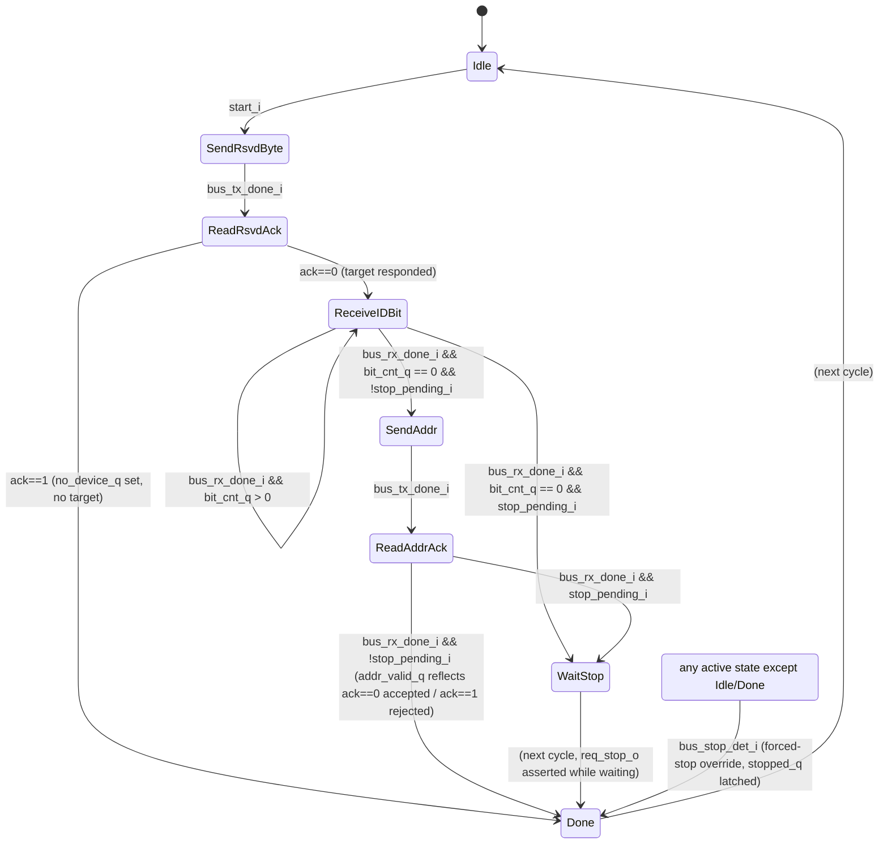

# Module: entdaa_fsm (Per-Device ENTDAA Round)

> Status: Complete
> Reference: `i3c-core/src/ctrl/ccc_entdaa.sv` (238 lines, target-side) — replaced by master-side design from scratch
> Estimated LoC: ~150 lines

## 1. Purpose

The `entdaa_fsm` module executes a single ENTDAA device round from the master's perspective:

1. Send the reserved byte `0x7E+R` (broadcast address with read bit)
2. Read the ACK slot — NACK means no target responded
3. Receive 64 raw bits (PID[47:0] + BCR[7:0] + DCR[7:0]) bit-by-bit via `bus_rx_req_bit`
4. Send the dynamic address with odd parity (`Addr+P`)
5. Read the ACK slot — ACK means the target accepted the address

`entdaa_fsm` is instantiated by `entdaa_controller`, which manages the multi-device loop. Each invocation (`start_i` pulse) handles one device.

## 2. Dependencies

### Sub-modules

- None

### Parent modules

- `entdaa_controller` (instantiates this module as `u_daa_fsm`)

### Packages

- `i3c_pkg` — `I3C_RSVD_ADDR` (7'h7E)
- `controller_pkg` — `Read` (read-direction bit constant)

## 3. Parameters

None.

## 4. Ports / Interfaces

### Clock and Reset

| Signal   | Direction | Width | Description            |
| -------- | --------- | ----- | ---------------------- |
| `clk_i`  | Input     | 1     | System clock           |
| `rst_ni` | Input     | 1     | Active-low async reset |

### DAA Control (from entdaa_controller)

| Signal           | Direction | Width | Description                                                    |
| ---------------- | --------- | ----- | -------------------------------------------------------------- |
| `start_i`        | Input     | 1     | Pulse: start one ENTDAA device round                           |
| `addr_i`         | Input     | 7     | Dynamic address to assign, from DAT entry                      |
| `done_o`         | Output    | 1     | Pulse: round complete (check `addr_valid_o` or `no_device_o`)  |
| `addr_valid_o`   | Output    | 1     | High with `done_o`: address was accepted (ACK)                 |
| `no_device_o`    | Output    | 1     | High with `done_o`: no target responded (NACK on `0x7E+R`)     |
| `req_stop_o`     | Output    | 1     | High in `WaitStop`: requests STOP be issued before terminating the round |
| `stop_pending_i` | Input     | 1     | From `entdaa_controller`: a STOP is already pending for this round; routes termination through `WaitStop` instead of going directly to `Done` |
| `stopped_o`      | Output    | 1     | Latched: a STOP (`bus_stop_det_i`) was observed at some point during the round |

### Received Device Information (to entdaa_controller)

| Signal  | Direction | Width | Description                           |
| ------- | --------- | ----- | ------------------------------------- |
| `pid_o` | Output    | 48    | Provisioned ID shifted in (MSB first) |
| `bcr_o` | Output    | 8     | Bus Characteristics Register          |
| `dcr_o` | Output    | 8     | Device Characteristics Register       |

### Bus TX Interface

| Signal               | Direction | Width | Description                  |
| -------------------- | --------- | ----- | ---------------------------- |
| `bus_tx_done_i`      | Input     | 1     | TX completed current request |
| `bus_tx_req_byte_o`  | Output    | 1     | Request byte transmission    |
| `bus_tx_req_bit_o`   | Output    | 1     | Always `0` (unused)          |
| `bus_tx_req_value_o` | Output    | 8     | Byte value to transmit       |
| `bus_tx_sel_od_pp_o` | Output    | 1     | Always `0` (Open-Drain)      |

### Bus RX Interface

| Signal                     | Direction | Width | Description                                                       |
| -------------------------- | --------- | ----- | ------------------------------------------------------------------|
| `bus_rx_data_i`            | Input     | 8     | `[0]` = single received bit                                       |
| `bus_rx_done_i`            | Input     | 1     | RX completed                                                      |
| `bus_rx_req_bit_o`         | Output    | 1     | Request single-bit reception (used in `ReadRsvdAck`, `ReceiveIDBit`) |
| `bus_rx_req_bit_handoff_o` | Output    | 1     | Request single-bit reception routed through the handoff RX path; asserted only in `ReadAddrAck` for the address-ACK read |
| `bus_rx_req_byte_o`        | Output    | 1     | Always `0` (unused)                                               |

### Bus Monitor Interface

| Signal           | Direction | Width | Description           |
| ---------------- | --------- | ----- | --------------------- |
| `bus_stop_det_i` | Input     | 1     | STOP detected (abort) |

### Stop / Handoff Handshake

When the round needs to end with a STOP on the bus (`stop_pending_i` asserted by `entdaa_controller`), `ReceiveIDBit` (on its final bit) and `ReadAddrAck` do not transition straight to `Done`. Instead they route through `WaitStop`, which holds `req_stop_o = 1` until the controller/bus layer issues the STOP. `WaitStop` always advances to `Done` next cycle (see §5.1/§5.2); `stopped_o` independently latches whenever `bus_stop_det_i` fires in any active, non-`Idle`/non-`Done` state, including a STOP that is forced externally rather than requested via `req_stop_o`.

The address-ACK read in `ReadAddrAck` does not use the plain bit-request port `bus_rx_req_bit_o`; it asserts `bus_rx_req_bit_handoff_o` instead, routing that read through the handoff RX path (used because the address phase follows directly from the TX-driven address byte and needs the handoff sequencing rather than a fresh standalone bit request).

## 5. Functional Description

### 5.1. FSM — 8 States

```systemverilog
typedef enum logic [2:0] {
  Idle           = 3'd0,
  SendRsvdByte   = 3'd1,
  ReadRsvdAck    = 3'd2,
  ReceiveIDBit   = 3'd3,
  SendAddr       = 3'd4,
  ReadAddrAck    = 3'd5,
  WaitStop       = 3'd6,
  Done           = 3'd7
} entdaa_state_e;
```

There is no separate "no device" state. `no_device_q` is a flag, set while in `ReadRsvdAck` on a NACK (`bus_rx_data_i[0] == 1`), and is emitted on `no_device_o` only when the FSM reaches `Done`. The flag-vs-state distinction matters: a NACK on the reserved byte still routes through `Done`, not through a dedicated terminal state.



### 5.2. State Descriptions

#### Idle (State 0)

Wait for `start_i`. On entry, reset `bit_cnt_q` to 63, clear `id_shift_q`, and clear `addr_valid_q`/`no_device_q`/`stopped_q`.

#### SendRsvdByte (State 1)

Transmit the reserved address with read bit:

```systemverilog
bus_tx_req_value_o = {I3C_RSVD_ADDR, Read};  // 8'hFD
bus_tx_req_byte_o  = 1'b1;
bus_tx_sel_od_pp_o = 1'b0;                    // Open-Drain
```

Advance to `ReadRsvdAck` when `bus_tx_done_i`.

#### ReadRsvdAck (State 2)

Request one bit read (`bus_rx_req_bit_o = 1`). When `bus_rx_done_i`:

- `no_device_q <= bus_rx_data_i[0]` is latched unconditionally (captures ACK==0/NACK==1)
- `bus_rx_data_i[0] == 0` (ACK) → at least one target responded → `ReceiveIDBit`
- `bus_rx_data_i[0] == 1` (NACK) → no target on bus → `Done` directly (the `no_device_q` flag, not a separate state, marks this outcome)

#### ReceiveIDBit (State 3)

Read one bit per invocation (`bus_rx_req_bit_o = 1`). Shift into `id_shift_q`:

```systemverilog
id_shift_d = {id_shift_q[62:0], bus_rx_data_i[0]};
if (bit_cnt_q != 0) bit_cnt_d = bit_cnt_q - 1;
```

When `bit_cnt_q` reaches 0, all 64 bits are captured (decoded later, in `Done`, from `id_shift_q`). Next state on `bus_rx_done_i`:

- `bit_cnt_q == 0 && !stop_pending_i` → `SendAddr`
- `bit_cnt_q == 0 && stop_pending_i` → `WaitStop`
- `bit_cnt_q > 0` → stay in `ReceiveIDBit`

#### SendAddr (State 4)

Compute odd parity over 7 address bits and transmit:

```systemverilog
parity = ~^addr_i;   // odd parity: XOR-reduce then invert
bus_tx_req_byte_o  = 1'b1;
bus_tx_req_value_o = {addr_i, parity};
bus_tx_sel_od_pp_o = 1'b0;
```

Advance to `ReadAddrAck` when `bus_tx_done_i`.

#### ReadAddrAck (State 5)

Request the address-ACK bit via the handoff RX path (`bus_rx_req_bit_handoff_o = 1`, **not** `bus_rx_req_bit_o`). When `bus_rx_done_i`:

- `addr_valid_d = ~bus_rx_data_i[0]` (ACK==0 → accepted/`addr_valid=1`; NACK==1 → rejected/`addr_valid=0`)
- Next state: `stop_pending_i ? WaitStop : Done`

#### WaitStop (State 6)

Holds `req_stop_o = 1'b1` to request the STOP be issued. Unconditionally advances to `Done` the next cycle. Reached only from `ReceiveIDBit` or `ReadAddrAck` when `stop_pending_i` was asserted.

#### Done (State 7)

Outputs are valid for one cycle:

```systemverilog
done_o       = 1'b1;
no_device_o  = no_device_q;
stopped_o    = stopped_q;
addr_valid_o = addr_valid_q;   // held from addr_valid_q (unchanged if no_device path taken)
pid_o        = id_shift_q[63:16];
bcr_o        = id_shift_q[15:8];
dcr_o        = id_shift_q[7:0];
```

`no_device_o` and `addr_valid_o` are not separate terminal states — they are flags (`no_device_q`, `addr_valid_q`) latched earlier (`ReadRsvdAck`, `ReadAddrAck`) and simply read out while in `Done`. Return to `Idle` next cycle.

#### Forced-Stop Override (any active state except Idle/Done)

If `bus_stop_det_i` is asserted while `state_q` is not `Idle` and not `Done`, the next state is forced to `Done` regardless of the state's normal transition (overrides everything above, including the `WaitStop` path). In the same cycle, `stopped_d` is set, so `stopped_q` is latched and surfaces on `stopped_o` once `Done` is reached. This is how an unexpected/early STOP cleanly terminates the round without a dedicated "no device" or "aborted" state.

## 6. Timing Requirements

| Aspect              | Requirement                                                                              |
| ------------------- | ---------------------------------------------------------------------------------------- |
| Per-device round    | 2 bytes TX + 65 RX bits (ACK + 64 ID bits) = ~74 SCL cycles minimum                     |
| Address parity      | Computed combinationally (`~^addr_i`) in `SendAddr`; no extra cycles                    |
| No-device detection | NACK detected on the ACK bit after `0x7E+R` = 1 RX bit cycle                            |

## 7. Changes from Reference Design

| Aspect                           | Reference (`ccc_entdaa.sv`, target-side)                                                             | This Design (master-side)                                     |
| -------------------------------- | ---------------------------------------------------------------------------------------------------- | ------------------------------------------------------------- |
| Perspective                      | Target sends its own PID, receives assigned address from master                                      | Master receives PID/BCR/DCR, sends the address               |
| States                           | 13 (Idle, WaitStart, ReceiveRsvdByte, AckRsvdByte, SendNack, SendID, PrepareIDBit, SendIDBit, LostArbitration, ReceiveAddr, AckAddr, Done, Error) | 8 (Idle, SendRsvdByte, ReadRsvdAck, ReceiveIDBit, SendAddr, ReadAddrAck, WaitStop, Done) |
| `id_i/bcr_i/dcr_i`              | Inputs: target's own identity to send to master                                                      | Removed (master does not send its identity)                  |
| `arbitration_lost_i`             | Target detects arbitration loss on SDA during PID transmission                                       | Removed (master reads bus as-is; arbitration is among targets)|
| `process_virtual_i`              | Caliptra virtual device support                                                                      | Removed                                                      |
| `address_o`                      | Output: address received FROM master                                                                 | Replaced by `addr_i` (input: address TO assign)               |
| `bus_tx_req_bit_o`               | Used for bit-level ACK                                                                               | Always `0` (unused)                                          |
| `bus_rx_req_byte_o`              | Used for byte-level reception                                                                        | Always `0` (unused)                                          |

## 8. Error Handling

| Error                   | Detection                                     | Action                          |
| ----------------------- | --------------------------------------------- | ------------------------------- |
| No target on bus        | NACK after `0x7E+R` (`bus_rx_data_i[0] == 1`) | `no_device_q` flag latched in `ReadRsvdAck`; → `Done` directly with `no_device_o = 1` |
| Target rejects address  | NACK after `Addr+P` (`bus_rx_data_i[0] == 1`) | `Done` (or `WaitStop` → `Done` if `stop_pending_i`) with `addr_valid_o = 0` |
| Unexpected STOP         | `bus_stop_det_i` in any active state except `Idle`/`Done` | Forced → `Done`, `stopped_o` latched |

## 9. Test Plan

### Scenarios

1. **Successful round:** 1 target; verify full state sequence Idle→Done; check `pid_o`, `bcr_o`, `dcr_o`, `addr_valid_o`
2. **No device:** NACK on `0x7E+R`; verify Idle→SendRsvdByte→ReadRsvdAck→Done with `no_device_o=1`
3. **Address NACK:** Target ACKs `0x7E+R` but NACKs `Addr+P`; verify Done with `addr_valid_o=0`
4. **64-bit reception:** Drive 64 specific bits; verify `id_shift_q` captures correctly (MSB first)
5. **Odd parity:** Test address 7'h08 (parity=0), 7'h09 (parity=1); verify `bus_tx_req_value_o[0]`
6. **Stop pending during ReceiveIDBit:** Assert `stop_pending_i` before the last ID bit; verify ReceiveIDBit→WaitStop→Done with `req_stop_o` asserted in `WaitStop`
7. **Stop pending during ReadAddrAck:** Assert `stop_pending_i`; verify ReadAddrAck→WaitStop→Done
8. **Forced STOP during ReceiveIDBit:** Assert `bus_stop_det_i` mid-PID; verify forced → `Done` with `stopped_o=1`
9. **Forced STOP during SendAddr:** Assert `bus_stop_det_i`; verify forced → `Done` with `stopped_o=1`

### UVM Test Structure

```
src/verification/uvm_i3c/
  sequences/
    i3c_entdaa_vseq.sv    # Simulates target: ACK on 0x7E+R, drive PID/BCR/DCR bits, ACK/NACK address
  tests/
    i3c_entdaa_test.sv
```

## 10. Implementation Notes

- **64-bit reception is bit-serial:** `ReceiveIDBit` loops 64 times using `bus_rx_req_bit_o`. The `id_shift_q` register is 64 bits wide; bits arrive MSB first per I3C spec.
- **Arbitration transparency:** The master reads whatever bit combination the wired-AND of all competing targets produces. The target that loses arbitration (drives `1` but sees `0`) stops participating in subsequent bits. The master reads the arbitration result naturally without any special handling.
- **`bus_tx_req_bit_o = 1'b0` always:** ACK and ID-bit reception use `bus_rx_req_bit_o` (`ReadRsvdAck`, `ReceiveIDBit`) or `bus_rx_req_bit_handoff_o` (`ReadAddrAck`), never bit-level TX. The `bus_tx_req_bit_o` port is present for interface compatibility with the MUX in `entdaa_controller` but is permanently deasserted.
- **`bus_rx_req_byte_o = 1'b0` always:** All reception in ENTDAA is single-bit. The port exists for interface compatibility but is permanently deasserted.
- **Two RX bit-request paths:** `bus_rx_req_bit_o` is used for the reserved-byte ACK and the 64 ID bits; `bus_rx_req_bit_handoff_o` is used only for the address-ACK bit in `ReadAddrAck`, routing that single read through the handoff RX path instead.
- **Open-Drain throughout:** `bus_tx_sel_od_pp_o = 1'b0` in all states. Push-Pull is never used in `entdaa_fsm` because targets drive ACK and PID bits simultaneously.
- **Address parity:** I3C requires odd parity — the parity bit is set such that the total number of `1`s in all 8 bits is odd. In SystemVerilog: `parity = ~^addr_i` (XOR-reduce over 7 bits, then invert gives odd parity).
