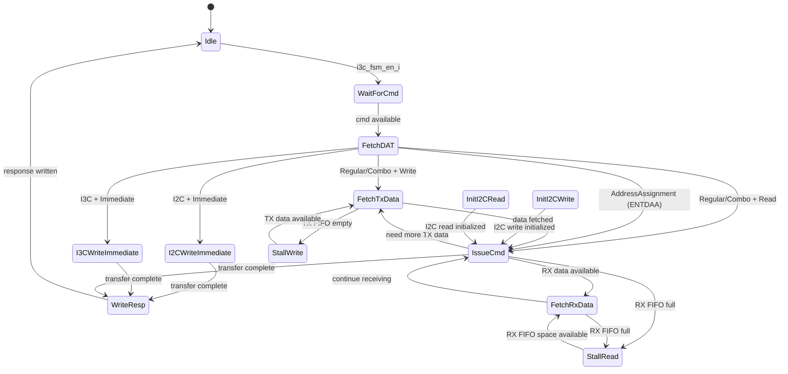

# Module: flow_active (Command Flow FSM)

> Status: Simplify + Improve
> Reference: `i3c-core/src/ctrl/flow_active.sv` (580 lines)
> Estimated LoC: ~500 lines

## 1. Purpose

The `flow_active` module is the **central command processor** of the I3C controller. It orchestrates all master transactions by:

1. Fetching command descriptors from the CMD FIFO
2. Looking up target information in the DAT
3. Coordinating bus operations via `bus_tx_flow`, `bus_rx_flow`, `scl_generator`, and `ccc`
4. Managing TX/RX FIFO data flow
5. Generating response descriptors to the RESP FIFO
6. Accumulating errors during transactions

This is the **most critical module** in the design. The reference has 8 out of 13 states unimplemented (TODO). This design implements all 13 states.

## 2. Dependencies

### Sub-modules

- None (purely FSM logic; sub-modules are peers connected by `controller_active`)

### Parent modules

- `controller_active`

### Packages

- `controller_pkg` — For `dat_entry_t`, `cmd_transfer_dir_e`
- `i3c_pkg` — For command descriptors, response descriptors, error types

### Connected Peer Modules (via controller_active)

- `bus_tx_flow` — Byte/bit transmission
- `bus_rx_flow` — Byte/bit reception
- `scl_generator` — Clock and START/STOP generation
- `ccc` — ENTDAA engine (ENEC/DISEC handled directly in `flow_active`)
- `bus_monitor` — Bus state feedback

## 3. Parameters

| Parameter          | Type | Default | Description               |
| ------------------ | ---- | ------- | ------------------------- |
| `HciCmdDataWidth`  | int  | 64      | Command descriptor width  |
| `HciTxDataWidth`   | int  | 32      | TX FIFO data width        |
| `HciRxDataWidth`   | int  | 32      | RX FIFO data width        |
| `HciRespDataWidth` | int  | 32      | Response descriptor width |
| `DatDepth`         | int  | 16      | DAT table depth           |

## 4. Ports / Interfaces

### Clock and Reset

| Signal   | Direction | Width | Description            |
| -------- | --------- | ----- | ---------------------- |
| `clk_i`  | Input     | 1     | System clock           |
| `rst_ni` | Input     | 1     | Active-low async reset |

### CMD FIFO Interface

| Signal               | Direction | Width | Description          |
| -------------------- | --------- | ----- | -------------------- |
| `cmd_queue_empty_i`  | Input     | 1     | CMD FIFO empty       |
| `cmd_queue_rvalid_i` | Input     | 1     | CMD data valid       |
| `cmd_queue_rready_o` | Output    | 1     | CMD read acknowledge |
| `cmd_queue_rdata_i`  | Input     | 64    | Command descriptor   |

### TX FIFO Interface

| Signal              | Direction | Width | Description         |
| ------------------- | --------- | ----- | ------------------- |
| `tx_queue_empty_i`  | Input     | 1     | TX FIFO empty       |
| `tx_queue_rvalid_i` | Input     | 1     | TX data valid       |
| `tx_queue_rready_o` | Output    | 1     | TX read acknowledge |
| `tx_queue_rdata_i`  | Input     | 32    | TX data DWORD       |

### RX FIFO Interface

| Signal              | Direction | Width | Description    |
| ------------------- | --------- | ----- | -------------- |
| `rx_queue_full_i`   | Input     | 1     | RX FIFO full   |
| `rx_queue_wvalid_o` | Output    | 1     | RX write valid |
| `rx_queue_wready_i` | Input     | 1     | RX FIFO ready  |
| `rx_queue_wdata_o`  | Output    | 32    | RX data DWORD  |

### RESP FIFO Interface

| Signal                | Direction | Width | Description         |
| --------------------- | --------- | ----- | ------------------- |
| `resp_queue_full_i`   | Input     | 1     | RESP FIFO full      |
| `resp_queue_wvalid_o` | Output    | 1     | RESP write valid    |
| `resp_queue_wready_i` | Input     | 1     | RESP FIFO ready     |
| `resp_queue_wdata_o`  | Output    | 32    | Response descriptor |

### DAT Interface

| Signal                | Direction | Width            | Description      |
| --------------------- | --------- | ---------------- | ---------------- |
| `dat_read_valid_hw_o` | Output    | 1                | Request DAT read |
| `dat_index_hw_o`      | Output    | $clog2(DatDepth) | DAT entry index  |
| `dat_rdata_hw_i`      | Input     | 32               | DAT entry data   |

### Bus TX Control (to bus_tx_flow)

| Signal               | Direction | Width | Description               |
| -------------------- | --------- | ----- | ------------------------- |
| `bus_tx_req_byte_o`  | Output    | 1     | Request byte transmission |
| `bus_tx_req_bit_o`   | Output    | 1     | Request bit transmission  |
| `bus_tx_req_value_o` | Output    | 8     | Value to transmit         |
| `bus_tx_done_i`      | Input     | 1     | TX completed              |
| `bus_tx_idle_i`      | Input     | 1     | TX is idle                |

### Bus RX Control (to bus_rx_flow)

| Signal              | Direction | Width | Description                   |
| ------------------- | --------- | ----- | ----------------------------- |
| `bus_rx_req_byte_o` | Output    | 1     | Request byte reception        |
| `bus_rx_req_bit_o`  | Output    | 1     | Request bit reception         |
| `bus_rx_data_i`     | Input     | 8     | Received data                 |
| `bus_rx_done_i`     | Input     | 1     | RX completed                  |
| `bus_rx_idle_i`     | Input     | 1     | RX is idle (from `rx_idle_o`) |

### SCL Generator Control

| Signal           | Direction | Width | Description                                                                                |
| ---------------- | --------- | ----- | ------------------------------------------------------------------------------------------ |
| `gen_start_o`    | Output    | 1     | Request START                                                                              |
| `gen_rstart_o`   | Output    | 1     | Request Repeated START (driven both by flow_active and in response to `ccc_req_restart_i`) |
| `gen_stop_o`     | Output    | 1     | Request STOP                                                                               |
| `gen_clock_o`    | Output    | 1     | Enable clock generation                                                                    |
| `gen_idle_o`     | Output    | 1     | Force return to idle (abort)                                                               |
| `sel_i3c_i2c_o`  | Output    | 1     | 0 = I2C FM, 1 = I3C SDR                                                                    |
| `scl_gen_done_i` | Input     | 1     | SCL generator operation complete                                                           |
| `scl_gen_busy_i` | Input     | 1     | SCL generator is busy                                                                      |

### CCC Control (to ccc module — ENTDAA only)

> **Note:** The `ccc` module is now an ENTDAA-only engine. ENEC and DISEC are handled entirely within `flow_active` via the `I3CWriteImmediate` state and do not involve this interface.

| Signal              | Direction | Width | Description                                                               |
| ------------------- | --------- | ----- | ------------------------------------------------------------------------- |
| `ccc_valid_o`       | Output    | 1     | Start ENTDAA; held high until `ccc_done_i`                                |
| `ccc_dev_count_o`   | Output    | 4     | Number of devices to address (from `addr_assign_desc_t.dev_count`)        |
| `ccc_dev_idx_o`     | Output    | 5     | Starting DAT index for address lookup (from `addr_assign_desc_t.dev_idx`) |
| `ccc_done_i`        | Input     | 1     | ENTDAA complete (from `ccc.done_o`)                                       |
| `ccc_req_restart_i` | Input     | 1     | Pulse: `ccc` requests a Repeated START for next device round              |

### CCC DAA Results (from ccc module)

> The `ccc` module reads the pre-populated DAT address itself (via its own DAT read port) and outputs results here after each successful device assignment. `flow_active` does **not** need to write addresses back to DAT — SW pre-populates them before issuing the ENTDAA command.

| Signal                | Direction | Width | Description                                          |
| --------------------- | --------- | ----- | ---------------------------------------------------- |
| `daa_address_i`       | Input     | 7     | Dynamic address just assigned                        |
| `daa_address_valid_i` | Input     | 1     | Pulse: one assignment was accepted (ACK from target) |
| `daa_pid_i`           | Input     | 48    | Provisioned ID received from the target              |
| `daa_bcr_i`           | Input     | 8     | BCR received from the target                         |
| `daa_dcr_i`           | Input     | 8     | DCR received from the target                         |

### OD/PP Mode Control

| Signal        | Direction | Width | Description               |
| ------------- | --------- | ----- | ------------------------- |
| `sel_od_pp_o` | Output    | 1     | 0=Open-Drain, 1=Push-Pull |

### Status

| Signal           | Direction | Width | Description           |
| ---------------- | --------- | ----- | --------------------- |
| `i3c_fsm_en_i`   | Input     | 1     | FSM enable (from CSR) |
| `i3c_fsm_idle_o` | Output    | 1     | FSM is idle           |

## 5. Functional Description

### 5.1. FSM States

```systemverilog
typedef enum logic [3:0] {
  Idle             = 4'd0,   // Wait for FSM enable
  WaitForCmd       = 4'd1,   // Fetch command from CMD FIFO
  FetchDAT         = 4'd2,   // Look up target in DAT
  I3CWriteImmediate= 4'd3,   // Immediate write to I3C device (CCC or short data)
  I2CWriteImmediate= 4'd4,   // Immediate write to I2C legacy device
  FetchTxData      = 4'd5,   // Fetch DWORD from TX FIFO
  FetchRxData      = 4'd6,   // Write received data to RX FIFO
  InitI2CWrite     = 4'd7,   // Initialize I2C write transaction
  InitI2CRead      = 4'd8,   // Initialize I2C read transaction
  StallWrite       = 4'd9,   // Wait for TX FIFO data (underflow prevention)
  StallRead        = 4'd10,  // Wait for RX FIFO space (overflow prevention)
  IssueCmd         = 4'd11,  // Drive command bytes on bus
  WriteResp        = 4'd12   // Generate and write response descriptor
} flow_fsm_state_e;
```



### 5.2. State Descriptions (All 13 States)

#### Idle (State 0) — IMPLEMENTED in reference

- **Purpose:** Wait for software to enable the FSM
- **Outputs:** `i3c_fsm_idle_o = 1`
- **Transition:** → `WaitForCmd` when `i3c_fsm_en_i` asserted

#### WaitForCmd (State 1) — IMPLEMENTED in reference

- **Purpose:** Fetch next command descriptor from CMD FIFO
- **Outputs:** `cmd_queue_rready_o = 1`
- **Actions:** Latch `cmd_queue_rdata_i` into internal `cmd_desc` register
- **Transition:** → `FetchDAT` when `!cmd_queue_empty_i & cmd_queue_rvalid_i`

#### FetchDAT (State 2) — IMPLEMENTED in reference

- **Purpose:** Read the DAT entry pointed to by `dev_index` field of command descriptor
- **Outputs:** `dat_read_valid_hw_o = 1`, `dat_index_hw_o = dev_index`
- **Actions:** Capture `dat_rdata_hw_i` after 1-cycle latency
- **Transition (on `dat_captured`):**
  - `cmd_attr == Immediate && i2c_cmd` → `I2CWriteImmediate`
  - `cmd_attr == Immediate && !i2c_cmd` → `I3CWriteImmediate` (covers private writes and ENEC/DISEC CCCs)
  - `cmd_attr == AddressAssignment` → `IssueCmd` (ENTDAA; no DAT read needed here — ccc reads DAT per round)
  - `cmd_dir == Write` → `FetchTxData`
  - `cmd_dir == Read` → `IssueCmd`

#### I2CWriteImmediate (State 4) — IMPLEMENTED in reference

- **Purpose:** Execute immediate data transfer to a legacy I2C device
- **Actions:**
  - Generate START via `scl_generator`
  - Send `{static_address, 1'b0}` (address + write) via `bus_tx_flow`
  - Read ACK via `bus_rx_flow`
  - Send up to 4 inline data bytes from command descriptor
  - Generate STOP (if `toc` bit set)
- **Counter:** `transfer_cnt` tracks current byte position
- **OD/PP:** Open-Drain throughout (I2C mode)
- **Transition:** → `WriteResp` when all bytes sent

#### I3CWriteImmediate (State 3) — **NEW (was TODO)**

- **Purpose:** Execute immediate data transfers on the I3C bus. Covers three sub-cases determined by the `cp` flag and `cmd[7]` (broadcast vs direct CCC):

**Sub-case A — Private I3C write (`cp = 0`):**

1. Generate START (Open-Drain)
2. Send `{dynamic_address, RnW}` from DAT entry
3. Read ACK (Open-Drain)
4. Switch to Push-Pull; send inline data bytes from descriptor with T-bit parity
5. Generate STOP (if `toc`)

**Sub-case B — Broadcast CCC (`cp = 1`, `cmd[7] = 0`, e.g. ENEC 0x00, DISEC 0x01):**

1. Generate START (Open-Drain)
2. Send `{7'h7E, 1'b0}` broadcast address
3. Read ACK
4. Send CCC code byte (`cmd` field); read ACK
5. Send defining byte (`def_or_data_byte1`) if `dtt >= 5`; read ACK
6. Generate STOP (if `toc`)

- **No Repeated START or device address — the entire frame stays Open-Drain**

**Sub-case C — Direct CCC (`cp = 1`, `cmd[7] = 1`, e.g. ENEC 0x80, DISEC 0x81):**

1. Generate START (Open-Drain)
2. Send `{7'h7E, 1'b0}` broadcast address; read ACK
3. Send CCC code byte; read ACK
4. Generate Repeated START (switch to Push-Pull)
5. Send `{dynamic_address, 1'b0}` (target address + write from DAT entry); read ACK (Open-Drain)
6. Send defining byte with T-bit parity; generate STOP (if `toc`)

- **Counter:** `transfer_cnt` tracks current byte position within inline data
- **OD/PP switching:**
  - Sub-cases A, B: Open-Drain for address/ACK phases; Push-Pull for data bytes (A only)
  - Sub-case C: Open-Drain through the broadcast header + CCC code; Push-Pull from Sr onward (data only)
- **Transition:** → `WriteResp` when complete

#### FetchTxData (State 5) — **NEW (was TODO)**

- **Purpose:** Pop a 32-bit DWORD from TX FIFO for regular/combo write transfers
- **Actions:**
  - Assert `tx_queue_rready_o` to pop TX FIFO
  - Capture `tx_queue_rdata_i` into internal `tx_dword` register
  - Track byte position within the DWORD (4 bytes per DWORD)
- **Transition:**
  - → `IssueCmd` when data captured
  - → `StallWrite` if TX FIFO empty

#### FetchRxData (State 6) — **NEW (was TODO)**

- **Purpose:** Push received data to RX FIFO
- **Actions:**
  - Assemble received bytes into a 32-bit DWORD (4 bytes per entry)
  - When DWORD complete: assert `rx_queue_wvalid_o` with `rx_queue_wdata_o`
  - Track `resp_data_length` for response descriptor
- **Transition:**
  - → `IssueCmd` to continue receiving
  - → `StallRead` if RX FIFO full

#### InitI2CWrite (State 7) — **NEW (was TODO)**

- **Purpose:** Initialize a regular I2C write transaction
- **Actions:**
  - Generate START (Open-Drain)
  - Send `{static_address, 1'b0}` (I2C address + write bit)
  - Read ACK — if NACK, set `resp_err_status = Nack`
- **OD/PP:** Open-Drain throughout
- **Transition:** → `IssueCmd` to send data bytes, or → `WriteResp` on NACK

#### InitI2CRead (State 8) — **NEW (was TODO)**

- **Purpose:** Initialize a regular I2C read transaction
- **Actions:**
  - Generate START (Open-Drain)
  - Send `{static_address, 1'b1}` (I2C address + read bit)
  - Read ACK — if NACK, set `resp_err_status = Nack`
- **OD/PP:** Open-Drain throughout
- **Transition:** → `IssueCmd` to receive data bytes, or → `WriteResp` on NACK

#### StallWrite (State 9) — **NEW (was TODO)**

- **Purpose:** Stall bus clock while waiting for TX FIFO data (prevents underflow)
- **Actions:**
  - Hold SCL LOW (deassert `gen_clock_o`)
  - Poll `tx_queue_empty_i`
- **Transition:** → `FetchTxData` when TX data available

#### StallRead (State 10) — **NEW (was TODO)**

- **Purpose:** Stall bus clock while waiting for RX FIFO space (prevents overflow)
- **Actions:**
  - Hold SCL LOW (deassert `gen_clock_o`)
  - Poll `rx_queue_full_i`
- **Transition:** → `FetchRxData` when RX space available

#### IssueCmd (State 11) — **NEW (was TODO)**

- **Purpose:** Core bus transaction execution — sends/receives data bytes on the bus
- **Actions (Write):**
  - Enable clock generation (`gen_clock_o = 1`)
  - For each byte in `tx_dword`: send via `bus_tx_flow` with T-bit (odd parity)
  - Read ACK after address byte
  - Decrement `remaining_length` counter
  - When DWORD exhausted: → `FetchTxData` for more, or → `WriteResp` when done
- **Actions (Read):**
  - Enable clock generation
  - Receive bytes via `bus_rx_flow`, check T-bit
  - Drive ACK/NACK (ACK if more data expected, NACK on last byte)
  - Accumulate into 32-bit DWORD, push to RX FIFO when full
  - When `data_length` reached or target signals end (T-bit=0): → `WriteResp`
- **Actions (ENTDAA):**
  - Set `sel_i3c_i2c_o = 1` (I3C mode)
  - Generate START (Open-Drain)
  - Send `{7'h7E, 1'b0}` broadcast header; read ACK
  - Send ENTDAA code `8'h07`; read ACK
  - Activate CCC module: assert `ccc_valid_o = 1`, provide `ccc_dev_count_o` and `ccc_dev_idx_o` from command descriptor fields
  - While `ccc_valid_o` is held high, respond to `ccc_req_restart_i` by asserting `gen_rstart_o` to scl_generator; hold `gen_rstart_o` until `scl_gen_done_i`
  - On each `daa_address_valid_i` pulse: forward `daa_address_i`, `daa_pid_i`, `daa_bcr_i`, `daa_dcr_i` to RX FIFO for SW readback
  - Wait for `ccc_done_i`; deassert `ccc_valid_o`
  - Generate STOP; → `WriteResp`
- **OD/PP switching:**
  - I2C transfers: always Open-Drain
  - I3C transfers: Open-Drain for address/ACK, Push-Pull for data

#### WriteResp (State 12) — IMPLEMENTED in reference

- **Purpose:** Generate response descriptor and push to RESP FIFO
- **Outputs:**

  ```systemverilog
  resp_desc.err_status  = resp_err_status_d;  // Accumulated error
  resp_desc.tid         = cmd_tid;             // From command descriptor
  resp_desc.data_length = resp_data_length_d;  // Actual bytes transferred
  ```

- **Actions:** Assert `resp_queue_wvalid_o` when `resp_queue_wready_i`
- **Transition:** → `Idle` when response written

### 5.3. Command Descriptor Parsing

The 64-bit command descriptor is parsed based on the `attr` field (bits [2:0]):

```systemverilog
assign cmd_attr = i3c_cmd_attr_e'(cmd_desc[2:0]);
assign cmd_tid  = cmd_desc[6:3];
assign dev_index = cmd_desc[20:16];
assign cmd_dir  = cmd_desc[29] ? Read : Write;
```

**Immediate Data Transfer (`attr = 3'b001`):**

- `dtt` field (bits [25:23]): 0-4 = data bytes, 5-7 = defining byte + (dtt-5) data bytes
- Data bytes packed in DWORD1: `{data_byte4, data_byte3, data_byte2, def_or_data_byte1}`

**Regular Transfer (`attr = 3'b000`):**

- `data_length` in DWORD1[63:48]
- Data comes from TX FIFO (write) or goes to RX FIFO (read)

**Address Assignment (`attr = 3'b010`):**

- `dev_count` in bits [29:26] → drives `ccc_dev_count_o`
- `dev_idx` in bits [20:16] → drives `ccc_dev_idx_o` (starting DAT index; ccc reads DAT entries `[dev_idx .. dev_idx + dev_count - 1]`)
- Triggers ENTDAA via CCC module; `flow_active` sends the opening broadcast header + ENTDAA code before activating `ccc_valid_o`

### 5.4. Error Accumulation

Errors are accumulated during a transaction and reported in the response:

```systemverilog
always_ff @(posedge clk_i or negedge rst_ni) begin
  if (!rst_ni || i3c_fsm_idle_o)
    resp_err_status_d <= Success;
  else if (nack_detected)
    resp_err_status_d <= Nack;
  else if (parity_error)
    resp_err_status_d <= Parity;
  else if (addr_nack)
    resp_err_status_d <= AddrHeader;
  // First error wins — once set, don't overwrite
end
```

### 5.5. OD/PP Switching Logic

```systemverilog
always_comb begin
  sel_od_pp_o = 1'b0;  // Default: Open-Drain
  if (!i2c_cmd) begin
    // I3C mode: Push-Pull after Repeated START for data phase
    if (state == IssueCmd && phase == DataPhase)
      sel_od_pp_o = 1'b1;
    // ACK/NACK bits always Open-Drain
    if (ack_phase)
      sel_od_pp_o = 1'b0;
  end
end
```

## 6. Timing Requirements

| Aspect              | Requirement                          |
| ------------------- | ------------------------------------ |
| CMD fetch latency   | 1 cycle (registered FIFO output)     |
| DAT read latency    | 1 cycle (registered read)            |
| TX FIFO to bus      | ~3 cycles (fetch + latch + drive)    |
| RX bus to FIFO      | ~2 cycles (sample + assemble)        |
| Response generation | 1 cycle after transaction completion |

## 7. Changes from Reference Design

| Aspect                    | Reference                                    | This Design                     |
| ------------------------- | -------------------------------------------- | ------------------------------- |
| Implemented states        | 5 of 13 (8 TODO)                             | All 13 implemented              |
| I3CWriteImmediate         | Empty TODO                                   | Full implementation             |
| FetchTxData / FetchRxData | Empty TODO                                   | Full implementation             |
| InitI2CWrite/Read         | Empty TODO                                   | Full implementation             |
| StallWrite/Read           | Empty TODO                                   | Full implementation             |
| IssueCmd                  | Empty TODO                                   | Full implementation             |
| Error handling            | Always returns `Success`                     | Proper error accumulation       |
| IBI interface             | 8 ports, always `'0`                         | Removed entirely                |
| DCT interface             | Full DCT read/write ports                    | Removed (SW stores PID/BCR/DCR) |
| I2C controller interface  | `fmt_fifo_*` signals to `i2c_controller_fsm` | Direct bus_tx/bus_rx control    |
| HCI threshold signals     | 10+ threshold ports per queue                | Removed (use full/empty only)   |
| `rx_queue_wvalid_o`       | Tied to `'0` (disabled)                      | Fully functional                |
| Parameters                | 10 HCI width/threshold parameters            | 5 essential parameters          |
| OD/PP control             | Not implemented (hardcoded OD)               | Proper phase-based switching    |

## 8. Error Handling

| Error            | Detection                                           | Response Code                             |
| ---------------- | --------------------------------------------------- | ----------------------------------------- |
| Address NACK     | ACK bit = 1 after address byte                      | `AddrHeader`                              |
| Data NACK        | ACK bit = 1 after data byte                         | `Nack`                                    |
| Parity error     | T-bit != calculated odd parity                      | `Parity`                                  |
| TX underflow     | TX FIFO empty when data needed                      | Stall (StallWrite), then `Ovl` if timeout |
| RX overflow      | RX FIFO full when data received                     | Stall (StallRead), then `Ovl` if timeout  |
| Frame error      | Unexpected bus condition during transfer            | `Frame`                                   |
| ENTDAA no device | `ccc_done_i` with zero `daa_address_valid_i` pulses | `Nack` (no targets responded)             |

## 9. Test Plan

### Scenarios

1. **I3C Private Write (immediate):** Send 2-byte immediate write to I3C device; verify bus waveform and response
2. **I3C Private Write (regular):** Send 8-byte write via TX FIFO; verify data integrity
3. **I3C Private Read:** Read 4 bytes from I3C device; verify RX FIFO data and response
4. **I2C Write (immediate):** Send immediate write to I2C legacy device; verify OD signaling
5. **I2C Write (regular):** Regular write via TX FIFO to I2C device
6. **I2C Read:** Read from I2C device; verify data in RX FIFO
7. **ENTDAA:** Execute ENTDAA via AddressAssignment command; verify broadcast header + ENTDAA code sent, ccc activated with correct dev_count/dev_idx, gen_rstart_o driven on ccc_req_restart_i
8. **CCC ENEC broadcast:** ImmediateDataTransfer with cp=1, cmd=0x00, dtt=5; verify [S][0x7E+W][ACK][0x00][ACK][DefByte][P] frame
9. **CCC DISEC direct:** ImmediateDataTransfer with cp=1, cmd=0x81; verify [S][0x7E+W][ACK][0x81][ACK][Sr][DA+W][ACK][DefByte][P] frame
10. **TX FIFO stall:** Large write with slow TX FIFO fill; verify StallWrite recovery
11. **RX FIFO stall:** Large read with full RX FIFO; verify StallRead recovery
12. **Address NACK:** Target NACKs address; verify AddrHeader error in response
13. **Parity error:** Corrupt T-bit; verify Parity error in response
14. **OD/PP switching:** Verify Open-Drain for address/ACK, Push-Pull for I3C data
15. **Multiple commands:** Enqueue 3 commands; verify all execute sequentially with correct responses
16. **Back-to-back transfers:** No idle gap between commands; verify performance

### Corner Cases

- Empty CMD FIFO when FSM enabled (stays in WaitForCmd)
- RESP FIFO full when writing response (stays in WriteResp until space available)
- Zero-length transfer (`data_length = 0`)
- Maximum-length transfer (`data_length = 65535`)

### UVM Test Structure

```
verification/uvm/
  tb_top.sv                    # DUT instantiation + clock/reset generation
  i3c_if.sv                    # SystemVerilog interface (SCL, SDA, register bus)
  i3c_env.sv                   # UVM environment (agent + scoreboard + coverage)
  i3c_agent.sv                 # UVM agent (sequencer + driver + monitor)
  i3c_driver.sv                # Drives SCL/SDA and register bus
  i3c_monitor.sv               # Samples bus transactions
  i3c_scoreboard.sv            # Checks responses vs expected
  i3c_coverage.sv              # Functional coverage groups
  sequences/
    i3c_base_seq.sv
    i3c_entdaa_seq.sv
    i3c_private_write_seq.sv
    i3c_private_read_seq.sv
    i3c_i2c_write_seq.sv
    i3c_enec_disec_seq.sv
  tests/
    i3c_base_test.sv
    i3c_entdaa_test.sv
    i3c_private_rw_test.sv
    i3c_i2c_test.sv
    i3c_error_test.sv
```

**Module coverage note:** `flow_active` is exercised by all tests — the command FSM drives every transaction from CMD FIFO fetch through bus_tx/bus_rx orchestration to RESP FIFO write.

## 10. Implementation Notes

- The reference design uses `i2c_controller_fsm` as a sub-module for I2C transactions (via `fmt_fifo_*` interface). This design eliminates that dependency — `flow_active` drives `bus_tx_flow` and `bus_rx_flow` directly for both I3C and I2C transfers. The difference is only in timing (CSR values) and OD/PP mode.
- The `transfer_cnt` counter is used in both immediate and regular transfers but with different semantics: for immediate, it counts bytes within the descriptor; for regular, it counts bytes within the current DWORD from TX FIFO. A separate `remaining_length` counter tracks the total transfer progress.
- The `cmd_desc` register is loaded once in `WaitForCmd` and remains stable throughout the transaction. Individual fields are extracted combinationally.
- OD/PP switching must happen at byte boundaries — never mid-byte. The `sel_od_pp_o` output changes only when transitioning between bus phases (address → data, ACK → data).
- For ENTDAA, `flow_active` generates the initial broadcast header (`{7'h7E, 1'b0}`) and ENTDAA code (`0x07`) with ACK checks, then activates the `ccc` module (`ccc_valid_o = 1`) for the multi-device DAA loop. During the loop, `flow_active` services `ccc_req_restart_i` by asserting `gen_rstart_o` to the SCL generator. After `ccc_done_i`, `flow_active` generates STOP and writes the response. The `ccc` module reads DAT entries independently — `flow_active` does not need to perform DAT reads for ENTDAA rounds.
- For ENEC and DISEC, `flow_active` handles the full CCC frame within `I3CWriteImmediate`. No `ccc_valid_o` is ever asserted for these CCCs. The `cp` flag and `cmd` field of the `ImmediateDataTransfer` descriptor carry all necessary information.
