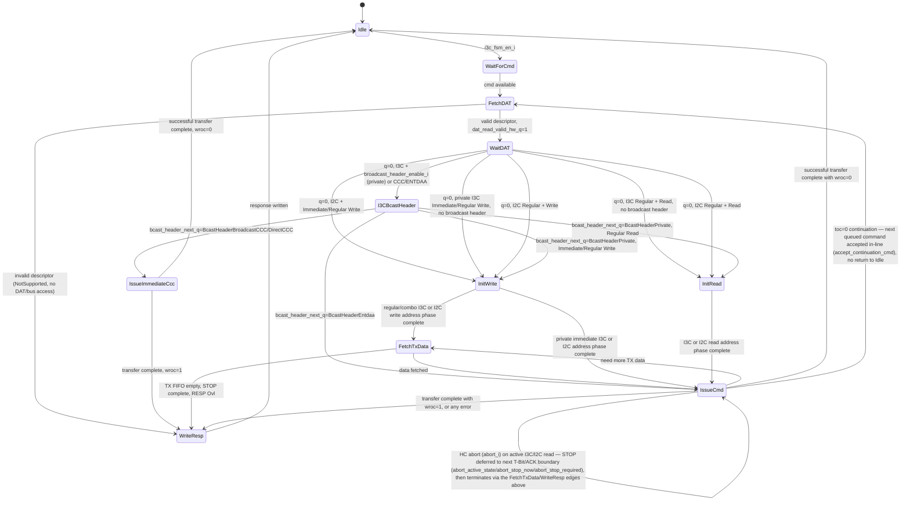

# Module: flow_active (Command Flow FSM)

> Status: Complete
> Reference: `i3c-core/src/ctrl/flow_active.sv` (580 lines)
> Estimated LoC: ~1700 lines

> Resolved review notes (audited against RTL):
> - ENTDAA no-device response policy: **Aligned.** No-device → `Success`, length 0, matching §8. `Nack` is reserved for the DAA-reject-after-retry case (`daa_nack_error_q`), not the no-device case.
> - CCC phase OD/PP and ACK/T-bit wording: **Aligned.** Confirmed correct as written in §5.2 sub-cases B/C.
> - `WriteResp` ready/valid wording: **Resolved.** Commands enter `WriteResp` only when a response is required. Within `WriteResp`, `resp_queue_wvalid_o` is asserted unconditionally and the state is held until `resp_queue_wready_i` (standard valid-before-ready); see §5.2.

## 1. Purpose

The `flow_active` module is the **central command processor** of the I3C controller. It orchestrates all master transactions by:

1. Fetching command descriptors from the CMD FIFO
2. Looking up target information in the DAT
3. Coordinating bus operations via `bus_tx_flow`, `bus_rx_flow`, `scl_generator`, and `entdaa_controller`
4. Managing TX/RX FIFO data flow
5. Generating response descriptors to the RESP FIFO
6. Accumulating errors during transactions

This is the **most critical module** in the design. The reference has 8 out of 13 states unimplemented (TODO). This design implements all 13 states.

## 2. Dependencies

### Sub-modules

- None (purely FSM logic; sub-modules are peers connected by `controller_active`)

### Parent modules

- `controller_active`

### Packages

- `controller_pkg` — For `dat_entry_t`, `cmd_transfer_dir_e`
- `i3c_pkg` — For command descriptors, response descriptors, error types

### Connected Peer Modules (via controller_active)

- `bus_tx_flow` — Byte/bit transmission
- `bus_rx_flow` — Byte/bit reception
- `scl_generator` — Clock and START/STOP generation
- `entdaa_controller` — ENTDAA engine (ENEC/DISEC handled directly in `flow_active`)
- `bus_monitor` — Bus state feedback

## 3. Parameters

| Parameter          | Type | Default | Description               |
| ------------------ | ---- | ------- | ------------------------- |
| `HciCmdDataWidth`  | int  | 64      | Command descriptor width  |
| `HciTxDataWidth`   | int  | 32      | TX FIFO data width        |
| `HciRxDataWidth`   | int  | 32      | RX FIFO data width        |
| `HciRespDataWidth` | int  | 32      | Response descriptor width |
| `DatDepth`         | int  | 32      | DAT table depth           |

## 4. Ports / Interfaces

### Clock and Reset

| Signal   | Direction | Width | Description            |
| -------- | --------- | ----- | ---------------------- |
| `clk_i`  | Input     | 1     | System clock           |
| `rst_ni` | Input     | 1     | Active-low async reset |

### CMD FIFO Interface

| Signal               | Direction | Width | Description          |
| -------------------- | --------- | ----- | -------------------- |
| `cmd_queue_empty_i`  | Input     | 1     | CMD FIFO empty       |
| `cmd_queue_rvalid_i` | Input     | 1     | CMD data valid       |
| `cmd_queue_rready_o` | Output    | 1     | CMD read acknowledge |
| `cmd_queue_rdata_i`  | Input     | 64    | Command descriptor   |

### TX FIFO Interface

| Signal              | Direction | Width | Description         |
| ------------------- | --------- | ----- | ------------------- |
| `tx_queue_empty_i`  | Input     | 1     | TX FIFO empty       |
| `tx_queue_rvalid_i` | Input     | 1     | TX data valid       |
| `tx_queue_rready_o` | Output    | 1     | TX read acknowledge |
| `tx_queue_rdata_i`  | Input     | 32    | TX data DWORD       |

### RX FIFO Interface

| Signal              | Direction | Width | Description    |
| ------------------- | --------- | ----- | -------------- |
| `rx_queue_full_i`   | Input     | 1     | RX FIFO full   |
| `rx_queue_wvalid_o` | Output    | 1     | RX write valid |
| `rx_queue_wready_i` | Input     | 1     | RX FIFO ready  |
| `rx_queue_wdata_o`  | Output    | 32    | RX data DWORD  |

### RESP FIFO Interface

| Signal                | Direction | Width | Description         |
| --------------------- | --------- | ----- | ------------------- |
| `resp_queue_full_i`   | Input     | 1     | RESP FIFO full      |
| `resp_queue_wvalid_o` | Output    | 1     | RESP write valid    |
| `resp_queue_wready_i` | Input     | 1     | RESP FIFO ready     |
| `resp_queue_wdata_o`  | Output    | 32    | Response descriptor |

### DAT Interface

| Signal                | Direction | Width            | Description      |
| --------------------- | --------- | ---------------- | ---------------- |
| `dat_read_valid_hw_o` | Output    | 1                | Request DAT read |
| `dat_index_hw_o`      | Output    | $clog2(DatDepth) | DAT entry index  |
| `dat_rdata_hw_i`      | Input     | 32               | DAT entry data   |

### Bus TX Control (to bus_tx_flow)

| Signal               | Direction | Width | Description               |
| -------------------- | --------- | ----- | ------------------------- |
| `bus_tx_req_byte_o`  | Output    | 1     | Request byte transmission |
| `bus_tx_req_bit_o`   | Output    | 1     | Request bit transmission  |
| `bus_tx_req_value_o` | Output    | 8     | Value to transmit         |
| `bus_tx_done_i`      | Input     | 1     | TX completed              |
| `bus_tx_idle_i`      | Input     | 1     | TX is idle                |

### Bus RX Control (to bus_rx_flow)

| Signal              | Direction | Width | Description                   |
| ------------------- | --------- | ----- | ----------------------------- |
| `bus_rx_req_byte_o` | Output    | 1     | Request byte reception        |
| `bus_rx_req_bit_o`  | Output    | 1     | Request bit reception         |
| `bus_rx_req_bit_handoff_o` | Output | 1 | Request bit reception with controller-takes-9th-bit handoff (address-ACK and write T-bit sampling) |
| `bus_rx_data_i`     | Input     | 8     | Received data                 |
| `bus_rx_done_i`     | Input     | 1     | RX completed                  |
| `bus_rx_idle_i`     | Input     | 1     | RX is idle (from `rx_idle_o`) |

### SCL Generator Control

| Signal           | Direction | Width | Description                      |
| ---------------- | --------- | ----- | -------------------------------- |
| `gen_start_o`    | Output    | 1     | Request START                    |
| `gen_rstart_o`   | Output    | 1     | Request Repeated START           |
| `takeover_o`     | Output    | 1     | Read-takeover fast-path: asserted alongside `gen_rstart_o` when the controller retakes SDA mid-read (requested-length reached or HC abort) or during ENTDAA Repeated START handling |
| `gen_stop_o`     | Output    | 1     | Request STOP                     |
| `gen_clock_o`    | Output    | 1     | Enable clock generation          |
| `gen_idle_o`     | Output    | 1     | Force return to idle (abort)     |
| `sel_i3c_i2c_o`  | Output    | 1     | 0 = I2C FM, 1 = I3C SDR          |
| `use_i2c_timing_o` | Output  | 1     | Select legacy I2C timing values  |
| `scl_use_od_low_o` | Output  | 1     | Use OD low timing in SCL generator |
| `scl_gen_done_i` | Input     | 1     | SCL generator operation complete |
| `scl_gen_busy_i` | Input     | 1     | SCL generator is busy            |

### ENTDAA Control (to entdaa_controller module)

> **Note:** The `entdaa_controller` module is an ENTDAA-only engine. ENEC and DISEC are handled entirely within `flow_active` via the `IssueImmediateCcc` state. The restart signal between `entdaa_controller` and `scl_generator` is handled by `controller_active`'s `daa_restart_pending_q` latch — `flow_active` does not service restart requests directly.

| Signal            | Direction | Width | Description                                                               |
| ----------------- | --------- | ----- | ------------------------------------------------------------------------- |
| `ccc_valid_o`     | Output    | 1     | Start ENTDAA; held high until `ccc_done_i`                                |
| `daa_stop_o`      | Output    | 1     | Request STOP of the ENTDAA loop (asserted on HC abort or `abort_i` during the DAA phase) |
| `ccc_dev_count_o` | Output    | 4     | Number of devices to address (from `addr_assign_desc_t.dev_count`)        |
| `daa_dev_idx_o`   | Output    | 5     | Starting DAT index for address lookup (from `addr_assign_desc_t.dev_idx`) |
| `ccc_done_i`      | Input     | 1     | ENTDAA complete (from `entdaa_controller.done_o`)                         |
| `daa_stop_req_i`  | Input     | 1     | Request to generate STOP now and end the ENTDAA loop                      |
| `daa_stopped_i`   | Input     | 1     | ENTDAA loop has stopped (gates `IssueCmd` → `WriteResp` together with `ccc_done_i`) |
| `daa_nack_error_i`| Input     | 1     | A device address-assignment attempt was NACKed after retry; latched into `daa_nack_error_q` and reported as `Nack` |

### ENTDAA Results (from entdaa_controller module)

> The `entdaa_controller` module reads the pre-populated DAT address itself (via its own DAT read port) and outputs results here after each successful device assignment. `flow_active` does **not** need to write addresses back to DAT — SW pre-populates them before issuing the ENTDAA command.

| Signal                | Direction | Width | Description                                          |
| --------------------- | --------- | ----- | ---------------------------------------------------- |
| `daa_address_i`       | Input     | 7     | Dynamic address just assigned                        |
| `daa_address_valid_i` | Input     | 1     | Pulse: one assignment was accepted (ACK from target) |
| `daa_pid_i`           | Input     | 48    | Provisioned ID received from the target              |
| `daa_bcr_i`           | Input     | 8     | BCR received from the target                         |
| `daa_dcr_i`           | Input     | 8     | DCR received from the target                         |

### OD/PP Mode Control

| Signal        | Direction | Width | Description               |
| ------------- | --------- | ----- | ------------------------- |
| `sel_od_pp_o` | Output    | 1     | 0=Open-Drain, 1=Push-Pull |

### Status

| Signal                             | Direction | Width | Description                           |
| ---------------------------------- | --------- | ----- | ------------------------------------- |
| `i3c_fsm_en_i`                     | Input     | 1     | FSM enable (from CSR)                 |
| `abort_i`                          | Input     | 1     | Request abort of an active transfer   |
| `i3c_fsm_idle_o`                   | Output    | 1     | FSM is idle                           |

## 5. Functional Description

### 5.1. FSM States

```systemverilog
typedef enum logic [3:0] {
  Idle              = 4'd0,   // Wait for FSM enable
  WaitForCmd        = 4'd1,   // Fetch command from CMD FIFO
  FetchDAT          = 4'd2,   // Look up target in DAT
  WaitDAT           = 4'd3,   // Wait for dat_entry capture to settle
  I3CBcastHeader    = 4'd4,   // Optional I3C broadcast-header preamble
  IssueImmediateCcc = 4'd5,   // Immediate CCC execution
  FetchTxData       = 4'd6,   // Fetch DWORD from TX FIFO
  InitWrite         = 4'd7,   // Initialize write transaction (I3C or I2C)
  InitRead          = 4'd8,   // Initialize read transaction (I3C or I2C)
  // 4'd9, 4'd10 reserved (freed by the InitI3C*/InitI2C* merge)
  IssueCmd          = 4'd11,  // Drive command/data bytes on bus
  WriteResp         = 4'd12   // Generate and write response descriptor
} flow_fsm_state_e;
```

A second, narrower helper enum steers the exit out of `I3CBcastHeader` once the broadcast
header preamble completes (latched in `WaitDAT`, before `I3CBcastHeader` is even entered):

```systemverilog
typedef enum logic [1:0] {
  BcastHeaderPrivate      = 2'd0,  // private regular/immediate xfer, broadcast header was opt-in
  BcastHeaderBroadcastCCC = 2'd1,  // CCC sub-case A/B (no target address byte)
  BcastHeaderDirectCCC    = 2'd2,  // CCC sub-case C (direct, has target address byte)
  BcastHeaderEntdaa       = 2'd3   // AddressAssignment (ENTDAA)
} bcast_header_next_e;
```

`bcast_header_next_q` is latched in `WaitDAT` alongside the main FSM state and read back in
`I3CBcastHeader` to choose its successor state (`IssueImmediateCcc`/`IssueCmd`/`InitWrite`/
`InitRead`) — see the dispatch edges in the diagram below.


```mermaid
stateDiagram-v2
    [*] --> Idle
    Idle --> WaitForCmd: i3c_fsm_en_i

    WaitForCmd --> FetchDAT: cmd available

    FetchDAT --> WriteResp: invalid descriptor (NotSupported, no DAT/bus access)
    FetchDAT --> WaitDAT: valid descriptor, dat_read_valid_hw_q=1

    WaitDAT --> InitWrite: q=0, I2C + Immediate/Regular Write
    WaitDAT --> I3CBcastHeader: q=0, I3C + broadcast_header_enable_i (private) or CCC/ENTDAA
    WaitDAT --> InitWrite: q=0, private I3C Immediate/Regular Write, no broadcast header
    WaitDAT --> InitRead: q=0, I3C Regular + Read, no broadcast header
    WaitDAT --> InitWrite: q=0, I2C Regular + Write
    WaitDAT --> InitRead: q=0, I2C Regular + Read

    I3CBcastHeader --> IssueImmediateCcc: bcast_header_next_q=BcastHeaderBroadcastCCC/DirectCCC
    I3CBcastHeader --> IssueCmd: bcast_header_next_q=BcastHeaderEntdaa
    I3CBcastHeader --> InitWrite: bcast_header_next_q=BcastHeaderPrivate, Immediate/Regular Write
    I3CBcastHeader --> InitRead: bcast_header_next_q=BcastHeaderPrivate, Regular Read

    IssueImmediateCcc --> WriteResp: transfer complete, wroc=1
    IssueImmediateCcc --> Idle: successful transfer complete, wroc=0

    FetchTxData --> IssueCmd: data fetched
    FetchTxData --> WriteResp: TX FIFO empty, STOP complete, RESP Ovl

    IssueCmd --> FetchTxData: need more TX data
    IssueCmd --> WriteResp: transfer complete with wroc=1, or any error
    IssueCmd --> Idle: successful transfer complete with wroc=0
    IssueCmd --> FetchDAT: toc=0 continuation — next queued command accepted in-line (accept_continuation_cmd), no return to Idle

    InitWrite --> FetchTxData: regular/combo I3C or I2C write address phase complete
    InitWrite --> IssueCmd: private immediate I3C or I2C address phase complete
    InitRead --> IssueCmd: I3C or I2C read address phase complete

    WriteResp --> Idle: response written

    IssueCmd --> IssueCmd: HC abort (abort_i) on active I3C/I2C read — STOP deferred to next T-Bit/ACK boundary (abort_active_state/abort_stop_now/abort_stop_required), then terminates via the FetchTxData/WriteResp edges above
```

### 5.2. State Descriptions (11 Active States, 2 Reserved Encodings)

#### Idle (State 0) — IMPLEMENTED in reference

- **Purpose:** Wait for software to enable the FSM
- **Outputs:** `i3c_fsm_idle_o = 1`
- **Transition:** → `WaitForCmd` when `i3c_fsm_en_i` asserted

#### WaitForCmd (State 1) — IMPLEMENTED in reference

- **Purpose:** Fetch next command descriptor from CMD FIFO
- **Outputs:** `cmd_queue_rready_o = 1`
- **Actions:** Latch `cmd_queue_rdata_i` into internal `cmd_desc` register
- **Transition:** → `FetchDAT` when `!cmd_queue_empty_i & cmd_queue_rvalid_i`

#### FetchDAT (State 2) — IMPLEMENTED in reference

- **Purpose:** Validate the complete command descriptor before any DAT or bus access. A supported descriptor then asserts the DAT read request long enough for the CSR FF to latch `dat_mem[dat_index]` into `dat_rdata_o`.
- **Invalid descriptor:** Set `not_supported_q`, keep DAT/bus request outputs low, and transition directly to `WriteResp`. The response is `NotSupported`, preserves TID, and has length 0 regardless of WROC.
- **Supported descriptor outputs:** `dat_read_valid_hw_o = 1`, `dat_index_hw_o = dev_index`
- **Supported descriptor transition:** → `WaitDAT` when `dat_read_valid_hw_q = 1`

#### WaitDAT (State 3) — new (M-6 fix)

- **Purpose:** Allow the `dat_entry` capture FF to re-fire with the correct `dat_rdata_o` before using `dat_entry.device` to select the next state.
- **Background:** `dat_rdata_o` in `csr_register` is a FF updated by `dat_read_valid_hw_q`. The `dat_entry` capture FF in `flow_active` is also gated by `dat_read_valid_hw_q`. Both fire at the same posedge (K+2), so `dat_entry` captures the OLD `dat_rdata_o`. Staying in WaitDAT one extra cycle lets `dat_read_valid_hw_q` fall to 0 while `dat_rdata_o` is already NEW; the capture FF re-fires at posedge K+3 reading the correct value.
- **Outputs:** none (all defaults; `dat_read_valid_hw_d = 0` is critical — lets `q` drop to 0)
- **Transition (on `!dat_read_valid_hw_q`):**
  - Immediate CCC (`cp = 1`) → `I3CBcastHeader`
  - Private immediate I3C (`cp = 0`) → `I3CBcastHeader` when `broadcast_header_enable_i = 1`; otherwise `InitWrite`. Immediate transfers do not support continuation via `toc = 0`.
  - Legacy I2C immediate → `InitWrite`
  - Valid `cmd_attr == AddressAssignment` → `I3CBcastHeader` (ENTDAA); descriptor validation already occurred in `FetchDAT`
  - Private regular I3C write/read → `I3CBcastHeader` only when `broadcast_header_enable_i = 1` and this is not a continuation; otherwise `InitWrite`/`InitRead`
  - Legacy I2C regular write/read → `InitWrite`/`InitRead`
- **Timing cost:** +2 cycles vs original FetchDAT direct dispatch (negligible vs SCL timing)

#### I3CBcastHeader (State 4)

- **Purpose:** Shared helper state that sends the I3C broadcast header `START + 7'h7E/W + ACK`.
- **Used for:** broadcast CCC, direct CCC, ENTDAA, and config-enabled fresh private I3C transfers.
- **Private transfer behavior:** after ACK, generate `Sr` in the following private address preamble before sending the target dynamic address.
- **CCC/ENTDAA behavior:** after ACK, continue directly with the CCC byte phase; the repeated-start, if required, is generated by the transaction-specific path.

#### Legacy I2C immediate write

- **Path:** `WaitDAT` -> `InitWrite` -> `IssueCmd` -> `WriteResp`.
- **Address phase:** `InitWrite` generates START, sends `{static_address, Write}`, and reads ACK.
- **Data phase:** `IssueCmd` sends up to four inline descriptor bytes and reads the I2C ACK/NACK after each byte.
- **OD/PP:** Open-Drain throughout.
- **Completion:** Generate STOP after all bytes, address NACK, data NACK, or HC abort.

#### IssueImmediateCcc (State 5) — **NEW (was TODO)**

- **Purpose:** Execute immediate data transfers on the I3C bus. Covers three sub-cases determined by the `cp` flag and `cmd[7]` (broadcast vs direct CCC):

**Sub-case A — Private I3C write (`cp = 0`):**

1. If `broadcast_header_enable_i = 1` and this is a fresh transfer, first send `START + 7E/W + Sr`.
2. Generate START or repeated START as selected by the preamble path.
3. Send `{dynamic_address, RnW}` from DAT entry.
4. Read ACK (Open-Drain).
5. Switch to Push-Pull; send inline data bytes from descriptor with T-bit parity.
6. Generate STOP (if `toc`).

**Sub-case B — Broadcast CCC (`cp = 1`, `cmd[7] = 0`, e.g. ENEC 0x00, DISEC 0x01):**

1. Generate START (Open-Drain)
2. Send `{7'h7E, 1'b0}` broadcast address
3. Read ACK
4. Switch to Push-Pull; send CCC code byte (`cmd` field) followed by controller T-bit (`~^cmd`)
5. For ENEC/DISEC, send Target Events byte from `def_or_data_byte1` followed by controller T-bit (`~^def_or_data_byte1`)
6. Generate STOP (if `toc`)

- **No Repeated START or device address.** Only the broadcast address and ACK are Open-Drain; CCC payload bytes and their T-bits are Push-Pull.
- **DTT policy:** The current implementation accepts only `dtt <= 4` for all Immediate Data Transfer descriptors. For ENEC/DISEC, legal `dtt` values do not select the event-byte count; exactly one Target Events byte is sent from `def_or_data_byte1`. `dtt > 4` is rejected in `FetchDAT` before DAT or bus activity with a `NotSupported` response.
- **ENTDAA descriptor policy:** `AddressAssignment` descriptors require `cmd=8'h07`, `toc=1`, `wroc=1`, `dev_count>0`, and `dev_idx+dev_count<=DatDepth`. Violations are rejected in `FetchDAT` before any DAT read, START, or `7'h7E` broadcast header. The range sum is widened before comparison so an index near the end of DAT cannot wrap. The response status is `NotSupported` with length 0.

**Sub-case C — Direct CCC (`cp = 1`, `cmd[7] = 1`, e.g. ENEC 0x80, DISEC 0x81):**

1. Generate START (Open-Drain)
2. Send `{7'h7E, 1'b0}` broadcast address; read ACK
3. Send CCC code byte followed by controller T-bit
4. Generate Repeated START (switch to Push-Pull)
5. Send `{dynamic_address, 1'b0}` (target address + write from DAT entry); read ACK (Open-Drain)
6. Send defining byte with T-bit parity; generate STOP (if `toc`)

- **Counter:** `issue_phase_q` (phase micro-counter) tracks current byte/bit position within inline data
- **OD/PP switching:**
  - Sub-cases A, B: Open-Drain for address/ACK phases; Push-Pull for I3C data/CCC payload bytes and controller T-bits
  - Sub-case C: Open-Drain for broadcast/target ACK sampling; Push-Pull for CCC opcode, controller T-bits, target address byte, and defining/event byte
- **Transition:** → `WriteResp` when complete

#### FetchTxData (State 6) — **NEW (was TODO)**

- **Purpose:** Pop a 32-bit DWORD from TX FIFO for regular/combo write transfers
- **Actions:**
  - Assert `tx_queue_rready_o` to pop TX FIFO
  - Capture `tx_queue_rdata_i` into internal `tx_dword` register
  - Track byte position within the DWORD (4 bytes per DWORD)
- **Transition:**
  - → `IssueCmd` when data captured
  - → `WriteResp` with response error `Ovl` if TX FIFO is empty when the controller needs the next DWORD

#### InitWrite (State 7) — **NEW (was TODO)**; merges the former InitI3CWrite/InitI2CWrite

- **Purpose:** Initialize a regular write transaction, I3C or I2C, selected by `!dat_entry.device`/`dat_entry.device`
- **Actions:**
  - Generate START or repeated START through the shared I3C/I2C address preamble (`drive_i3c_addr_preamble`/`drive_i2c_addr_preamble`, selected by `target_is_i3c`)
  - I3C: send `{dynamic_address, 1'b0}` from the DAT entry. I2C: send `{static_address, 1'b0}`
  - Read address ACK and set `AddrHeader` response status on NACK
- **OD/PP:** Open-Drain for START/address/ACK throughout (I2C never switches to Push-Pull); for I3C the later data phase is Push-Pull in `IssueCmd`
- **Transition:** I3C regular → `FetchTxData` when `data_length > 0`, else `IssueCmd`. I2C regular → `FetchTxData` unconditionally. Either mode, immediate → `IssueCmd`

#### InitRead (State 8) — **NEW (was TODO)**; merges the former InitI3CRead/InitI2CRead

- **Purpose:** Initialize a regular read transaction, I3C or I2C, selected by `!dat_entry.device`/`dat_entry.device`
- **Actions:**
  - Generate START or repeated START through the shared I3C/I2C address preamble, selected by `target_is_i3c`
  - I3C: send `{dynamic_address, 1'b1}` from the DAT entry. I2C: send `{static_address, 1'b1}`
  - Read address ACK and set `AddrHeader` response status on NACK
- **OD/PP:** Open-Drain for START/address/ACK throughout (I2C never switches to Push-Pull); for I3C the later read data phase uses Push-Pull timing/ownership rules in `IssueCmd`
- **Transition:** → `IssueCmd` after address phase, or → `WriteResp` on NACK after STOP

#### TX FIFO underflow handling

- **Purpose:** Terminate a regular/combo write deterministically when software did not provide enough TX FIFO data.
- **Actions:**
  - Do not assert `tx_queue_rready_o` while the TX FIFO is empty.
  - Latch `tx_underflow`.
  - Generate STOP using the active I3C/I2C timing mode.
  - Write a response descriptor with error status `Ovl` and `data_length` equal to the number of bytes already transferred.
- **Transition:** `FetchTxData` → `WriteResp` after STOP completes.

#### IssueCmd (State 11) — **NEW (was TODO)**

- **Purpose:** Core bus transaction execution — sends/receives data bytes on the bus
- **Actions (Write):**
  - Enable clock generation (`gen_clock_o = 1`)
  - For each byte in `tx_dword`: send via `bus_tx_flow` with T-bit (odd parity)
  - Read ACK after address byte
  - Decrement `remaining_len_q` counter
  - When DWORD exhausted: → `FetchTxData` for more; on successful completion, → `WriteResp` for `wroc=1` or → `Idle` for `wroc=0`
- **Actions (Read):**
  - Enable clock generation
  - Receive bytes via `bus_rx_flow`, check T-bit
  - Drive ACK/NACK (ACK if more data expected, NACK on last byte)
  - Accumulate into 32-bit DWORD, push to RX FIFO when full
  - If RX FIFO cannot accept a committed DWORD, latch `rx_overflow` and terminate with `Ovl`
  - For an I2C read, when the received byte completes a DWORD that RX FIFO cannot
    accept, drive NACK in that byte's controller-owned ACK/NACK slot, then STOP.
    The rejected DWORD is not stored, while response `data_length` includes all bytes
    received through that rejected commit boundary.
  - When `data_length` is reached successfully: → `WriteResp` for `wroc=1` or → `Idle` for `wroc=0`. Target early termination (T-bit=0 before the requested length, latched as `short_read_q`) always forces STOP and ends the transfer — no `toc=0` continuation is taken regardless of the next command, even when `sre=0`. Whether the termination is *reported* as an error is a separate, `sre`-gated decision (`short_read_error = short_read_q && reg_desc.sre`, §5.4): with `sre=1` → `WriteResp` with `I3cShortReadErr`; with `sre=0` the same termination is not an error — → `WriteResp` with `Success` if `wroc=1`, or → `Idle` with no response at all if `wroc=0`
  - **Controller read takeover / abort (MIPI I3C Basic v1.1.1 §5.1.2.3.4):** once the
    target has ACKed a read address it drives SDA push-pull, so the controller may only
    retake the bus at a **T-Bit** (9th bit), where the target parks SDA to High-Z. The
    controller never tears a read down with a bare STOP mid-word.
    - **Early termination at requested length:** when `remaining_len` reaches 0 and the
      target returns T-Bit=1 (parked, would continue), assert `gen_rstart_o`
      (`request_read_takeover`) — a Repeated START — then STOP (or a new address for a
      `toc=0` continuation).
    - **HC abort (`abort_i`) of an active I3C read:** the blanket abort STOP is **deferred**
      (`abort_immediate_stop_safe` returns 0 for this phase). The controller finishes the in-flight data word — or,
      if abort lands right after the ACK, the **first** data word — to its T-Bit, latches
      `read_abort_term_q`/`hc_aborted_q`, then retakes SDA: **T-Bit=1 → Repeated START
      then STOP**; **T-Bit=0 → direct STOP** (target already released SDA). Response is
      `HcAborted` (not `I3cShortReadErr`), with `data_length` = bytes actually received.
    - **HC abort (`abort_i`) of an active I2C read:** the blanket abort STOP is
      deferred until the current byte reaches the I2C ACK/NACK bit. The controller
      receives and commits the in-flight byte, drives NACK as the controller-owned
      9th bit, then generates STOP. No Repeated START or continuation is generated
      for an I2C read abort, even when `toc=0`. Response is `HcAborted`, with
      `data_length` = committed bytes including the abort-terminated byte.
- **Actions (ENTDAA):**
  - Set `sel_i3c_i2c_o = 1` (I3C mode)
  - Generate START (Open-Drain)
  - Send `{7'h7E, 1'b0}` broadcast header; read ACK
  - Send ENTDAA code `8'h07` followed by controller T-bit
  - Activate entdaa_controller: assert `ccc_valid_o = 1`, provide `ccc_dev_count_o` and `daa_dev_idx_o` from command descriptor
  - Wait for `ccc_done_i`; deassert `ccc_valid_o` (the `daa_restart_pending_q` latch in `controller_active` routes each restart pulse from `entdaa_controller` to `scl_generator` automatically — `flow_active` does not service restart requests)
  - On each `daa_address_valid_i` pulse: forward the DAA result to RX FIFO for SW readback as three DWORDs:
    `PID[47:16]`, `{PID[15:0], BCR[7:0], DCR[7:0]}`, and `{25'h0, DA[6:0]}`
  - If `entdaa_controller` reports that the next DAT dynamic address is reserved, wait for the normal DAA STOP completion and report `NotSupported` with `data_length` equal to the already committed DAA result bytes
  - If RX FIFO cannot accept a DAA result DWORD, latch `rx_overflow`, request STOP, and report `Ovl` with `data_length` equal to the number of DAA result bytes actually committed
  - Generate STOP; → `WriteResp`
- **OD/PP switching:**
  - I2C transfers: always Open-Drain
  - I3C transfers: Open-Drain for address/ACK, Push-Pull for data

#### WriteResp (State 12) — IMPLEMENTED in reference

- **Purpose:** Generate response descriptor and push to RESP FIFO
- **Entry policy:** successful regular, immediate, and immediate-CCC commands enter this state only when their active descriptor has `wroc=1`. Any error enters this state regardless of `wroc`. `AddressAssignment.wroc=0` remains an invalid descriptor and is rejected with `NotSupported`.
- **Outputs:**

  ```systemverilog
  resp_desc.err_status  = resp_err_status_d;  // Accumulated error
  resp_desc.tid         = cmd_tid;             // From command descriptor
  resp_desc.data_length = resp_data_length_d;  // Actual bytes transferred
  ```

- **Actions:** Assert `resp_queue_wvalid_o` unconditionally (standard valid-before-ready); the state is held until `resp_queue_wready_i` is asserted
- **Transition:** → `Idle` when `resp_queue_wready_i` (response written)

For a supported regular `toc=0` continuation, the completed command is reported before the next command is accepted only when `wroc=1`; therefore acceptance waits for `resp_queue_wready_i`. With `wroc=0`, no response is generated and the next supported command is accepted without RESP FIFO dependency. A missing or unsupported continuation terminates with STOP and a `NotSupported` response regardless of WROC.

### 5.3. Command Descriptor Parsing

The 64-bit command descriptor is parsed based on the `attr` field (bits [2:0]):

```systemverilog
assign cmd_attr = i3c_cmd_attr_e'(cmd_desc[2:0]);
assign cmd_tid  = cmd_desc[6:3];
assign dev_index = cmd_desc[20:16];
assign cmd_dir  = cmd_desc[29] ? Read : Write;
```

Before DAT access, `invalid_cmd_desc()` applies the implemented-subset policy:

- Only DAT-format `RegularTransfer` (`000`), `ImmediateDataTransfer` (`001`), and `AddressAssignment` (`010`) are supported. `ComboTransfer` (`011`) and direct/internal attribute values `100` through `111` return `NotSupported`.
- Only `mode=sdr0` is supported for regular and immediate transfers. `sdr1` through `sdr4`, both HDR values, and `reserved` return `NotSupported`.
- Regular transfers require `cp=0`. Immediate transfers require `rnw=0`, `dtt<=4`, and, when `cp=1`, opcode `00`, `01`, `80`, or `81`.
- AddressAssignment requires opcode ENTDAA (`07`) in addition to its format/range checks.
- Every invalid descriptor is rejected before DAT or bus activity and writes one length-zero `NotSupported` response even when `wroc=0`.

**Immediate Data Transfer (`attr = 3'b001`):**

- `dtt` field (bits [25:23]): 0-4 = number of immediate data bytes for private immediate writes; 5-7 are unsupported in the current implementation and produce `NotSupported` before bus activity.
- For ENEC/DISEC CCCs, `dtt` does not determine the Target Events byte count. The controller sends exactly one Target Events byte from `def_or_data_byte1` when the descriptor is otherwise legal (`dtt <= 4`).
- Data bytes packed in DWORD1: `{data_byte4, data_byte3, data_byte2, def_or_data_byte1}`

**Regular Transfer (`attr = 3'b000`):**

- `data_length` in DWORD1[63:48]
- Data comes from TX FIFO (write) or goes to RX FIFO (read)

**Address Assignment (`attr = 3'b010`):**

- `dev_count` in bits [29:26] → drives `ccc_dev_count_o`
- `dev_idx` in bits [20:16] → drives `daa_dev_idx_o` (starting DAT index; entdaa_controller reads DAT entries `[dev_idx .. dev_idx + dev_count - 1]`)
- Triggers ENTDAA via entdaa_controller module; `flow_active` sends the opening broadcast header via `I3CBcastHeader`, then sends ENTDAA code before activating `ccc_valid_o`
- The assigned dynamic address selected from DAT for each ENTDAA round must be non-reserved. A reserved DAT dynamic address is rejected by the DAA engine before that round starts and is surfaced as `NotSupported`, not as `Nack`.

### 5.4. Error Accumulation

Errors are accumulated during a transaction and reported in the response. Only the codes emitted by the RTL are listed:

Computed by `map_resp_err_status()` (priority order, first match wins):

```systemverilog
function automatic i3c_resp_err_status_e map_resp_err_status();
  if (addr_nack_q) begin
    return AddrHeader;
  end else if (data_nack_q) begin
    return I2cDataNackOrI3cBusAborted;
  end else if (daa_nack_error_q) begin
    return Nack;
  end else if (rx_overflow_q || tx_underflow_q) begin
    return Ovl;
  end else if (short_read_error) begin
    return I3cShortReadErr;
  end else if (not_supported_q) begin
    return NotSupported;
  end else if (hc_aborted_q) begin
    return HcAborted;
  end else begin
    return Success;
  end
endfunction
```

- `addr_nack_q` — address byte (I2C or I3C) was NACKed → `AddrHeader`
- `data_nack_q` — an I2C data byte was NACKed (set only on I2C regular-write/immediate data-byte NACK) → `I2cDataNackOrI3cBusAborted` (4'b1001), **not** `Nack`
- `daa_nack_error_q` — ENTDAA address-assignment attempt was rejected after retry (from `daa_nack_error_i`) → `Nack` (4'b0101); this is the only path that emits `Nack`
- `rx_overflow_q` / `tx_underflow_q` → `Ovl`
- `short_read_error` (= `short_read_q && reg_desc.sre`) — target early termination (T-bit=0) is reported as an error only when `sre=1` → `I3cShortReadErr`; `short_read_q` alone always ends the transfer (STOP, no continuation), but with `sre=0` it is not an error — completion is `Success` (or no response at all if `wroc=0`)
- `not_supported_q` → `NotSupported`
- `hc_aborted_q` → `HcAborted`
- none of the above → `Success`

### 5.5. OD/PP Switching Logic

```systemverilog
always_comb begin
  sel_od_pp_o = 1'b0;  // Default: Open-Drain
  if (!i2c_cmd) begin
    // I3C mode: Push-Pull after Repeated START for data phase
    if (state == IssueCmd && phase == DataPhase)
      sel_od_pp_o = 1'b1;
    // ACK/NACK bits always Open-Drain
    if (ack_phase)
      sel_od_pp_o = 1'b0;
  end
end
```

## 6. Timing Requirements

| Aspect              | Requirement                          |
| ------------------- | ------------------------------------ |
| CMD fetch latency   | 1 cycle (registered FIFO output)     |
| DAT read latency    | 1 cycle (registered read)            |
| TX FIFO to bus      | ~3 cycles (fetch + latch + drive)    |
| RX bus to FIFO      | ~2 cycles (sample + assemble)        |
| Response generation | 1 cycle after transaction completion |

## 7. Changes from Reference Design

| Aspect                    | Reference                                    | This Design                        |
| ------------------------- | -------------------------------------------- | ---------------------------------- |
| Implemented states        | 6 of 14 (8 TODO)                             | All 14 implemented                 |
| IssueImmediateCcc         | Empty TODO                                   | Full implementation                |
| FetchTxData               | Empty TODO                                   | Full implementation                |
| InitWrite/Read (I2C path)  | Empty TODO                                   | Full implementation                |
| TX underflow / RX overflow | Incomplete or delegated handling            | Error response with `Ovl`          |
| IssueCmd                  | Empty TODO                                   | Full implementation                |
| WaitDAT (State 3)         | Not present                                  | Added for M-6 DAT capture fix      |
| Error handling            | Always returns `Success`                     | Proper error accumulation          |
| Error codes emitted       | `Success` only                               | `Success`, `AddrHeader`, `I2cDataNackOrI3cBusAborted`, `Nack`, `Ovl`, `I3cShortReadErr`, `NotSupported`, `HcAborted` |
| IBI interface             | 8 ports, always `'0`                         | Removed entirely                   |
| DCT interface             | Full DCT read/write ports                    | Removed (SW stores PID/BCR/DCR)    |
| I2C controller interface  | `fmt_fifo_*` signals to `i2c_controller_fsm` | Direct bus_tx/bus_rx control       |
| HCI threshold signals     | 10+ threshold ports per queue                | Removed (use full/empty only)      |
| `rx_queue_wvalid_o`       | Tied to `'0` (disabled)                      | Fully functional                   |
| Parameters                | 10 HCI width/threshold parameters            | 5 essential parameters             |
| OD/PP control             | Not implemented (hardcoded OD)               | Proper phase-based switching       |
| ENTDAA restart handling   | Not present                                  | Via `controller_active` latch (not in this module) |

## 8. Error Handling

| Error            | Detection                                              | Response Code    |
| ---------------- | ------------------------------------------------------ | ---------------- |
| Address NACK     | ACK bit = 1 after address byte (I2C or I3C)             | `AddrHeader`     |
| I2C data NACK    | ACK bit = 1 after an I2C data byte (`data_nack_q`)      | `I2cDataNackOrI3cBusAborted` |
| DAA address-assignment reject | ENTDAA device address attempt NACKed after retry (`daa_nack_error_i`/`daa_nack_error_q`) | `Nack` |
| DAA reserved assigned address | DAT dynamic address selected for the next ENTDAA round is reserved by `is_i3c_rsvd_addr()` | `NotSupported` |
| TX underflow     | TX FIFO empty when a regular/combo write needs data    | `Ovl`            |
| RX overflow      | RX FIFO cannot accept received data or DAA result data | `Ovl`            |
| Short read       | Target drives T-bit=0 before all requested bytes sent and descriptor `sre=1` | `I3cShortReadErr`|
| HC abort (I3C read) | `abort_i` during an I3C read; terminate at next T-Bit via Repeated START (T=1) or STOP (T=0) | `HcAborted` |
| HC abort (I2C read) | `abort_i` during an I2C read; finish current byte, drive controller NACK on the ACK/NACK bit, then STOP | `HcAborted` |
| ENTDAA no device | `ccc_done_i` with zero `daa_address_valid_i` pulses    | `Success`, length 0 |

## 9. Test Plan

### Scenarios

1. **I3C Private Write (immediate):** Send 2-byte immediate write to I3C device with `broadcast_header_enable_i=0`; verify direct target address and response
2. **I3C Private Write with broadcast header:** Enable `HC_CONTROL[0]` (IBA_INCLUDE); verify `[S][0x7E+W][ACK][Sr][DA+W]...`
3. **I3C Private Write (regular):** Send 8-byte write via TX FIFO; verify data integrity
4. **I3C Private Read:** Read 4 bytes from I3C device; verify RX FIFO data and response
5. **I2C Write (immediate):** Send immediate write to I2C legacy device; verify OD signaling
6. **I2C Write (regular):** Regular write via TX FIFO to I2C device
7. **I2C Read:** Read from I2C device; verify data in RX FIFO
8. **ENTDAA:** Execute ENTDAA via valid AddressAssignment command; verify broadcast header + ENTDAA code sent, entdaa_controller activated with correct dev_count/dev_idx
8a. **ENTDAA reserved assigned address:** Program a reserved DAT dynamic address and verify ENTDAA uses the normal STOP path before issuing that DAA round, then writes `NotSupported`
9. **CCC ENEC broadcast:** ImmediateDataTransfer with cp=1, cmd=0x00, legal dtt<=4; verify [S][0x7E+W][ACK][0x00][T][TargetEvents][T][P] frame
10. **CCC ENEC dtt>4 rejection:** ImmediateDataTransfer with cp=1, cmd=0x00, dtt=5..7; verify no DAT read, no bus frame, and response `NotSupported` with length 0
11. **Invalid descriptor rejection:** Sweep unsupported attributes/modes, Immediate `rnw=1`/`dtt>4`, unsupported immediate CCC opcodes, Regular `cp=1`, and AddressAssignment with a non-ENTDAA opcode; separately cover AddressAssignment `toc=0`, `wroc=0`, `dev_count=0`, and a DAT span beyond `DatDepth`; verify no DAT read or bus frame, exact `NotSupported` response, and successful recovery without reset
12. **CCC DISEC direct:** ImmediateDataTransfer with cp=1, cmd=0x81; verify [S][0x7E+W][ACK][0x81][T][Sr][DA+W][ACK][DefByte][T][P] frame
13. **TX FIFO underflow:** Large write with insufficient TX FIFO data; verify STOP and response `Ovl`
14. **RX FIFO overflow:** Large read with full RX FIFO; verify response `Ovl`
15. **ENTDAA RX FIFO overflow:** One target joins ENTDAA while RX FIFO has only 0, 1, or 2 free DWORD entries for the 3-DWORD DAA result; verify committed DAA result words are preserved, the first uncommitted word is dropped only at the overflow boundary, response is `Ovl`, and length reflects committed DAA result bytes
16. **Address NACK:** Target NACKs address; verify `AddrHeader` error in response
17. **Short read:** Target terminates early (T-bit=0); verify `I3cShortReadErr` when `sre=1`, and normal WROC policy when `sre=0`
18. **OD/PP switching:** Verify Open-Drain for address/ACK, Push-Pull for I3C data
19. **RESP FIFO backpressure:** Fill RESP, complete both a successful `wroc=1` command and an error-producing `wroc=0` command, then release one slot; verify `WriteResp` and descriptor stability while blocked, preserved FIFO contents, and exactly one appended response after release
20. **WROC policy:** For regular, immediate, and immediate-CCC commands, verify successful `wroc=0` completion suppresses RESP, `wroc=1` writes RESP, errors override `wroc=0`, and a `wroc=0` continuation runs while RESP is full
21. **Multiple commands:** Enqueue 3 commands; verify all execute sequentially with policy-correct responses
22. **Back-to-back transfers:** No idle gap between commands; verify performance

### Corner Cases

- Empty CMD FIFO when FSM enabled (stays in WaitForCmd)
- HC abort held in `WaitForCmd` with a queued command (CMD remains pending; no START or RESP until software clears abort)
- HC abort during regular, immediate, normal CCC, or ENTDAA execution (finish the defined protocol boundary, force STOP, and emit `HcAborted` unless an already-latched higher-priority error is present)
- RESP FIFO full when a response is required (stays in WriteResp until space is available); successful `wroc=0` commands bypass WriteResp
- Zero-length transfer (`data_length = 0`)
- Maximum-length transfer (`data_length = 65535`)

### UVM Test Structure

```
src/verification/uvm_i3c/
  sequences/
    i3c_base_vseq.sv
    i3c_entdaa_vseq.sv
    i3c_private_write_vseq.sv
    i3c_private_read_vseq.sv
    i3c_i2c_write_vseq.sv
  tests/
    i3c_base_test.sv
    i3c_entdaa_test.sv
    i3c_private_rw_test.sv
    i3c_i2c_test.sv
    i3c_error_test.sv
```

**Module coverage note:** `flow_active` is exercised by all tests — the command FSM drives every transaction from CMD FIFO fetch through bus_tx/bus_rx orchestration to RESP FIFO write.

## 10. Implementation Notes

- The reference design uses `i2c_controller_fsm` as a sub-module for I2C transactions (via `fmt_fifo_*` interface). This design eliminates that dependency — `flow_active` drives `bus_tx_flow` and `bus_rx_flow` directly for both I3C and I2C transfers. The difference is only in timing (CSR values) and OD/PP mode.
- There is no signal literally named `transfer_cnt`/`remaining_length` in the RTL. Sequencing within a byte/word uses the phase micro-counter `issue_phase_q` (localparams `PhaseStart`…`PhaseDirectCccStop`); the running count of bytes still owed for the overall transfer is `remaining_len_q`; the running count of bytes already placed into the current response is `resp_data_len_q`; and the byte position inside the current TX/RX DWORD is tracked by `tx_byte_idx_q`/`rx_byte_idx_q`.
- The `cmd_desc` register is loaded once in `WaitForCmd` and remains stable throughout the transaction. Individual fields are extracted combinationally.
- OD/PP switching must happen at byte boundaries — never mid-byte. The `sel_od_pp_o` output changes only when transitioning between bus phases (address → data, ACK → data).
- For ENTDAA, `flow_active` generates the initial broadcast header (`{7'h7E, 1'b0}`) and ENTDAA code (`0x07`) with ACK checks, then activates `entdaa_controller` (`ccc_valid_o = 1`) for the multi-device DAA loop. The restart signal flow is: `entdaa_controller.req_restart_o` → `daa_restart_pending_q` (in `controller_active`) → `scl_generator` — entirely bypassing `flow_active`. After `ccc_done_i`, `flow_active` generates STOP and writes the response.
- For ENEC and DISEC, `flow_active` handles the full CCC frame within `IssueImmediateCcc`. No `ccc_valid_o` is ever asserted for these CCCs. The `cp` flag and `cmd` field of the `ImmediateDataTransfer` descriptor carry all necessary information.
- The error codes emitted by the RTL are: `Success`, `AddrHeader`, `I2cDataNackOrI3cBusAborted`, `Nack`, `Ovl`, `I3cShortReadErr`, `NotSupported`, and `HcAborted`. `I2cDataNackOrI3cBusAborted` is emitted for an I2C data-byte NACK (`data_nack_q`); `Nack` is reserved for an ENTDAA device address-assignment reject after retry (`daa_nack_error_q`). Error codes such as `Crc`, `Frame`, and `Parity` are defined in the package but not used by this module.
