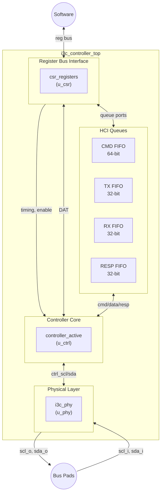

# Module: i3c_controller_top (Top-Level Integration)

> Status: New
> Reference: `i3c-core/src/i3c.sv` (1,279 lines) + `i3c-core/src/i3c_wrapper.sv` (298 lines)
> Estimated LoC: ~150 lines

## 1. Purpose

The top-level module integrates all major subsystems into a single, self-contained I3C Master Controller IP:

- **Controller Core** (`controller_active`) — Protocol engine
- **PHY** (`i3c_phy`) — Physical bus interface with 2FF sync
- **CSR** (`csr_registers`) — Software register interface
- **HCI Queues** (`hci_queues`) — Command/data FIFOs

It exposes two external interfaces:

1. **Register bus** — For software access (simple addr/data/wen/ren)
2. **Physical pins** — SCL and SDA bus lines

## 2. Dependencies

### Sub-modules

| Module              | Instance   | Role                           |
| ------------------- | ---------- | ------------------------------ |
| `controller_active` | `u_ctrl`   | Protocol engine                |
| `i3c_phy`           | `u_phy`    | Physical layer (2FF + drivers) |
| `csr_registers`     | `u_csr`    | Register file + DAT            |
| `hci_queues`        | `u_queues` | 4 FIFOs (CMD/TX/RX/RESP)       |

### Parent modules

- None (this is the top-level)

### Packages

- `i3c_pkg`
- `controller_pkg`

## 3. Parameters

| Parameter       | Type | Default | Description                |
| --------------- | ---- | ------- | -------------------------- |
| `DatDepth`      | int  | 16      | Device Address Table depth |
| `CmdFifoDepth`  | int  | 64      | CMD FIFO depth             |
| `TxFifoDepth`   | int  | 64      | TX FIFO depth              |
| `RxFifoDepth`   | int  | 64      | RX FIFO depth              |
| `RespFifoDepth` | int  | 64      | RESP FIFO depth            |
| `AddrWidth`     | int  | 12      | Register bus address width |
| `DataWidth`     | int  | 32      | Register bus data width    |

## 4. Ports / Interfaces

### Clock and Reset

| Signal   | Direction | Width | Description                   |
| -------- | --------- | ----- | ----------------------------- |
| `clk_i`  | Input     | 1     | System clock (min 333 MHz)    |
| `rst_ni` | Input     | 1     | Active-low asynchronous reset |

### Register Bus (Software Interface)

| Signal        | Direction | Width     | Description             |
| ------------- | --------- | --------- | ----------------------- |
| `reg_addr_i`  | Input     | AddrWidth | Register address        |
| `reg_wdata_i` | Input     | DataWidth | Write data              |
| `reg_wen_i`   | Input     | 1         | Write enable            |
| `reg_ren_i`   | Input     | 1         | Read enable             |
| `reg_rdata_o` | Output    | DataWidth | Read data               |
| `reg_ready_o` | Output    | 1         | Transaction acknowledge |

### Physical Bus Pins

| Signal        | Direction | Width | Description                       |
| ------------- | --------- | ----- | --------------------------------- |
| `scl_i`       | Input     | 1     | SCL bus input (from pad)          |
| `scl_o`       | Output    | 1     | SCL bus output (to pad driver)    |
| `sda_i`       | Input     | 1     | SDA bus input (from pad)          |
| `sda_o`       | Output    | 1     | SDA bus output (to pad driver)    |
| `sel_od_pp_o` | Output    | 1     | OD/PP mode select (to pad driver) |

## 5. Functional Description

### 5.1. Integration Architecture



### 5.2. Internal Signal Connections

#### CSR ↔ HCI Queues

The CSR module acts as a bridge between the register bus and the FIFO interfaces:

```systemverilog
// CMD FIFO: CSR writes → CMD FIFO write port
u_csr.cmd_wvalid_o  → u_queues.cmd_wvalid_i
u_csr.cmd_wdata_o   → u_queues.cmd_wdata_i
u_queues.cmd_wready_o → u_csr.cmd_wready_i

// TX FIFO: CSR writes → TX FIFO write port
u_csr.tx_wvalid_o   → u_queues.tx_wvalid_i
u_csr.tx_wdata_o    → u_queues.tx_wdata_i
u_queues.tx_wready_o → u_csr.tx_wready_i

// RX FIFO: RX FIFO read port → CSR reads
u_queues.rx_rvalid_o → u_csr.rx_rvalid_i
u_queues.rx_rdata_o  → u_csr.rx_rdata_i
u_csr.rx_rready_o    → u_queues.rx_rready_i

// RESP FIFO: RESP FIFO read port → CSR reads
u_queues.resp_rvalid_o → u_csr.resp_rvalid_i
u_queues.resp_rdata_o  → u_csr.resp_rdata_i
u_csr.resp_rready_o    → u_queues.resp_rready_i

// Queue status feedback
u_queues.{cmd,tx,rx,resp}_{full,empty}_o → u_csr.*_i
```

#### HCI Queues ↔ Controller Active

```systemverilog
// CMD FIFO read port → flow_active
u_queues.cmd_rvalid_o  → u_ctrl.cmd_queue_rvalid_i
u_queues.cmd_rdata_o   → u_ctrl.cmd_queue_rdata_i
u_ctrl.cmd_queue_rready_o → u_queues.cmd_rready_i
u_queues.cmd_empty_o   → u_ctrl.cmd_queue_empty_i

// TX FIFO read port → flow_active
u_queues.tx_rvalid_o   → u_ctrl.tx_queue_rvalid_i
u_queues.tx_rdata_o    → u_ctrl.tx_queue_rdata_i
u_ctrl.tx_queue_rready_o → u_queues.tx_rready_i
u_queues.tx_empty_o    → u_ctrl.tx_queue_empty_i

// RX FIFO write port ← flow_active
u_ctrl.rx_queue_wvalid_o → u_queues.rx_wvalid_i
u_ctrl.rx_queue_wdata_o  → u_queues.rx_wdata_i
u_queues.rx_wready_o    → u_ctrl.rx_queue_wready_i
u_queues.rx_full_o      → u_ctrl.rx_queue_full_i

// RESP FIFO write port ← flow_active
u_ctrl.resp_queue_wvalid_o → u_queues.resp_wvalid_i
u_ctrl.resp_queue_wdata_o  → u_queues.resp_wdata_i
u_queues.resp_wready_o     → u_ctrl.resp_queue_wready_i
u_queues.resp_full_o       → u_ctrl.resp_queue_full_i
```

#### CSR → Controller Active (Configuration)

```systemverilog
// Timing registers
u_csr.t_r_o      → u_ctrl.t_r_i
u_csr.t_f_o      → u_ctrl.t_f_i
u_csr.t_low_o    → u_ctrl.t_low_i
u_csr.t_high_o   → u_ctrl.t_high_i
u_csr.t_su_sta_o → u_ctrl.t_su_sta_i
u_csr.t_hd_sta_o → u_ctrl.t_hd_sta_i
u_csr.t_su_sto_o → u_ctrl.t_su_sto_i
u_csr.t_su_dat_o → u_ctrl.t_su_dat_i
u_csr.t_hd_dat_o → u_ctrl.t_hd_dat_i

// Control
u_csr.ctrl_enable_o → u_ctrl.ctrl_enable_i  // HC_CONTROL[0] → bus monitor enable
u_csr.i3c_fsm_en_o → u_ctrl.i3c_fsm_en_i   // FSM enable
u_csr.sw_reset_o   → u_queues.sw_reset_i    // FIFO reset

// Status feedback
u_ctrl.i3c_fsm_idle_o → u_csr.i3c_fsm_idle_i
```

#### Controller Active ↔ PHY

```systemverilog
// Synchronized inputs (PHY → Controller)
u_phy.ctrl_scl_o → u_ctrl.ctrl_scl_i
u_phy.ctrl_sda_o → u_ctrl.ctrl_sda_i

// Drive outputs (Controller → PHY)
u_ctrl.ctrl_scl_o → u_phy.ctrl_scl_i
u_ctrl.ctrl_sda_o → u_phy.ctrl_sda_i

// OD/PP mode
u_ctrl.sel_od_pp_o → u_phy.sel_od_pp_i

// External pins
scl_i → u_phy.scl_i
u_phy.scl_o → scl_o
sda_i → u_phy.sda_i
u_phy.sda_o → sda_o
u_phy.sel_od_pp_o → sel_od_pp_o
```

#### CSR ↔ DAT (Hardware Read Path)

```systemverilog
u_ctrl.dat_read_valid_hw_o → u_csr.dat_read_valid_i
u_ctrl.dat_index_hw_o      → u_csr.dat_index_i
u_csr.dat_rdata_o          → u_ctrl.dat_rdata_hw_i
```

### 5.3. Reset Distribution

```systemverilog
// Global async reset to all modules
rst_ni → u_phy.rst_ni, u_csr.rst_ni, u_queues.rst_ni, u_ctrl.rst_ni

// Software reset (from HC_CONTROL register) only resets FIFOs
u_csr.sw_reset_o → u_queues.sw_reset_i
```

## 6. Timing Requirements

| Aspect               | Requirement                                 |
| -------------------- | ------------------------------------------- |
| System clock         | Minimum 333 MHz                             |
| Register bus latency | 1 cycle write, combinational read           |
| Pin-to-internal      | 2 cycle latency (PHY 2FF sync)              |
| Internal-to-pin      | 0 cycle latency (combinational output path) |

## 7. Changes from Reference Design

| Aspect               | Reference                                                  | This Design                          |
| -------------------- | ---------------------------------------------------------- | ------------------------------------ |
| Top hierarchy        | `i3c.sv` → `i3c_wrapper.sv` → modules                      | Single `i3c_controller_top`          |
| Wrappers             | 3 levels of wrappers                                       | Flat (1 level)                       |
| Bus interface        | AXI4 + AHB-Lite adapters (418 lines)                       | Simple reg bus (~0 lines of adapter) |
| `ifdef` conditionals | `CONTROLLER_SUPPORT`, `TARGET_SUPPORT`, `AXI_ID_FILTERING` | None                                 |
| Parameters           | 50+ top-level parameters                                   | 7 parameters                         |
| SRAM primitives      | `prim_ram_1p_adv` for queues                               | Synthesizable reg-based FIFOs        |
| Recovery handler     | `recovery_handler.sv` instance                             | Removed                              |
| Target mode          | `target_fsm`, `tti` instances                              | Removed                              |
| Standby controller   | `controller_standby` instance                              | Removed                              |
| `controller.sv`      | Intermediate aggregator module                             | Removed (flattened)                  |
| `configuration.sv`   | CSR extraction module (80 lines)                           | Merged into `csr_registers`          |

## 8. Error Handling

No error logic at this level. All errors are handled by sub-modules and reported through the RESP FIFO.

## 9. Test Plan

### Scenarios

1. **Full system: I3C Private Write:** Software writes CMD + TX data via register bus → verify SCL/SDA waveform → read response via register bus
2. **Full system: I3C Private Read:** Software writes CMD → target drives data on SDA → read RX data + response via register bus
3. **Full system: I2C Write:** Same as I3C write but with I2C device in DAT
4. **Full system: ENTDAA:** Software writes ENTDAA command → verify DAA protocol on bus
5. **Register access:** Read/write all CSR registers via register bus; verify values
6. **Timing configuration:** Write timing registers → verify SCL frequency changes
7. **Software reset:** Assert SW_RESET → verify FIFOs cleared, controller continues
8. **Multiple transactions:** Enqueue multiple commands → verify sequential execution
9. **Pin-level verification:** Verify 2FF synchronization latency on input path
10. **FPGA loopback:** Connect SCL_o→SCL_i, SDA_o→SDA_i (with pull-up behavior) for self-test

### cocotb Test Structure

```
tests/
  test_top/
    test_system_write.py     # End-to-end write tests
    test_system_read.py      # End-to-end read tests
    test_system_daa.py       # ENTDAA system tests
    test_system_i2c.py       # I2C legacy tests
    i3c_target_model.py      # Behavioral I3C target model
    i2c_target_model.py      # Behavioral I2C target model
    Makefile
```

### Target Models

For system-level testing, behavioral models of I3C and I2C targets are needed:

**I3C Target Model (`i3c_target_model.py`):**

- Responds to broadcast address 0x7E
- Participates in ENTDAA (drives PID/BCR/DCR, accepts address)
- ACKs assigned dynamic address
- Responds to Private Read/Write
- Drives T-bit correctly

**I2C Target Model (`i2c_target_model.py`):**

- Responds to configured static address
- ACKs address and data bytes
- Provides read data when addressed with RnW=1

## 10. Implementation Notes

- This module should be entirely structural — no logic beyond `assign` statements for signal routing. All behavioral logic lives in sub-modules.
- The register bus is intentionally simple (no handshaking complexity). For integration into an SoC with AXI or APB, a thin adapter can be placed outside this module.
- The `sel_od_pp_o` output should connect to the FPGA/ASIC pad driver configuration. On Xilinx FPGAs, this controls whether an IOBUF is configured for open-drain or push-pull.
- For simulation, SCL and SDA should be modeled as wired-AND buses (open-drain behavior): the simulated bus value is the AND of all drivers. A pull-up resistor holds the line HIGH when no driver is active.
- The module has no `ifdef` blocks — all configuration is done through parameters and CSR registers at runtime.
