# Phase 1: Theoretical Study and Architecture Design (v2)

> **Author:** Vo Minh Huy (22207042)
> **Supervisor:** Nguyen Duy Manh Thi
> **Timeline:** 02/03/2026 - 15/03/2026 (~2 weeks)
> **Revision:** v2 — Narrowed scope per mentor feedback

---

## 1. Introduction

This document is the revised Phase 1 deliverable for the graduation thesis "Design of an I3C
Communication Controller." Following mentor feedback, the scope has been narrowed to focus on
a **basic I3C Master Controller (Active Controller)** operating in SDR mode only, with the
following core capabilities:

- **SDR (Single Data Rate) mode** up to 12.5 MHz
- **Dynamic Address Assignment (DAA)** via ENTDAA
- **Basic data transmission and reception (Private Read/Write)**
- **I2C backward compatibility** (legacy 400 kHz Fast Mode, hardcoded timing)

**Explicitly out of scope:**

- In-Band Interrupts (IBI)
- Hot-Join
- HDR (High Data Rate) modes (HDR-DDR, HDR-TSL, HDR-TSP)
- Multi-master / secondary controller operation
- Target (slave) mode
- Bus recovery protocol
- Full HCI compliance

### 1.1. Approach: Study and Improve on Reference Design

This thesis adopts a **study-and-improve** methodology. Rather than designing from scratch, we
study the open-source **CHIPS Alliance i3c-core** reference implementation
([chipsalliance/i3c-core](https://github.com/chipsalliance/i3c-core)) — a production-grade
I3C controller designed for the Caliptra root-of-trust subsystem. The thesis:

1. **Studies** the reference design's architecture, module decomposition, and protocol handling
2. **Extracts** the subset relevant to a basic master controller
3. **Simplifies** areas over-engineered for the thesis scope (e.g., removes target mode, IBI,
   recovery, HDR)
4. **Improves** on selected aspects (e.g., clearer FSM structure, simplified register interface,
   focused verification)

This approach ensures the design is grounded in proven architecture while allowing the thesis
to contribute original work in simplification and focused optimization.

---

## 2. MIPI I3C Protocol Overview

### 2.1. What Is I3C?

I3C (Improved Inter-Integrated Circuit) is a serial communication bus defined by the MIPI
Alliance. It is designed to unify sensor and actuator communication in modern SoC designs,
replacing I2C and SPI with a single, faster, lower-power bus while maintaining backward
compatibility with I2C devices.

**Target Specification:** MIPI I3C Basic v1.1.1 (with Errata 01, 2022)

### 2.2. Bus Topology

I3C uses a **shared two-wire bus**:

- **SCL** (Serial Clock) — driven by the master in SDR mode
- **SDA** (Serial Data) — bidirectional, shared by master and targets

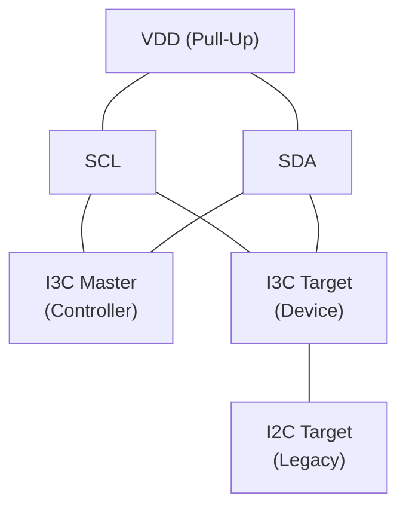

Key bus characteristics:

- Open-drain signaling after START (address phase) and during I2C legacy communication
- Push-pull signaling after Repeated START and during I3C SDR data phase (higher speed)
- ACK/NACK bit is always driven in open-drain
- Only the master drives SCL; targets may stretch clock only in specific conditions
- Maximum ~108 usable device addresses on the bus (7-bit address space minus reserved addresses)

### 2.3. SDR (Single Data Rate) Mode

SDR is the default and mandatory transfer mode for I3C. The thesis controller will operate
exclusively in this mode.

| Parameter             | Value                                  |
| --------------------- | -------------------------------------- |
| Maximum SCL frequency | 12.9 MHz (typ. 12.5 MHz)               |
| Data encoding         | NRZ (binary)                           |
| Data rate             | 1 bit/clock                            |
| Signaling             | Push-Pull (data), Open-Drain (address) |
| Bit order             | MSB first                              |
| Word size             | 8 bits + T-bit (parity/ACK)            |

**9th bit in SDR transfers:**

- **Address byte 9th bit:** ACK/NACK (0 = ACK, 1 = NACK) from the target — this is **not** a T-bit
- **Data byte 9th bit (T-bit / Transition bit):** Odd parity over bits [7:0] when the master writes; end-of-data indicator when the target reads (T-bit=0 signals end of data, T-bit=1 signals more data to follow)

### 2.4. Frame Format

An I3C SDR frame consists of:

```text
[START] [Addr(7-bit) + RnW(1-bit) + T-bit(1-bit)] [Data(8-bit) + T-bit(1-bit)]... [STOP]
```

**Address byte detail (9 bits):**

```text
Bit:  [8]   [7]   [6]   [5]   [4]   [3]   [2]   [1]   [0]
      A6    A5    A4    A3    A2    A1    A0    RnW   T-bit
      |<---------- 7-bit address ---------->|
```

- `RnW = 0`: Write transfer (master sends data)
- `RnW = 1`: Read transfer (target sends data)
- `T-bit`: ACK from target (0) or NACK (1)

### 2.5. Bus Conditions

| Condition           | Definition                                    |
| ------------------- | --------------------------------------------- |
| START (S)           | SDA falls while SCL is HIGH                   |
| REPEATED START (Sr) | START issued without preceding STOP           |
| STOP (P)            | SDA rises while SCL is HIGH                   |
| Bus Idle            | Both SCL and SDA are HIGH; no active transfer |

### 2.6. Reserved Address

I3C uses the broadcast address `7'h7E` (0x7E) for:

- CCC (Common Command Code) broadcasts to all targets
- DAA entry point (ENTDAA)

---

## 3. I3C vs I2C Comparison

| Feature                  | I2C (Fast-Mode Plus) | I3C (SDR)                                                    |
| ------------------------ | -------------------- | ------------------------------------------------------------ |
| Max clock frequency      | 1 MHz (Fm+)          | 12.5 MHz                                                     |
| Max data rate            | 1 Mbit/s             | 12.5 Mbit/s                                                  |
| Signaling                | Open-Drain only      | Open-Drain + Push-Pull                                       |
| Address space            | 7-bit static         | 7-bit dynamic                                                |
| Address assignment       | Fixed / SW config    | Dynamic (ENTDAA)                                             |
| Clock stretching         | Yes (target)         | No (Controller Clock Stalling available for Controller only) |
| Wire count               | 2 (SCL + SDA)        | 2 (SCL + SDA)                                                |
| Pull-up resistor         | External required    | Internal (no external)                                       |
| Backward compatibility   | N/A                  | Full I2C Fm+ support                                         |
| Error detection          | ACK/NACK only        | Parity (T-bit) + CRC                                         |
| Multi-master arbitration | Clock sync + SDA arb | Not needed in single-master                                  |

**Key advantages of I3C over I2C:**

1. **12.5x faster** data rate with push-pull signaling
2. **Dynamic addressing** eliminates address conflicts
3. **Lower power** through push-pull drivers (no pull-up current waste)
4. **Full I2C backward compatibility** on the same bus

> **Note:** IBI (In-Band Interrupts) and Hot-Join are important I3C features but are outside
> the scope of this thesis. They can be added as future enhancements.

---

## 4. Common Command Codes (CCC)

CCCs are special commands issued by the master to configure and manage target devices. They
use the reserved broadcast address `0x7E`.

### 4.1. CCC Classification

| Type      | Address Range | Description                              |
| --------- | ------------- | ---------------------------------------- |
| Broadcast | 0x00 - 0x7F   | Sent to all targets simultaneously       |
| Direct    | 0x80 - 0xFE   | Sent to a specific target (with address) |
| Reserved  | 0xFF          | Reserved for future use                  |

### 4.2. CCCs Supported in This Design

This design implements only the **essential CCCs** required for basic master operation:

**Broadcast CCCs:**

| Code | Mnemonic | Description                      |
| ---- | -------- | -------------------------------- |
| 0x00 | ENEC     | Enable events                    |
| 0x01 | DISEC    | Disable events                   |
| 0x07 | ENTDAA   | Enter Dynamic Address Assignment |

**Direct CCCs:**

| Code | Mnemonic | Description                     |
| ---- | -------- | ------------------------------- |
| 0x80 | ENEC     | Enable events (specific target) |
| 0x81 | DISEC    | Disable events (specific target)|

> **Future work:** Additional CCCs such as SETDASA (0x87), GETPID (0x8D), GETBCR (0x8E),
> GETDCR (0x8F), SETMWL/SETMRL, GETSTATUS, and RSTACT can be added incrementally.

### 4.3. CCC Frame Format

**Broadcast CCC:**

```text
[S] [0x7E + W] [ACK] [CCC Code] [ACK] [Defining Byte (opt)] [ACK] [P]
```

**Direct CCC (Write):**

```text
[S] [0x7E + W] [ACK] [CCC Code] [ACK] [Sr] [Target Addr + W] [ACK] [Data] [T] [P]
```

**Direct CCC (Read):**

```text
[S] [0x7E + W] [ACK] [CCC Code] [ACK] [Sr] [Target Addr + R] [ACK] [Data] [T] [P]
```

---

## 5. Dynamic Address Assignment (DAA)

DAA is the mechanism by which the master assigns 7-bit dynamic addresses to I3C targets at
runtime, eliminating static address conflicts.

### 5.1. Target Identification

Each I3C target has a unique 64-bit identity:

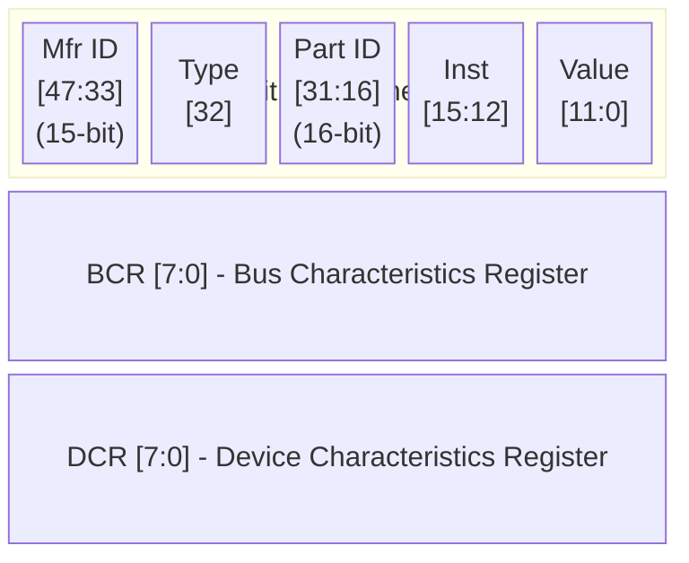

**BCR (Bus Characteristics Register):**

| Bit   | Field              | Description                  |
| ----- | ------------------ | ---------------------------- |
| [7:6] | Device Role        | 00=Target, 01=Master-capable |
| [5]   | Advanced Caps      | 1=supports advanced features |
| [4]   | Virtual Target     | 1=virtual target present     |
| [3]   | Offline Capable    | 1=may go offline             |
| [2]   | IBI Payload        | 1=IBI includes data payload  |
| [1]   | IBI Request        | 1=can request IBI            |
| [0]   | Max Data Speed Lim | 1=limited speed              |

### 5.2. ENTDAA Protocol Sequence

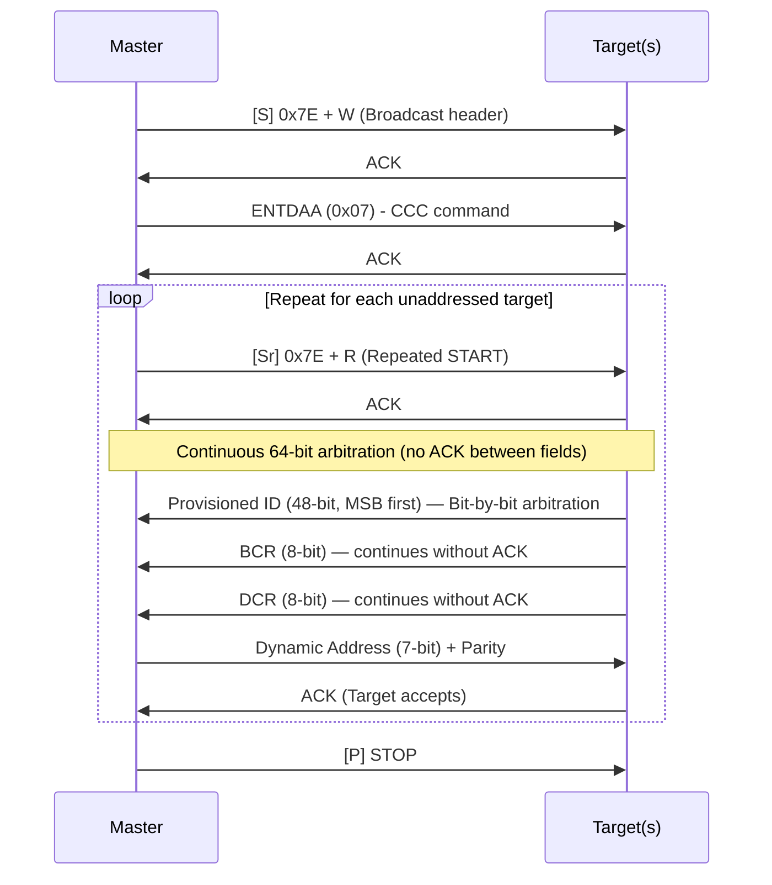

**Arbitration mechanism:** When multiple unaddressed targets respond simultaneously, each
drives its Provisioned ID bit-by-bit. A target that drives HIGH (1) but reads LOW (0) on SDA
loses arbitration and withdraws, leaving only one winner per round.

---

## 6. Private Read/Write Transactions

### 6.1. Private Write (Master to Target)

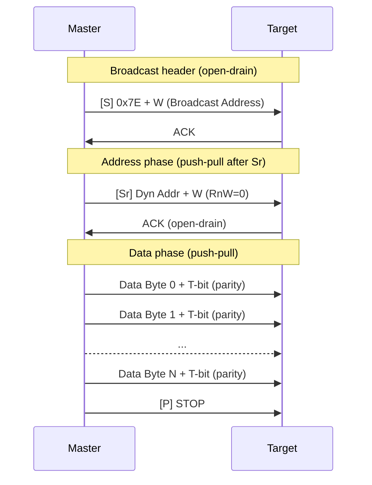

> **Note:** The broadcast header `[S] 0x7E + W` is optional for Private Transfers but
> commonly used to signal I3C activity on a mixed bus. For a pure I3C bus, the controller may
> omit the broadcast header and address the target directly.

### 6.2. Private Read (Target to Master)

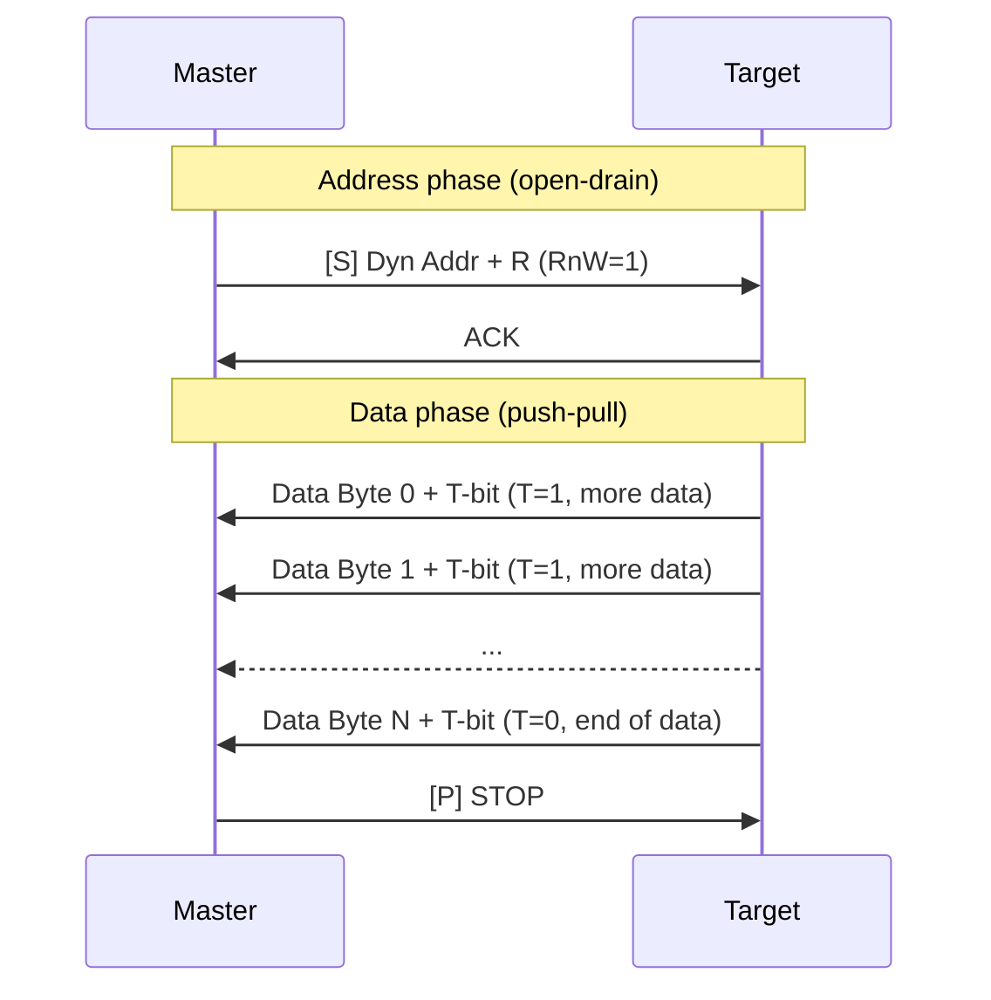

**T-bit semantics during Private Read:**

- **T-bit = 1:** Target has more data bytes to send
- **T-bit = 0:** Last data byte; target signals end of data

**Signaling mode transitions:**

- After START: **Open-Drain** (for I2C compatibility and arbitration)
- After Repeated START: **Push-Pull** (for maximum speed in I3C SDR mode)
- ACK/NACK bit: Always **Open-Drain**
- The controller switches via the `sel_od_pp` signal to the PHY layer

---

## 7. Timing Parameters

### 7.1. I3C SDR Timing

| Parameter                  | Symbol   | Min | Max  | Unit | Notes                           |
| -------------------------- | -------- | --- | ---- | ---- | ------------------------------- |
| SCL frequency              | f_SCL    | -   | 12.9 | MHz  | Typ. 12.5 MHz                   |
| SCL LOW period             | t_LOW    | 24  | -    | ns   |                                 |
| SCL HIGH period            | t_HIGH   | 24  | -    | ns   |                                 |
| START setup time           | t_SU_STA | -   | -    | ns   |                                 |
| START hold time            | t_HD_STA | -   | -    | ns   |                                 |
| Data setup time            | t_SU_DAT | 3   | -    | ns   |                                 |
| Data hold time             | t_HD_DAT | 0   | 12   | ns   | Max applies to OD signaling     |
| STOP setup time            | t_SU_STO | 12  | -    | ns   | Controller parameter            |
| Rise time (PP)             | t_R      | -   | 12   | ns   |                                 |
| Fall time (PP)             | t_F      | -   | 12   | ns   |                                 |
| Bus Available condition    | tAVAL    | 1   | -    | µs   | Min idle time after STOP        |
| Bus Free condition         | tCAS     | 38  | -    | ns   | Min time between STOP and START |
| Clock-to-Data out (Target) | tSCO     | -   | 12   | ns   | Target-driven parameter         |

### 7.2. I2C Legacy Timing (400 kHz Fast Mode)

| Parameter        | Symbol   | Min  | Max | Unit |
| ---------------- | -------- | ---- | --- | ---- |
| SCL frequency    | f_SCL    | -    | 400 | kHz  |
| SCL LOW period   | t_LOW    | 1300 | -   | ns   |
| SCL HIGH period  | t_HIGH   | 600  | -   | ns   |
| START setup time | t_SU_STA | 600  | -   | ns   |
| START hold time  | t_HD_STA | 600  | -   | ns   |
| Data setup time  | t_SU_DAT | 100  | -   | ns   |
| Data hold time   | t_HD_DAT | 0    | -   | ns   |
| Bus idle time    | t_BUF    | 1300 | -   | ns   |

### 7.3. System Clock Requirement

The system clock must be fast enough to meet the I3C timing constraints:

- **Minimum system clock:** 333 MHz (to achieve t_SCO = 12 ns)
- **Rationale:** t_SCO_max = 4 x T_sys_clk (3 internal pipeline cycles + 1 async boundary)
- At 333 MHz: 4 x 3 ns = 12 ns, satisfying the spec

---

## 8. Reference Design Analysis: CHIPS Alliance i3c-core

This section analyzes the open-source [CHIPS Alliance i3c-core](https://github.com/chipsalliance/i3c-core)
reference implementation. The design was developed for the Caliptra root-of-trust subsystem and
provides a production-grade I3C controller/target IP.

### 8.1. Repository Structure

The i3c-core repository is organized as follows:

| Directory      | Purpose                                           |
| -------------- | ------------------------------------------------- |
| `src/ctrl/`    | Controller and bus flow control (35+ SV modules)  |
| `src/csr/`     | Control and Status Registers (I3CCSR)             |
| `src/hci/`     | Host Controller Interface queues and adapters     |
| `src/phy/`     | Physical layer interfaces                         |
| `src/recovery/`| Bus recovery mechanisms                           |
| `src/rdl/`     | Register Description Language definitions         |
| `src/libs/`    | Library components (AXI adapters, memory I/F)     |

**Top-level hierarchy:**

```text
i3c.sv                        ← Top-level (no bus I/O)
└── i3c_wrapper.sv            ← AHB-Lite / AXI4 frontend
    ├── I3CCSR.sv             ← Register file (auto-generated from RDL)
    ├── controller.sv         ← Controller aggregator
    │   ├── controller_active.sv  ← Active controller (HCI queues)
    │   │   ├── flow_active.sv        ← Command flow FSM
    │   │   ├── ccc.sv                ← CCC processor (40+ commands)
    │   │   ├── ccc_entdaa.sv         ← ENTDAA state machine
    │   │   ├── bus_tx_flow.sv        ← TX serializer
    │   │   ├── bus_rx_flow.sv        ← RX deserializer
    │   │   └── ibi.sv                ← IBI handler
    │   ├── bus_monitor.sv        ← S/Sr/P detection
    │   ├── bus_timers.sv         ← Timing parameter management
    │   └── configuration.sv      ← CSR extraction
    ├── i3c_phy.sv            ← PHY (sync + OD/PP drivers)
    └── recovery_handler.sv   ← Bus recovery
```

### 8.2. Key Modules Relevant to Basic Master

| Module | File | Role |
| --- | --- | --- |
| `controller_active` | `src/ctrl/controller_active.sv` | Top-level active controller with HCI queue interfaces, DAT/DCT memory, dual-bus drive |
| `flow_active` | `src/ctrl/flow_active.sv` | Command flow FSM -- orchestrates transfers, manages command/response queues |
| `bus_tx_flow` | `src/ctrl/bus_tx_flow.sv` | TX serializer -- bit/byte-level transmission with timing control |
| `bus_rx_flow` | `src/ctrl/bus_rx_flow.sv` | RX deserializer -- bit counting FSM, SCL-edge synchronized reception |
| `ccc` | `src/ctrl/ccc.sv` | CCC processor -- handles 40+ CCCs with FSM-based execution |
| `ccc_entdaa` | `src/ctrl/ccc_entdaa.sv` | ENTDAA FSM -- PID/BCR/DCR arbitration, dynamic address assignment |
| `bus_monitor` | `src/ctrl/bus_monitor.sv` | Bus event detection (START, STOP, Sr) with timing-aware state machines |
| `i3c_phy` | `src/phy/i3c_phy.sv` | Physical layer -- double FF sync, OD/PP mode switching |
| `configuration` | `src/ctrl/configuration.sv` | CSR parameter extraction (addressing, timing, mode enables) |

### 8.3. Thesis Reuse/Simplify/Improve Analysis

| Module | Thesis Action | Details |
| --- | --- | --- |
| `i3c_phy` | **Reuse** | Proven PHY with CDC sync -- no changes needed |
| `bus_monitor` | **Reuse** | Edge detection logic is fundamental -- reuse as-is |
| `bus_tx_flow` | **Reuse** | Bit/byte serialization is well-structured |
| `bus_rx_flow` | **Reuse** | Deserializer with T-bit validation -- reuse as-is |
| `ccc_entdaa` | **Reuse** | ENTDAA arbitration FSM -- core DAA functionality |
| `controller_active` | **Simplify** | Remove IBI queue interface, simplify HCI to 4 queues |
| `flow_active` | **Simplify** | Implement 8 missing TODO states, remove HDR mode paths, simplify internal logic |
| `ccc` | **Simplify** | Reduce from 40+ CCCs to 3 (ENTDAA, ENEC, DISEC) |
| `configuration` | **Simplify** | Remove target-mode and IBI configuration fields |
| `I3CCSR` | **Improve** | Replace auto-generated RDL with focused manual register map |
| `controller` | **Improve** | Remove target mode, recovery; cleaner top-level integration |
| Bus interface | **Improve** | Simple register I/F instead of full AXI4/AHB-Lite |

### 8.4. Out-of-Scope Reference Modules

The following modules exist in the reference design but are **not needed** for this thesis:

| Module                      | Reason for Exclusion                          |
| --------------------------- | --------------------------------------------- |
| `i3c_target_fsm.sv`         | Target (slave) mode — out of scope            |
| `i2c_target_fsm.sv`         | I2C target support — out of scope             |
| `ibi.sv`                    | In-Band Interrupts — out of scope             |
| `i3c_bus_monitor.sv`        | HDR exit detection — not needed for SDR-only  |
| `recovery_handler.sv`       | Bus recovery protocol — out of scope          |
| `recovery_executor.sv`      | Recovery pattern execution — out of scope     |
| `target_reset_detector.sv`  | Target reset conditions — out of scope        |
| `controller_standby.sv`     | Standby controller — out of scope             |

---

## 9. Proposed System Architecture

### 9.1. Top-Level Block Diagram

The architecture is based on the CHIPS Alliance reference design, simplified for basic master
operation (no IBI, no target mode, no recovery).

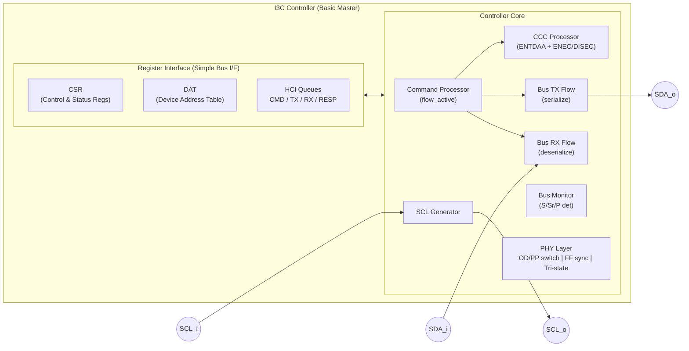

**Changes from reference design:**

- Removed IBI FIFO from HCI queues (5 → 4 queues)
- Removed DCT from register interface (marked optional, see §9.2.9)
- CCC Processor limited to ENTDAA + ENEC/DISEC only
- No target mode, standby controller, or recovery modules

### 9.2. Module Decomposition

#### 9.2.1. PHY Layer (`i3c_phy`)

Handles the physical interface to SCL and SDA bus lines. **Reused from reference design.**

**Ports:**

| Signal        | Direction | Width | Description                        |
| ------------- | --------- | ----- | ---------------------------------- |
| `clk_i`       | Input     | 1     | System clock                       |
| `rst_ni`      | Input     | 1     | Active-low reset                   |
| `scl_i`       | Input     | 1     | SCL bus input                      |
| `scl_o`       | Output    | 1     | SCL bus output (drive low or hi-z) |
| `sda_i`       | Input     | 1     | SDA bus input                      |
| `sda_o`       | Output    | 1     | SDA bus output                     |
| `sel_od_pp_i` | Input     | 1     | 0=Open-Drain, 1=Push-Pull          |

**Responsibilities:**

- Double flip-flop synchronization of SCL/SDA inputs to the system clock domain
- Open-Drain driver: can only pull LOW or release (high-impedance)
- Push-Pull driver: can actively drive both HIGH and LOW
- Mode switching controlled by `sel_od_pp_i`

> **Note:** The reference design hardcodes `sel_od_pp_i` to open-drain (`0`) in
> `controller_active.sv`. The thesis must implement proper OD/PP switching logic
> to enable push-pull signaling during I3C SDR data phases (required for 12.5 MHz).

#### 9.2.2. Bus Monitor (`bus_monitor`)

Detects bus conditions by monitoring SCL and SDA edges. **Reused from reference design.**

**Outputs:**

| Signal       | Description                                    |
| ------------ | ---------------------------------------------- |
| `start_det`  | START condition detected (SDA falls, SCL HIGH) |
| `rstart_det` | REPEATED START detected                        |
| `stop_det`   | STOP condition detected (SDA rises, SCL HIGH)  |
| `bus_idle`   | Bus is idle (both lines HIGH)                  |

#### 9.2.3. SCL Generator

Generates the SCL clock signal with configurable frequency and duty cycle.

**Configuration registers:**

| Register       | Description                     |
| -------------- | ------------------------------- |
| `T_R_REG`      | Rise time (system clock cycles) |
| `T_F_REG`      | Fall time (system clock cycles) |
| `T_LOW_REG`    | SCL LOW period                  |
| `T_HIGH_REG`   | SCL HIGH period                 |
| `T_SU_STA_REG` | START condition setup time      |
| `T_HD_STA_REG` | START condition hold time       |
| `T_SU_STO_REG` | STOP condition setup time       |

**Operating modes:**

- I3C SDR: up to 12.5 MHz push-pull
- I2C FM: 400 kHz open-drain
- I2C FM+: 1 MHz open-drain

#### 9.2.4. Bus TX Flow (`bus_tx_flow`)

Serializes bytes into individual bits on SDA, synchronized to SCL. **Reused from reference design.**

**FSM States:**

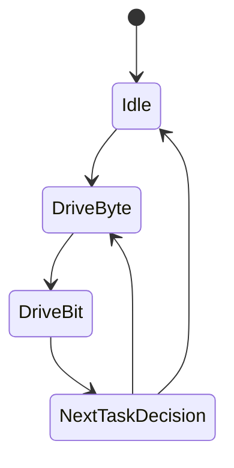

**Operation:**

1. Accepts a byte from the command processor
2. Shifts out MSB first, one bit per SCL cycle
3. Respects t_SU_DAT (data setup time) and t_HD_DAT (data hold time)
4. Drives the T-bit (parity) after 8 data bits
5. Reads target ACK/NACK on the 9th clock

#### 9.2.5. Bus RX Flow (`bus_rx_flow`)

Deserializes bits from SDA into bytes, synchronized to SCL. **Reused from reference design.**

**FSM States:**

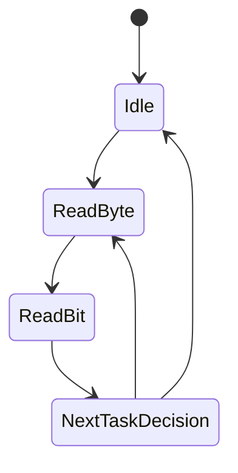

**Operation:**

1. Samples SDA on SCL positive edge
2. Assembles 8 bits MSB-first into a byte
3. Validates T-bit (parity check)
4. Drives ACK/NACK on the 9th clock when master is reading

#### 9.2.6. Command Processor (`flow_active`)

Top-level FSM that orchestrates all master transactions. **Simplified from reference design**
(removed HDR paths; I2C backward compatibility retained as mandatory).

**FSM States:**

```systemverilog
typedef enum logic [3:0] {
    Idle,               // Waiting for software command
    WaitForCmd,         // Fetch command from Command FIFO
    FetchDAT,           // Look up target in Device Address Table
    I3CWriteImmediate,  // Small write with inline data (up to 4 bytes)
    I2CWriteImmediate,  // I2C legacy immediate write
    FetchTxData,        // Fetch data from TX FIFO
    FetchRxData,        // Process received data to RX FIFO
    InitI2CWrite,       // Initialize I2C write transaction
    InitI2CRead,        // Initialize I2C read transaction
    StallWrite,         // Wait for TX FIFO data
    StallRead,          // Wait for RX FIFO space
    IssueCmd,           // Drive command on the bus
    WriteResp           // Write result to Response FIFO
} flow_fsm_state_e;
```

> **Simplification:** The reference design defines 13 states but only 5 are implemented (8 are
> TODO stubs). The thesis will implement all 13 states with simplified internal logic (no HDR
> mode paths). I2C states are retained with minimal support (hardcoded 400 kHz Fast Mode timing,
> no CSR configurability).

**Command types:**

| Attribute  | Code   | Description                   |
| ---------- | ------ | ----------------------------- |
| Regular    | 3'b000 | Standard read/write transfer  |
| Immediate  | 3'b001 | CCC with up to 4 inline bytes |
| AddrAssign | 3'b010 | DAA command (ENTDAA)          |

#### 9.2.7. CCC Processor (`ccc` + `ccc_entdaa`)

Handles CCC encoding/decoding and the DAA state machine. **Simplified:** only 3 CCCs
(ENTDAA, ENEC, DISEC) instead of 40+.

**ENTDAA FSM** (reused from reference design):

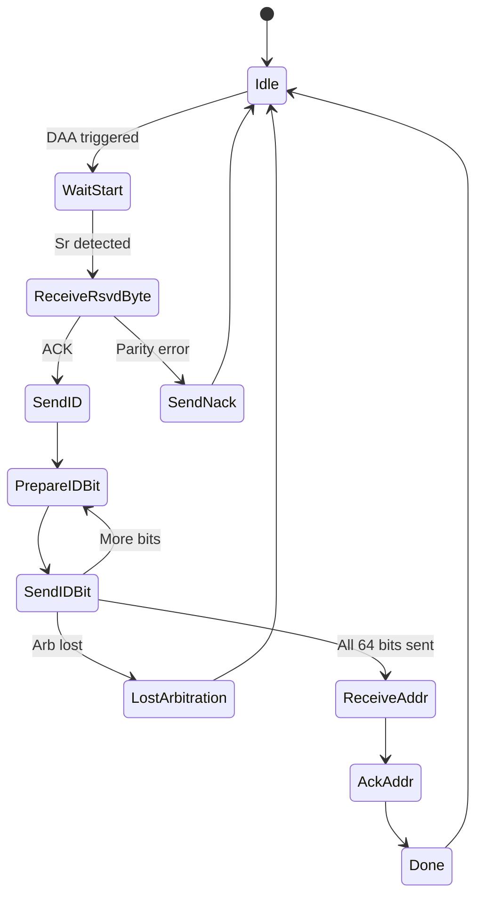

#### 9.2.8. HCI Queues

FIFO-based interface between software and the controller hardware. **Simplified:** removed
IBI FIFO (4 queues instead of 5).

| Queue     | Direction | Width  | Depth | Description             |
| --------- | --------- | ------ | ----- | ----------------------- |
| CMD FIFO  | SW → HW   | 64-bit | 64    | Command descriptors     |
| TX FIFO   | SW → HW   | 32-bit | 64    | Write data payload      |
| RX FIFO   | HW → SW   | 32-bit | 64    | Read data payload       |
| RESP FIFO | HW → SW   | 32-bit | 64    | Command response status |

#### 9.2.9. Register Interface (CSR)

Simplified register-mapped interface. **Improved:** manual register map instead of
auto-generated RDL, focused on basic master needs.

**Key register groups:**

| Group            | Description                                          |
| ---------------- | ---------------------------------------------------- |
| I3CBase          | Core control, status, interrupt enable/status        |
| DAT              | Device Address Table (up to 16 entries x 64-bit)     |
| Timing registers | SCL timing configuration                             |
| Queue thresholds | FIFO threshold and status registers                  |

> **Simplification:** DAT reduced from 128 to 16 entries (sufficient for thesis scope). DCT
> (Device Characteristics Table) is optional — PID/BCR/DCR from ENTDAA can be stored in
> software. IBI-related register fields removed.

**DAT Entry Format (simplified, 32-bit):**

| Field           | Bits    | Description                          |
| --------------- | ------- | ------------------------------------ |
| Static Address  | [6:0]   | I2C static address (if applicable)   |
| Dynamic Address | [22:16] | Assigned I3C dynamic address         |
| Is I2C Device   | [31]    | 1 = legacy I2C device                |

### 9.3. Data Flow

#### 9.3.1. Write Transaction Data Path

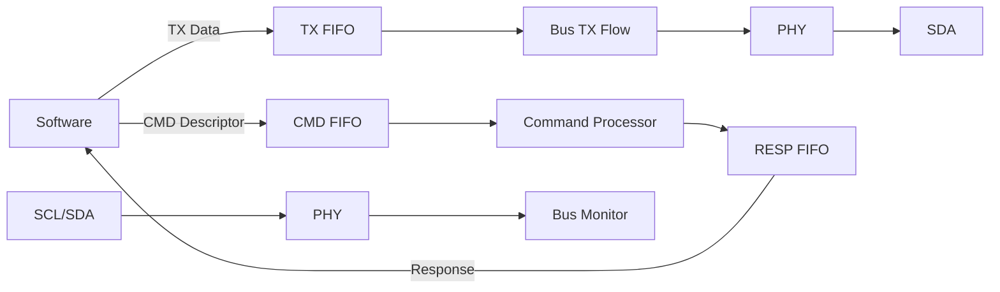

#### 9.3.2. Read Transaction Data Path

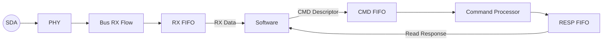

### 9.4. Response Descriptor

Every command produces a response in the RESP FIFO:

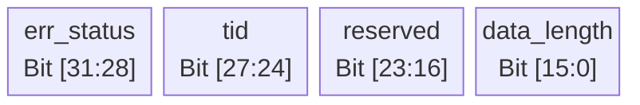

**Error status codes (essential subset):**

| Code | Name                 | Description                |
| ---- | -------------------- | -------------------------- |
| 0x0  | Success              | No error                   |
| 0x2  | Parity Error         | T-bit parity mismatch      |
| 0x3  | Frame Error          | Framing violation          |
| 0x4  | Address Header Error | Address not acknowledged   |
| 0x5  | NACK                 | Target NACKed              |
| 0x6  | Overflow             | FIFO overflow or underflow |

> **Simplification:** Reduced from 10 error codes to 6. CRC Error (0x1) removed (no HDR),
> Short Read Error (0x7) and HC/Bus Aborted (0x8, 0x9) can be added later.

---

## 10. Design Constraints and Parameters

### 10.1. Configurable Parameters

| Parameter         | Default | Description                        |
| ----------------- | ------- | ---------------------------------- |
| `CMD_FIFO_DEPTH`  | 64      | Command queue depth                |
| `TX_FIFO_DEPTH`   | 64      | TX data FIFO depth                 |
| `RX_FIFO_DEPTH`   | 64      | RX data FIFO depth                 |
| `RESP_FIFO_DEPTH` | 64      | Response FIFO depth                |
| `DAT_DEPTH`       | 16      | Max device address table entries   |
| `DATA_WIDTH`      | 32      | Register bus data width            |
| `ADDR_WIDTH`      | 12      | Register bus address width         |

> **Removed:** `IBI_FIFO_DEPTH` (no IBI support), `DCT_DEPTH` (DCT optional).
> **Changed:** `DAT_DEPTH` reduced from 128 to 16.

### 10.2. Design Decisions

| Decision            | Choice                  | Rationale                                              |
| ------------------- | ----------------------- | ------------------------------------------------------ |
| HDL Language        | SystemVerilog           | Industry standard, UVM compatible                      |
| Bus Interface       | Simple register I/F     | Thesis scope simplification (vs AXI4/AHB in reference) |
| Transfer Mode       | SDR only                | Mandatory mode, sufficient for thesis                  |
| Controller Role     | Master only             | Simplifies design, clear scope                         |
| Clock Domain        | Single clock            | Avoids CDC complexity                                  |
| FIFO Implementation | Synchronous FIFO        | Single clock domain                                    |
| Reference Design    | CHIPS Alliance i3c-core | Proven architecture to study and improve upon          |

---

## 11. Deliverables Checklist (Phase 1)

- [x] Study of MIPI I3C Basic v1.1.1 specification
- [x] I3C vs I2C comparative analysis
- [x] Protocol behavior analysis (SDR frame format, bus conditions)
- [x] Timing parameter documentation (I3C SDR, I2C FM)
- [x] CCC command catalog (essential subset: ENTDAA, ENEC, DISEC)
- [x] DAA protocol sequence and arbitration mechanism
- [x] Private Read/Write transaction flow diagrams
- [x] **Reference design analysis** (CHIPS Alliance i3c-core study)
- [x] Top-level architecture block diagram (simplified for basic master)
- [x] Module decomposition with interfaces and responsibilities
- [x] FSM state definitions for major modules
- [x] HCI queue architecture (4 queues, no IBI)
- [x] Register interface structure (CSR, DAT; DCT optional)
- [x] Design constraints and configurable parameters

---

## 12. References

1. MIPI Alliance, "Specification for I3C Basic, Version 1.1.1 (with Errata 01)," 2022.
2. MIPI Alliance, "Specification for I3C HCI (Host Controller Interface), Version 1.2."
3. NXP Semiconductors, "UM10204 I2C-bus specification and user manual, Rev. 7.0," 2021.
4. CHIPS Alliance, "i3c-core — Open-source I3C controller/target reference implementation,"
   [https://github.com/chipsalliance/i3c-core](https://github.com/chipsalliance/i3c-core).
5. CHIPS Alliance, "Caliptra — Open-source Root of Trust,"
   [https://github.com/chipsalliance/caliptra-rtl](https://github.com/chipsalliance/caliptra-rtl).
