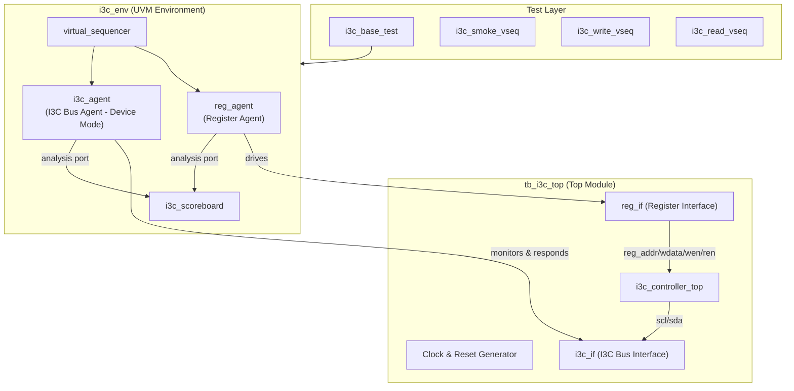
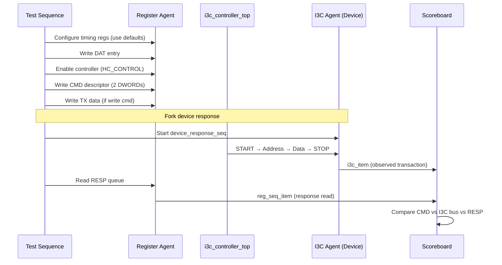

# UVM Verification Environment for I3C Controller IP

Build a UVM-based verification environment for the simplified I3C master controller IP, modeled after the ChipAlliance `i3c-core` reference verification structure but adapted to your IP's unique architecture (direct register interface instead of AXI, master-only, simplified DAT).

## Decisions (Resolved)

| Decision | Choice |
|----------|--------|
| Simulator | **Xcelium** |
| Bus timing | **Use CSR defaults** (t_low=13, t_high=13 cycles, etc.) |
| I3C targets | **Single device** for Phase 1, scale later |
| Functional coverage | **Deferred** to Phase 2 |
| Host interface agent | **Custom `reg_agent`** (lightweight, matches simple addr/wen/ren CSR interface) |

## Per-File Specifications

Detailed specifications for every verification file are in [docs/verification_specs/](file:///Users/minhuy/Workspaces/i3c/docs/verification_specs/):

| Spec File | Component |
|-----------|-----------|
| [01_dv_macros_spec.md](file:///Users/minhuy/Workspaces/i3c/docs/verification_specs/01_dv_macros_spec.md) | DV macros include |
| [02_csr_addr_pkg_spec.md](file:///Users/minhuy/Workspaces/i3c/docs/verification_specs/02_csr_addr_pkg_spec.md) | CSR address constants package |
| [03_reg_agent_spec.md](file:///Users/minhuy/Workspaces/i3c/docs/verification_specs/03_reg_agent_spec.md) | Register bus agent (interface, driver, monitor, sequencer, cfg, seq_item, agent) |
| [04_i3c_agent_spec.md](file:///Users/minhuy/Workspaces/i3c/docs/verification_specs/04_i3c_agent_spec.md) | I3C bus agent (interface, driver, monitor, sequencer, cfg, seq_item, item, agent) |
| [05_i3c_seq_lib_spec.md](file:///Users/minhuy/Workspaces/i3c/docs/verification_specs/05_i3c_seq_lib_spec.md) | I3C sequence library (device response seq) |
| [06_env_spec.md](file:///Users/minhuy/Workspaces/i3c/docs/verification_specs/06_env_spec.md) | Environment, env config, virtual sequencer, scoreboard |
| [07_tb_top_spec.md](file:///Users/minhuy/Workspaces/i3c/docs/verification_specs/07_tb_top_spec.md) | Testbench top module |
| [08_tests_and_vseqs_spec.md](file:///Users/minhuy/Workspaces/i3c/docs/verification_specs/08_tests_and_vseqs_spec.md) | Base test, test package, all virtual sequences |
| [09_build_infrastructure_spec.md](file:///Users/minhuy/Workspaces/i3c/docs/verification_specs/09_build_infrastructure_spec.md) | Makefile, filelist, README |

---

## Architecture Overview



---

## File Tree

```
verification/
├── README.md
├── Makefile
└── uvm_i3c/
    ├── filelist.f
    ├── dv_inc/
    │   ├── dv_macros.svh
    │   └── i3c_csr_addr_pkg.sv
    ├── dv_reg/
    │   ├── reg_agent_pkg.sv
    │   ├── reg_if.sv
    │   ├── reg_seq_item.sv
    │   ├── reg_driver.sv
    │   ├── reg_monitor.sv
    │   ├── reg_sequencer.sv
    │   ├── reg_agent.sv
    │   └── reg_agent_cfg.sv
    ├── dv_i3c/
    │   ├── i3c_agent_pkg.sv
    │   ├── i3c_if.sv
    │   ├── i3c_seq_item.sv
    │   ├── i3c_item.sv
    │   ├── i3c_driver.sv
    │   ├── i3c_monitor.sv
    │   ├── i3c_sequencer.sv
    │   ├── i3c_agent.sv
    │   ├── i3c_agent_cfg.sv
    │   └── seq_lib/
    │       ├── i3c_seq_lib.sv
    │       └── i3c_device_response_seq.sv
    ├── i3c_core/
    │   ├── tb_i3c_top.sv
    │   ├── i3c_env_cfg.sv
    │   ├── i3c_env.sv
    │   ├── i3c_env_pkg.sv
    │   ├── i3c_virtual_sequencer.sv
    │   ├── i3c_scoreboard.sv
    │   ├── i3c_base_test.sv
    │   ├── i3c_test_pkg.sv
    │   └── i3c_vseqs/
    │       ├── i3c_base_vseq.sv
    │       ├── i3c_smoke_vseq.sv
    │       ├── i3c_write_vseq.sv
    │       ├── i3c_read_vseq.sv
    │       └── i3c_vseq_list.sv
    └── xrun.args                    # Xcelium compilation arguments
```

**Total: ~30 new files**

---

## Phase 1 Tests

| Test Name | Description | Key Checks |
|-----------|-------------|------------|
| `i3c_smoke` | Immediate data transfer (1-2 byte write) | Bus activity observed, response = Success |
| `i3c_write` | Regular transfer write (N bytes via TX queue) | Data on bus matches TX queue, response = Success |
| `i3c_read` | Regular transfer read (N bytes to RX queue) | RX queue data matches device-driven data, response = Success |

## Phase 2 Roadmap

| Feature | Description |
|---------|-------------|
| ENTDAA test | Dynamic address assignment sequence |
| CCC tests | Broadcast and direct CCC commands |
| Error injection | NACK, queue overflow, abort |
| Multi-device | Multiple I3C targets on bus |
| Functional coverage | Covergroups for protocol, CSR, queues |
| I2C legacy | I2C device transfers |

---

## Verification Flow



## Build & Run (Xcelium)

```bash
# Compile + elaborate
xrun -compile -elaborate -f verification/uvm_i3c/filelist.f -uvmhome CDNS-1.2

# Run smoke test
xrun -R +UVM_TESTNAME=i3c_base_test +UVM_TEST_SEQ=i3c_smoke_vseq

# Run with verbosity
xrun -R +UVM_TESTNAME=i3c_base_test +UVM_TEST_SEQ=i3c_write_vseq +UVM_VERBOSITY=UVM_HIGH
```

## Key Differences from Reference i3c-core

| Aspect | ChipAlliance i3c-core | Your I3C Controller |
|--------|----------------------|---------------------|
| Host Interface | AXI (TODO in reference) | Simple reg (addr/wdata/wen/ren) |
| Host Agent | AXI agent (planned) | Custom `reg_agent` |
| DUT Role | Controller + Target modes | Controller (master) only |
| DAT Width | 64-bit | 32-bit |
| CMD Queue Access | Via AXI | Via CSR register writes (2×32-bit staging) |
| PHY | Tri-state with OD/PP | 2FF synchronizer, direct drive |
| Simulator | Questa/VCS | Xcelium |
