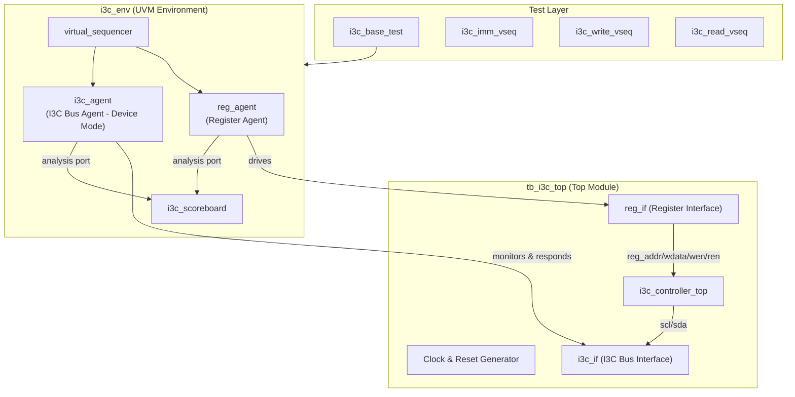
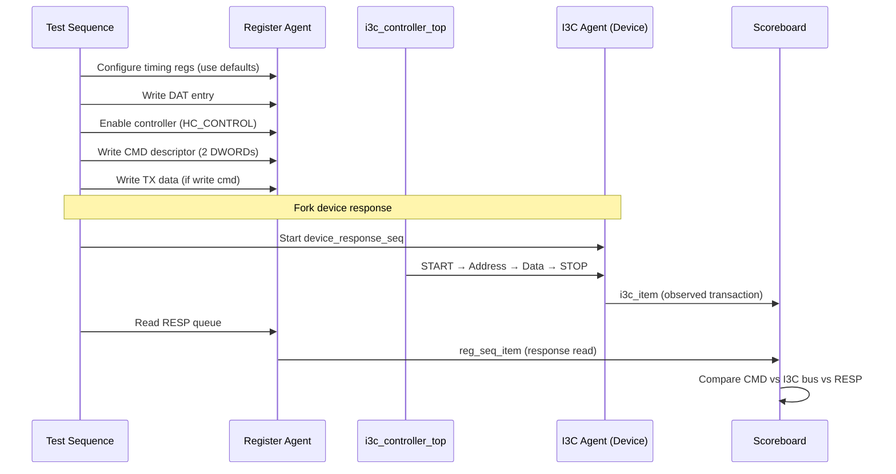

# UVM Verification Environment for I3C Controller IP

Build a UVM-based verification environment for the simplified I3C master controller IP, modeled after the ChipAlliance `i3c-core` reference verification structure but adapted to your IP's unique architecture (direct register interface instead of AXI, master-only, simplified DAT).

## Decisions (Resolved)

| Decision | Choice |
|----------|--------|
| Simulator | **Xcelium** |
| Bus timing | **Use CSR defaults** (t_low=13, t_high=13 cycles, etc.) |
| I3C targets | **Single device** exercised by the env (`i3c_agent_cfg` reserves a second target slot, `i3c_target1`, that is not populated — `04_i3c_agent_spec.md` §11.2) |
| Functional coverage | **Implemented**: `i3c_coverage`/`reg_coverage` (raw per-domain) + `i3c_correlated_coverage` (cross-domain, fed by the scoreboard) — `06_env_spec.md` §5.5/§6, `10_functional_coverage_matrix.md` |
| Host interface agent | **Custom `reg_agent`** (lightweight, matches simple addr/wen/ren CSR interface) |

## Per-File Specifications

Detailed specifications for every verification file are in [docs/verification_specs/](.):

| Spec File | Component |
|-----------|-----------|
| [01_dv_macros_spec.md](01_dv_macros_spec.md) | DV macros include |
| [02_csr_addr_pkg_spec.md](02_csr_addr_pkg_spec.md) | CSR address constants package |
| [03_reg_agent_spec.md](03_reg_agent_spec.md) | Register bus agent (interface, driver, monitor, sequencer, cfg, seq_item, agent) |
| [04_i3c_agent_spec.md](04_i3c_agent_spec.md) | I3C bus agent (interface, driver, monitor, sequencer, cfg, seq_item, item, agent) |
| [05_i3c_seq_lib_spec.md](05_i3c_seq_lib_spec.md) | I3C sequence library (device response seq) |
| [06_env_spec.md](06_env_spec.md) | Environment, env config, virtual sequencer, scoreboard, coverage wiring |
| [07_tb_top_spec.md](07_tb_top_spec.md) | Testbench top module |
| [08_tests_and_vseqs_spec.md](08_tests_and_vseqs_spec.md) | Base test, test package, all virtual sequences |
| [09_build_infrastructure_spec.md](09_build_infrastructure_spec.md) | Makefile, filelist, README |
| [10_functional_coverage_matrix.md](10_functional_coverage_matrix.md) | Functional coverage model (covergroups, coverpoints, crosses) |

---

## Architecture Overview


```mermaid
graph TB
    subgraph TB["tb_i3c_top (Top Module)"]
        CLK["Clock & Reset Generator"]
        DUT["i3c_controller_top"]
        REG_IF["reg_if (Register Interface)"]
        I3C_IF["i3c_if (I3C Bus Interface)"]
    end

    subgraph ENV["i3c_env (UVM Environment)"]
        REG_AGENT["reg_agent<br/>(Register Agent)"]
        I3C_AGENT["i3c_agent<br/>(I3C Bus Agent - Device Mode)"]
        VSEQ["virtual_sequencer"]
        SCB["i3c_scoreboard"]
    end

    subgraph TESTS["Test Layer"]
        BASE_TEST["i3c_base_test"]
        SMOKE["i3c_imm_vseq"]
        WRITE_TEST["i3c_write_vseq"]
        READ_TEST["i3c_read_vseq"]
    end

    REG_AGENT -->|drives| REG_IF
    REG_IF -->|reg_addr/wdata/wen/ren| DUT
    DUT -->|scl/sda| I3C_IF
    I3C_AGENT -->|monitors & responds| I3C_IF
    I3C_AGENT -->|analysis port| SCB
    REG_AGENT -->|analysis port| SCB
    VSEQ --> REG_AGENT
    VSEQ --> I3C_AGENT
    BASE_TEST --> ENV
```

---

## File Tree (current)

```
src/verification/
├── README.md
├── Makefile
└── uvm_i3c/
    ├── filelist.f
    ├── dv_inc/                      # dv_macros.svh, i3c_csr_addr_pkg.sv
    ├── dv_reg/                      # reg_agent_pkg + if/seq_item/driver/monitor/sequencer/agent/cfg
    │   └── reg_coverage.sv          # raw register-bus covergroups
    ├── dv_i3c/
    │   ├── i3c_timing_pkg.sv, i3c_agent_pkg.sv, i3c_if.sv
    │   ├── i3c_seq_item.sv, i3c_item.sv, i3c_driver.sv, i3c_monitor.sv
    │   ├── i3c_sequencer.sv, i3c_agent.sv, i3c_agent_cfg.sv
    │   ├── i3c_coverage.sv          # raw I3C-item covergroups (04/10 specs)
    │   └── seq_lib/                 # i3c_seq_lib.sv, i3c_device_response_seq.sv
    ├── i3c_core/
    │   ├── tb_i3c_top.sv, i3c_env_cfg.sv, i3c_env.sv, i3c_env_pkg.sv
    │   ├── i3c_virtual_sequencer.sv
    │   ├── i3c_scoreboard.sv        # shell: analysis ports, model typedefs, extern method TOC
    │   ├── i3c_scoreboard_{refmodel,bus,ccc,resp,cov,fmt}.svh  # 6 include files (06 spec §5.5)
    │   ├── i3c_correlated_item.sv, i3c_correlated_coverage.sv  # cross-domain coverage
    │   ├── i3c_base_test.sv, i3c_test_pkg.sv
    │   ├── sva/                     # flow_active/csr_registers/sync_fifo/i3c_controller_top/tb_pad_model checkers
    │   └── i3c_vseqs/
    │       ├── i3c_base_vseq.sv, i3c_vseq_list.sv
    │       └── bus_vseqs/, ccc_vseqs/, csr_vseqs/, daa_vseqs/, fifo_vseqs/,
    │           i2c_vseqs/, imm_vseqs/, resp_vseqs/, sdr_read_vseqs/, sdr_write_vseqs/
    ├── block_tests/                 # standalone elaboration-guard tests (e.g. FIFO depth check)
    └── xrun.args                    # Xcelium compilation arguments
```

The flat `i3c_vseqs/{i3c_imm,i3c_write,i3c_read}_vseq.sv` set below (§ "Phase 1 Tests") reflects the very first cut of this environment; virtual sequences now live under the ten category directories above — see `docs/test_plan/I3C_Testplan.md` for the current test list and CLAUDE.md's `make *_regression` targets for how they're run.

---

## Initial (Phase 1) Tests

The environment's original three-test slice — kept here as the historical starting point:

| Test Name | Description | Key Checks |
|-----------|-------------|------------|
| `i3c_smoke` | Immediate data transfer (1-2 byte write) | Bus activity observed, response = Success |
| `i3c_write` | Regular transfer write (N bytes via TX queue) | Data on bus matches TX queue, response = Success |
| `i3c_read` | Regular transfer read (N bytes to RX queue) | RX queue data matches device-driven data, response = Success |

## Roadmap Status

Everything originally planned as "Phase 2" here is implemented; only multi-device remains out of scope:

| Feature | Status |
|---------|--------|
| ENTDAA test | **Done** — `i3c_core/i3c_vseqs/daa_vseqs/` (single-device and multi-round arbitration, rejection, DAT-boundary cases) |
| CCC tests | **Done** — `i3c_core/i3c_vseqs/ccc_vseqs/` (broadcast/direct ENEC/DISEC, ENTDAA opening frame) |
| Error injection | **Done** — abort/reset/backpressure coverage across `resp_vseqs/`, `csr_vseqs/` (HC abort, SW reset while busy, RX/RESP FIFO full, NACK cases) |
| Multi-device | **Not implemented** — the env config carries a second target slot (`i3c_agent_cfg.i3c_target1`) but only one device is populated (`i3c_env_cfg::initialize()`, `06_env_spec.md` §3) |
| Functional coverage | **Done** — `i3c_coverage` (11 covergroups) + `i3c_correlated_coverage` (21 covergroups) + `reg_coverage`; see `10_functional_coverage_matrix.md` |
| I2C legacy | **Done** — `i3c_core/i3c_vseqs/i2c_vseqs/` and I2C paths through `bus_vseqs/`/`resp_vseqs/` |

---

## Verification Flow


```mermaid
sequenceDiagram
    participant Test as Test Sequence
    participant Reg as Register Agent
    participant DUT as i3c_controller_top
    participant I3C as I3C Agent (Device)
    participant SCB as Scoreboard

    Test->>Reg: Configure timing regs (use defaults)
    Test->>Reg: Write DAT entry
    Test->>Reg: Enable controller (HC_CONTROL)
    Test->>Reg: Write CMD descriptor (2 DWORDs)
    Test->>Reg: Write TX data (if write cmd)
    Note over Test,I3C: Fork device response
    Test->>I3C: Start device_response_seq

    DUT->>I3C: START → Address → Data → STOP
    I3C->>SCB: i3c_item (observed transaction)

    Test->>Reg: Read RESP queue
    Reg->>SCB: reg_seq_item (response read)
    SCB->>SCB: Compare CMD vs I3C bus vs RESP
```

## Build & Run (Xcelium)

The raw `xrun` invocations originally sketched here are now wrapped by the top-level `Makefile` (see `CLAUDE.md` "Commands" and `09_build_infrastructure_spec.md`):

```bash
cd src/verification
make compile                        # compile + elaborate only
make sim SEQ=i3c_write_vseq          # compile + run a specific sequence
make sim SEQ=i3c_write_vseq VERBOSITY=UVM_HIGH SEED=12345
make regression                     # all CSR/FIFO/bus/SDR/IMM/I2C/CCC/DAA/error suites
make csr_regression bus_regression sdr_regression ccc_regression daa_regression err_regression
```

## Coding Conventions

- Use `uvm_config_db` exclusively for all config passing. Do **not** use the deprecated `get_config_*`/`set_config_*` API (causes `UVM/CFG/GET/DPR` warnings and is removed in IEEE 1800.2).

## Key Differences from Reference i3c-core

| Aspect | ChipAlliance i3c-core | Your I3C Controller |
|--------|----------------------|---------------------|
| Host Interface | AXI (TODO in reference) | Simple reg (addr/wdata/wen/ren) |
| Host Agent | AXI agent (planned) | Custom `reg_agent` |
| DUT Role | Controller + Target modes | Controller (master) only |
| DAT Width | 64-bit | 32-bit |
| CMD Queue Access | Via AXI | Via CSR register writes (2×32-bit staging) |
| PHY | Tri-state with OD/PP | 2FF synchronizer, direct drive |
| Simulator | Questa/VCS | Xcelium |
