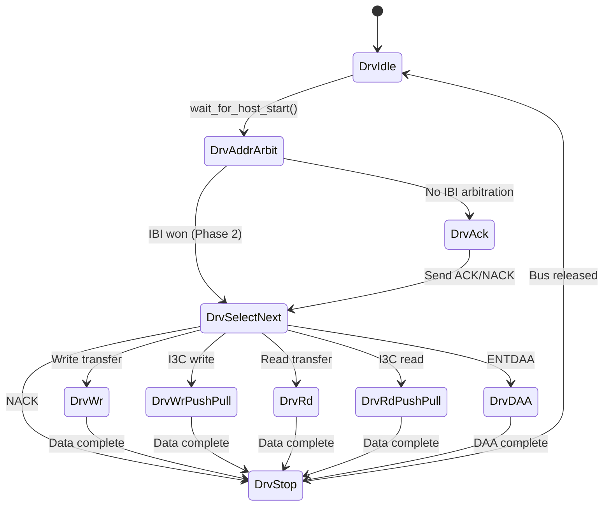

# Component: I3C Bus Agent (dv_i3c/)

> Status: Adapt from reference
> Location: `verification/uvm_i3c/dv_i3c/`
> Reference: `i3c-core/verification/uvm_i3c/dv_i3c/` (~70KB, 10 files)
> Estimated LoC: ~1500 lines total (10 files)

## 1. Purpose

A UVM agent that models an I3C bus participant. For Phase 1, this agent operates in **Device mode** — it responds to START conditions, address matching, and data transfers initiated by the DUT (which is the I3C controller/host).

The agent is adapted from the ChipAlliance i3c-core reference verification agent, retaining the proven I3C protocol handling while adapting to our DUT's simplified PHY (non-tristate, direct drive with 2FF synchronizer).

## 2. Dependencies

### Packages

- `uvm_pkg`
- `dv_macros.svh` (included)

### Used By

- `i3c_env` — instantiates one `i3c_agent` in Device mode
- `i3c_virtual_sequencer` — holds handle to `i3c_sequencer`
- Virtual sequences — start device response sequences on the I3C sequencer

---

## 3. File: i3c_if.sv

### 3.1. Purpose

SystemVerilog interface modeling the physical I3C bus with open-drain emulation. Provides timing-aware helper tasks for START/STOP/RSTART detection and bit-level data transfer.

### 3.2. Adapted from Reference

Based on `i3c-core/verification/uvm_i3c/dv_i3c/i3c_if.sv` (430 lines). Key adaptations:
- Connects to DUT via open-drain bus wires (not directly to DUT ports)
- Retains all I2C and I3C timing helper tasks
- Retains open-drain / push-pull mode switching logic

### 3.3. Ports

| Signal | Type | Description |
|--------|------|-------------|
| `clk_i` | Input | System clock |
| `rst_ni` | Input | Active-low reset |
| `scl_io` | Inout wire | SCL bus (open-drain emulated) |
| `sda_io` | Inout wire | SDA bus (open-drain emulated) |

### 3.4. Internal Signals

| Signal | Description |
|--------|-------------|
| `scl_i` | Sampled SCL value |
| `sda_i` | Sampled SDA value |
| `scl_o` | SCL output from agent (default 1) |
| `scl_pp_en` | SCL push-pull enable |
| `host_sda_o` | Host-side SDA output |
| `host_sda_pp_en` | Host SDA push-pull enable |
| `device_sda_o` | Device-side SDA output |
| `device_sda_pp_en` | Device SDA push-pull enable |

### 3.5. Open-Drain Emulation

```systemverilog
// SCL: open-drain with weak pull-up
assign scl_io = scl_pp_en ?
  scl_o : (scl_o ? 1'bz : scl_o);
assign (highz0, weak1) scl_io = 1'b1;

// SDA: both host and device can drive
assign sda_io = host_sda_pp_en ?
  host_sda_o : (host_sda_o ? 1'bz : host_sda_o);
assign sda_io = device_sda_pp_en ?
  device_sda_o : (device_sda_o ? 1'bz : device_sda_o);
assign (highz0, weak1) sda_io = 1'b1;
```

### 3.6. Clocking Block

```systemverilog
clocking cb @(posedge clk_i);
  input scl_i, sda_i;
  output scl_o, host_sda_o, device_sda_o;
  output scl_pp_en, host_sda_pp_en, device_sda_pp_en;
endclocking
```

### 3.7. Helper Tasks

Copied from reference with no functional changes:

| Task | Description |
|------|-------------|
| `p_edge_scl()` | Wait for SCL positive edge |
| `sample_target_data(output bit)` | Sample SDA on SCL rising edge |
| `wait_for_host_start()` | Detect START condition (SDA↓ while SCL=1) |
| `get_bit_data(src, output bit)` | Sample one data bit |
| `wait_for_device_ack(ack_bit)` | Wait for ACK/NACK from device |
| `wait_for_device_ack_or_nack(output ack)` | Wait for either ACK or NACK |
| `wait_for_host_rstart(output rstart)` | Detect RSTART condition |
| `wait_for_host_stop(delay, output stop)` | Detect STOP condition |
| `wait_for_i2c_host_stop_or_rstart(tc, rstart, stop)` | Wait for either with I2C timing |
| `wait_for_i3c_host_stop_or_rstart(tc, rstart, stop)` | Wait for either with I3C timing |
| `wait_for_host_ack()` / `wait_for_host_nack()` | Wait for host ACK/NACK |
| `host_i2c_start(tc)` / `host_i3c_start(tc)` | Drive START with timing |
| `host_i2c_rstart(tc)` / `host_i3c_rstart(tc)` | Drive RSTART with timing |
| `host_i2c_stop(tc)` / `host_i3c_stop(tc)` | Drive STOP with timing |
| `host_i2c_data(tc, bit)` / `host_i3c_data(tc, bit)` | Drive one data bit |
| `device_i2c_send_bit(tc, bit)` | Device sends one OD bit (I2C) |
| `device_i3c_od_send_bit(tc, bit)` | Device sends one OD bit (I3C) |
| `device_i3c_send_bit(tc, bit)` | Device sends one PP bit (I3C) |
| `device_send_T_bit(tc, bit)` | Device sends T-bit with Tsco |
| `device_i2c_send_ack(tc)` / `device_i2c_send_nack(tc)` | ACK/NACK helpers |
| `time_check(delay, exp, wire, msg)` | Timing constraint checker |

### 3.8. Connection to DUT

In `tb_i3c_top.sv`, the open-drain bus is emulated with wires:

```systemverilog
wire scl_bus, sda_bus;

// Open-drain bus model
assign scl_bus = (dut_scl_o === 1'b0) ? 1'b0 : 1'bz;
assign sda_bus = (dut_sda_o === 1'b0) ? 1'b0 : 1'bz;

// Pull-ups
pullup(scl_bus);
pullup(sda_bus);

// DUT reads bus value
assign dut_scl_i = scl_bus;
assign dut_sda_i = sda_bus;

// I3C interface connects to same bus
i3c_if i3c_bus(.clk_i(clk), .rst_ni(rst_n), .scl_io(scl_bus), .sda_io(sda_bus));
```

### 3.9. Implementation Notes

- The `time_check` task uses `#(delay * 1ns)` — timing is in nanoseconds, not clock cycles
- Since our DUT uses clock-cycle-count timing internally, there is a domain translation: the I3C interface uses real timing for bus protocol while the DUT counts system clocks
- The `scl_spinwait_timeout_ns` should be set large enough for the DUT's default timing (e.g., 10ms)

---

## 4. File: i3c_agent_pkg.sv

### 4.1. Purpose

Package containing all I3C agent types, enums, timing structs, CCC definitions, and source includes.

### 4.2. Adapted from Reference

Directly from `i3c-core/verification/uvm_i3c/dv_i3c/i3c_agent_pkg.sv` (282 lines).

### 4.3. Key Contents

#### Enums

| Enum | Values | Description |
|------|--------|-------------|
| `if_mode_e` | `Host`, `Device` | Agent mode (Phase 1: Device only) |
| `bus_op_e` | `BusOpWrite`, `BusOpRead` | Transfer direction |
| `i3c_drv_phase_e` | `DrvIdle`, `DrvStart`, `DrvRStart`, `DrvAddr`, ... | Driver FSM states |
| `i3c_ccc_e` | `ENEC`, `DISEC`, `ENTDAA`, ... | CCC command codes |

#### Timing Structs

```systemverilog
typedef struct {
  int tHoldStop, tHoldStart, tSetupStart;
  int tSetupBit, tHoldBit, tClockPulse, tClockLow, tSetupStop;
} i2c_timing_t;

typedef struct {
  int tHoldStop, tHoldStart, tSetupStart, tHoldRStart;
  int tSetupBit, tHoldBit, tClockPulse;
  int tClockLowOD, tClockLowPP, tSetupStop;
} i3c_timing_t;

typedef struct {
  i2c_timing_t i2c_tc;
  i3c_timing_t i3c_tc;
} bus_timing_t;
```

#### I3C Device Struct

```systemverilog
typedef struct {
  bit [6:0]  static_addr, dynamic_addr;
  bit        static_addr_valid, dynamic_addr_valid;
  bit [7:0]  bcr, dcr;
  bit [47:0] pid;
  bit [15:0] max_read_length, max_write_length;
  // ... additional fields
} I3C_device;
```

#### CCC Lookup Tables

- `defining_byte_for_CCC[logic[7:0]]` — which CCCs require defining bytes
- `data_for_CCC[logic[7:0]]` — which CCCs have data
- `data_direction_for_CCC[logic[7:0]]` — host→device or device→host

#### Source Includes

```systemverilog
`include "i3c_item.sv"
`include "i3c_seq_item.sv"
`include "i3c_agent_cfg.sv"
`include "i3c_monitor.sv"
`include "i3c_driver.sv"
`include "i3c_sequencer.sv"
`include "i3c_agent.sv"
`include "seq_lib/i3c_seq_lib.sv"
```

---

## 5. File: i3c_seq_item.sv

### 5.1. Purpose

Driver-side transaction item. Sequences create these to instruct the driver how to behave during a bus transaction.

### 5.2. Fields

| Field | Type | Rand | Description |
|-------|------|------|-------------|
| `i3c` | `bit` | Yes | 1 = I3C mode, 0 = I2C mode |
| `addr` | `bit [6:0]` | Yes | Target device address |
| `dir` | `bit` | Yes | 0 = write, 1 = read |
| `dev_ack` | `bit` | Yes | Whether device ACKs the address |
| `data` | `bit [7:0] [$]` | Yes | Data bytes to send/receive |
| `data_cnt` | `bit [15:0]` | Yes | Number of data bytes |
| `T_bit` | `bit [$]` | Yes | T-bits (I3C) or ACK/NACK (I2C) per byte |
| `end_with_rstart` | `bit` | Yes | 1 = end with RSTART, 0 = end with STOP |
| `is_daa` | `bit` | Yes | 1 = DAA transaction |
| `IBI` | `bit` | Yes | IBI transaction (Phase 2) |
| `IBI_ADDR` | `bit [6:0]` | Yes | IBI device address |
| `IBI_START` | `bit` | Yes | Device triggers START |
| `IBI_ACK` | `bit` | Yes | Host ACKs IBI |

### 5.3. Adapted from Reference

Identical to `i3c-core/verification/uvm_i3c/dv_i3c/i3c_seq_item.sv` (42 lines).

---

## 6. File: i3c_item.sv

### 6.1. Purpose

Monitor-side transaction item. Created by `i3c_monitor` to represent an observed bus transaction.

### 6.2. Fields

| Field | Type | Description |
|-------|------|-------------|
| `data_q` | `bit [7:0] [$]` | Observed data bytes |
| `addr` | `bit [6:0]` | Observed address |
| `bus_op` | `bus_op_e` | Read or write |
| `addr_ack` | `bit` | Address ACK observed |
| `data_ack_q` | `bit [$]` | Per-byte ACK/T-bit |
| `i3c` | `bit` | I3C or I2C transaction |
| `i3c_broadcast` | `bit` | Broadcast CCC frame |
| `i3c_direct` | `bit` | Direct CCC frame |
| `CCC` | `i3c_ccc_e` | CCC code (if applicable) |
| `CCC_valid` | `bit` | CCC was decoded |
| `start`, `stop`, `rstart` | `bit` | Bus condition flags |
| `interrupted` | `bit` | Controller terminated early |
| `num_data` | `int` | Valid data count |
| `tran_id` | `int` | Transaction ID from monitor |

### 6.3. Utility Methods

- `clear_data()` — reset data fields
- `clear_flag()` — reset condition flags
- `clear_all()` — reset everything
- `convert2string()` — human-readable representation for debug

### 6.4. Adapted from Reference

Identical to `i3c-core/verification/uvm_i3c/dv_i3c/i3c_item.sv` (108 lines).

---

## 7. File: i3c_driver.sv

### 7.1. Purpose

Drives the I3C bus interface based on sequence items. In Phase 1, operates exclusively in **Device mode** — responds to host-initiated transactions.

### 7.2. Adapted from Reference

Based on `i3c-core/verification/uvm_i3c/dv_i3c/i3c_driver.sv` (714 lines).

### 7.3. Key Architecture

```
run_phase() forks:
  ├── reset_signals()     — monitor reset, release bus
  ├── get_and_drive()     — main item processing loop
  └── drive_scl()         — SCL clock generation (Host mode only, NOT used in Phase 1)
```

### 7.4. Device Mode FSM (get_and_drive → drive_device_item)



### 7.5. Device Mode Key Operations

| State | Action |
|-------|--------|
| `DrvIdle` | Wait for host START condition |
| `DrvAddrArbit` | Sample address from bus (7 bits + R/W) |
| `DrvAck` | Drive ACK (SDA=0) or NACK (SDA=1) using `device_i3c_od_send_bit` or `device_i2c_send_bit` |
| `DrvWr` | For each byte: sample 8 SDA bits on SCL edges, send ACK/NACK per T_bit[] |
| `DrvWrPushPull` | Same but sample T-bit (9th bit) for I3C PP write |
| `DrvRd` | For each byte: drive 8 SDA bits from `req.data[]`, wait for host ACK/NACK |
| `DrvRdPushPull` | Drive 8 bits + T-bit using `device_i3c_send_bit` and `device_send_T_bit` |
| `DrvDAA` | Send 64-bit PID+BCR+DCR (8 bytes), receive assigned address byte, send ACK |
| `DrvStop` | Release bus, wait for STOP or RSTART |

### 7.6. Stop/RStart Detection

The main loop (`get_and_drive`) forks the device item processing against stop/rstart detection. If STOP is detected first, the transaction ends. If RSTART is detected, the state moves to `DrvAddr` for the next sub-frame.

### 7.7. Implementation Notes

- **Phase 1 simplification**: Only Device mode is used (Host mode code is retained but not exercised)
- The driver does NOT drive SCL in Device mode — only the DUT drives SCL
- The driver uses `cfg.tc.i3c_tc` / `cfg.tc.i2c_tc` timing constants for bit-level timing
- `release_bus()` sets `device_sda_o = 1` and `device_sda_pp_en = 0`

---

## 8. File: i3c_monitor.sv

### 8.1. Purpose

Passively monitors the I3C bus and constructs `i3c_item` transactions for analysis.

### 8.2. Adapted from Reference

Based on `i3c-core/verification/uvm_i3c/dv_i3c/i3c_monitor.sv` (~700 lines).

### 8.3. Analysis Port

```systemverilog
uvm_analysis_port#(i3c_item) ap;
```

### 8.4. Behavior Overview

```
run_phase() forks:
  ├── detect_reset()       — monitor reset state
  └── collect_thread()     — main monitoring loop
```

**collect_thread():**
1. Wait for START condition on bus
2. Sample 7-bit address + R/W bit
3. If address is `7'h7E` (I3C broadcast), decode as CCC frame
4. Sample ACK/NACK bit
5. Based on R/W direction:
   - Write: sample data bytes, record ACK/NACK per byte
   - Read: sample data bytes, record T-bits
6. Detect STOP or RSTART to complete transaction
7. Build `i3c_item` and write to analysis port

### 8.5. CCC Detection

- Address `7'h7E` with W indicates broadcast CCC
- Next byte after ACK is the CCC code
- Monitor decodes CCC type using `i3c_ccc_e` enum
- For direct CCCs, capture per-target address + data

### 8.6. I3C vs I2C Detection

- If bus uses push-pull mode after address (detected by timing or mode signal), it's I3C
- Otherwise, treated as I2C legacy frame
- For Phase 1, the monitor infers this from the address (7'h7E = I3C, others depend on DAT configuration)

### 8.7. Implementation Notes

- The monitor is always enabled (`cfg.en_monitor = 1`)
- It does not affect bus timing or behavior
- Transaction boundaries are defined by START → STOP
- RSTART within a frame creates sub-transactions linked by `rstart` flag

---

## 9. File: i3c_sequencer.sv

### 9.1. Purpose

Standard UVM sequencer parameterized with `i3c_seq_item`.

### 9.2. Implementation

```systemverilog
class i3c_sequencer extends uvm_sequencer#(.REQ(i3c_seq_item), .RSP(i3c_seq_item));
  `uvm_component_utils(i3c_sequencer)
  i3c_agent_cfg cfg;
  // Standard new() and build_phase()
endclass
```

---

## 10. File: i3c_agent_cfg.sv

### 10.1. Purpose

Configuration object for the I3C agent.

### 10.2. Fields

| Field | Type | Default | Description |
|-------|------|---------|-------------|
| `is_active` | `bit` | `1'b1` | Active or passive agent |
| `if_mode` | `if_mode_e` | `Device` | Host or Device mode (**Device for Phase 1**) |
| `has_driver` | `bit` | `1'b1` | Create driver |
| `ok_to_end_delay_ns` | `int` | `1000` | Delay after ok_to_end |
| `in_reset` | `bit` | `0` | Reset status |
| `en_monitor` | `bit` | `1'b1` | Enable monitor |
| `vif` | `virtual i3c_if` | - | Interface handle |
| `tc` | `bus_timing_t` | Default timings | Bus timing configuration |
| `i3c_target0` | `I3C_device` | - | Target device 0 config |
| `driver_rst` | `bit` | `0` | Agent reset without DUT reset |
| `monitor_rst` | `bit` | `0` | Monitor reset without DUT reset |

### 10.3. Phase 1 Configuration

```systemverilog
cfg.if_mode = Device;
cfg.is_active = 1;
cfg.has_driver = 1;
cfg.en_monitor = 1;
cfg.i3c_target0.dynamic_addr = 7'h08;  // Example target address
cfg.i3c_target0.static_addr = 7'h50;
```

---

## 11. File: i3c_agent.sv

### 11.1. Purpose

Top-level agent class. Builds and connects driver, sequencer, and monitor.

### 11.2. Adapted from Reference

Identical structure to `i3c-core/verification/uvm_i3c/dv_i3c/i3c_agent.sv` (47 lines).

### 11.3. build_phase

1. Get `i3c_agent_cfg` from `uvm_config_db`
2. Always create `i3c_monitor`
3. If active: create `i3c_sequencer` and optionally `i3c_driver`
4. Get `virtual i3c_if` from `uvm_config_db` into `cfg.vif`

### 11.4. connect_phase

Connect `driver.seq_item_port` to `sequencer.seq_item_export` when active with driver.

---

## 12. Changes from Reference

| Aspect | Reference | This Design |
|--------|-----------|-------------|
| Agent modes used | Host + Device | **Device only** (Phase 1) |
| I3C targets | Multiple possible | **Single device** |
| AXI interaction | AXI agent planned | Not applicable (reg_agent used) |
| IBI support | Full IBI arbitration | Retained in driver FSM but not tested |
| i3c_if connection | Direct to DUT tristate pins | Via **open-drain emulation wires** |

## 13. Implementation Notes

- The entire agent should be largely copy-adaptable from the reference
- The most critical adaptation is in `i3c_if.sv` — the open-drain bus model must properly interact with the DUT's non-tristate PHY
- The driver's Host-mode code (`drive_host_item`, `drive_scl`) is retained for future use but not exercised
- All timing constants in `i3c_timing_t` and `i2c_timing_t` use nanoseconds, matching the reference
