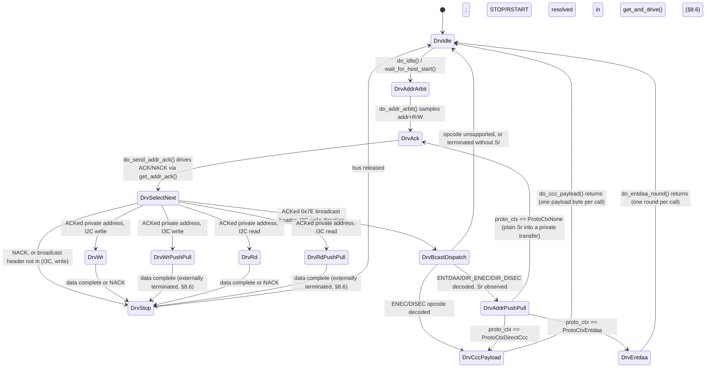

# Component: I3C Bus Agent (dv_i3c/)

> Status: Adapt from reference
> Location: `src/verification/uvm_i3c/dv_i3c/`
> Reference: `i3c-core/verification/uvm_i3c/dv_i3c/` (~70KB, 10 files)
> Current size: ~3300 lines total (13 files, including coverage and sequence-library files)

## 1. Purpose

A UVM agent that models an I3C bus participant. For Phase 1, this agent operates in **Device mode** — it responds to START conditions, address matching, and data transfers initiated by the DUT (which is the I3C controller/host).

The agent is adapted from the ChipAlliance i3c-core reference verification agent, retaining the proven I3C protocol handling while adapting to our DUT's simplified PHY (non-tristate, direct drive with 2FF synchronizer).

## 2. Dependencies

### Packages

- `uvm_pkg`
- `dv_macros.svh` (included)

### Used By

- `i3c_env` — instantiates one `i3c_agent` in Device mode
- `i3c_virtual_sequencer` — holds handle to `i3c_sequencer`
- Virtual sequences — start device response sequences on the I3C sequencer

---

## 3. File: i3c_if.sv

### 3.1. Purpose

SystemVerilog interface modeling the physical I3C bus with open-drain emulation. Provides timing-aware helper tasks for START/STOP/RSTART detection and bit-level data transfer.

### 3.2. Diverged from Reference

The current `i3c_if.sv` (640 lines) has diverged substantially from the ChipAlliance reference — it
is Device-mode only (no host-side drive signals: the agent never plays the controller role), adds
explicit START/RSTART/STOP setup/hold timing checks (`` `uvm_error `` on violation), and adds an
SDA handoff protocol (`wait_for_i3c_target_sda_handoff()`) that watches the DUT-derived
`dut_sda_oe_i` plus `dut_sda_o_i` status to know when the controller has released the bus for the
target/device to drive. Task names and signal names below are read directly off current source — do
not port from `i3c-core`.

### 3.3. Ports

| Signal | Type | Description |
|--------|------|-------------|
| `clk_i` | Input | System clock |
| `rst_ni` | Input | Active-low reset |
| `dut_sel_od_pp_i` | Input | DUT's OD/PP select — `1` = push-pull data phase (from `sel_od_pp_o`) |
| `dut_sda_oe_i` | Input | TB-derived SDA output-enable (`dut_sel_od_pp_i || !dut_sda_o_i`) — used to detect controller SDA release |
| `dut_sda_o_i` | Input | DUT's driven SDA value — used to detect the specific STOP-before-handoff case |
| `scl_io` | Inout wire | SCL bus (open-drain emulated) |
| `sda_io` | Inout wire | SDA bus (open-drain emulated, device side only) |

### 3.4. Internal Signals

| Signal | Description |
|--------|-------------|
| `scl_i` | Sampled SCL value (`= scl_io`) |
| `sda_i` | Sampled SDA value (`= sda_io`) |
| `scl_o` | SCL output from agent (default 1) |
| `scl_pp_en` | SCL push-pull enable |
| `device_sda_o` | Device-side SDA output (default 1) |
| `device_sda_pp_en` | Device SDA push-pull enable (default 1) |
| `dut_sel_od_pp` / `dut_sda_oe` / `dut_sda_o` | Registered copies of the DUT input ports, sampled in the clocking block |
| `spike_filter` / `delay` / `scl_delayed` / `scl_filtered` | Optional SCL glitch filter (`enable_spike_filter()`/`disable_spike_filter()`); `scl_filtered` is currently unused by any task |

There are no `host_sda_o`/`host_sda_pp_en` signals — this interface never drives the host/controller
side of the bus; the DUT (controller) drives SCL/SDA directly and the agent only plays Device mode.

### 3.5. Open-Drain Emulation

```systemverilog
assign scl_io = scl_pp_en ? scl_o : (scl_o ? 1'bz : scl_o);
assign (highz0, weak1) scl_io = 1'b1;

assign sda_io = device_sda_pp_en ? device_sda_o : (device_sda_o ? 1'bz : device_sda_o);
assign (highz0, weak1) sda_io = 1'b1;
```

Only the device side drives `sda_io`; the DUT drives its own SCL/SDA output pins separately and
`dut_sel_od_pp_i`/`dut_sda_oe_i`/`dut_sda_o_i` are sampled purely as status inputs for handoff
detection, not driven by this interface.

### 3.6. Clocking Block

```systemverilog
clocking cb @(posedge clk_i);
  input scl_i;
  input sda_i;
  input dut_sel_od_pp;
  input dut_sda_oe;
  input dut_sda_o;
  output scl_o;
  output device_sda_o;
  output scl_pp_en;
  output device_sda_pp_en;
endclocking
```

### 3.7. Helper Tasks

Read directly from current `i3c_if.sv` (640 lines) — no correspondence to the reference file's line
numbers.

| Task | Description |
|------|-------------|
| `enable_spike_filter()` / `disable_spike_filter()` | Toggle the optional SCL glitch filter |
| `p_edge_scl()` | Wait for one full SCL low-then-high cycle |
| `sample_target_data(output bit)` | Sample SDA on the next SCL positive edge (via `p_edge_scl()`) |
| `sample_bit_data(src, output bit)` | Sample SDA on SCL posedge, wait for negedge (host-driven data bit) |
| `sample_t_bit_data(src, output bit)` | Sample SDA on SCL posedge only (no negedge wait) — used for T-bit |
| `sample_addr(msg, output addr[6:0], output dir)` | Sample 7 address bits (MSB-first) + R/W bit via `sample_bit_data()` |
| `sample_one_byte(msg, output data[7:0])` | Sample 8 data bits (MSB-first) via `sample_target_data()` |
| `sample_i3c_data_byte_and_t_bit(msg, output data[7:0], output t_bit)` | `sample_one_byte()` + T-bit via `sample_target_data()` |
| `wait_for_host_start(tc)` | Detect START with `tSetupStart`/`tHoldStart` timing checks |
| `wait_for_host_rstart(tc, output rstart)` | Detect RSTART with `tSetupStart`/`tHoldRStart` timing checks |
| `wait_for_host_stop(tc, output stop)` | Detect STOP with `tSetupStop`/`tHoldStop` timing checks |
| `wait_for_i2c_host_stop_or_rstart(tc, rstart, stop)` | Race `wait_for_host_stop()`/`wait_for_host_rstart()` with I2C timing (RStart hold reuses `tHoldStart`) |
| `wait_for_i3c_host_stop_or_rstart(tc, rstart, stop)` | Same race with I3C timing |
| `sample_i3c_next_addr_or_stop(tc, msg, got_addr, rstart, stop, addr, dir)` | After a stop/rstart wait, samples the next address if RSTART was seen |
| `wait_for_host_ack()` / `wait_for_host_nack()` | Wait for SDA=0/1 on SCL posedge (host ACK/NACK) |
| `wait_for_host_ack_or_nack(output ack_r)` | Race both host ACK/NACK waits |
| `wait_for_device_ack_or_nack(output ack_r)` | Sample SDA on SCL posedge as the device's own driven ACK/NACK |
| `time_check(delay, exp_value, check_wire, msg)` | Generic setup/hold timing assertion helper (`` `uvm_error `` on violation) |
| `device_i2c_send_bit(tc, bit_i)` | Drive one I2C OD bit with `tSetupBit`/`tClockPulse`/`tHoldBit` timing |
| `wait_for_i3c_target_sda_handoff(phase, output ok, pp_phase=0)` | Wait for the DUT to release SDA (`dut_sda_oe == 0`) before the device drives; `pp_phase` controls the device-side drive mode, not the release condition |
| `device_i3c_raw_od_send_bit(tc, bit_i)` | Drive one I3C OD bit (no handoff wait) — used by ENTDAA/CCC OD phases |
| `device_i3c_send_addr_ack_handoff(tc, ack)` | Address ACK/NACK with SDA handoff, held through `tSCO` (read-direction handoff to target) |
| `device_i3c_send_addr_ack_no_handoff(tc, ack)` | Address ACK/NACK with SDA handoff but SDA held after (write-direction, target keeps driving) |
| `device_i3c_raw_pp_send_bit(tc, bit_i)` | Drive one I3C PP bit (no handoff wait) |
| `device_i3c_raw_pp_send_t_bit(tc, bit_i)` | Drive PP T-bit, releasing SDA after `tSCO` |
| `device_i3c_send_bit(tc, bit_i)` | Handoff-aware wrapper around `device_i3c_raw_pp_send_bit()` for read data bits |
| `device_i3c_send_t_bit(tc, bit_i)` | Handoff-aware wrapper around `device_i3c_raw_pp_send_t_bit()` |
| `device_i3c_send_daa_bit(tc, bit_i)` | Handoff-aware wrapper around `device_i3c_raw_od_send_bit()` for ENTDAA identity bits |

### 3.8. Connection to DUT

The DUT's PHY (`src/rtl/i3c_controller_top.sv:23-26`) is **direct-drive** (separate `scl_i`/`scl_o` and `sda_i`/`sda_o` pairs), not tri-state. The agent's `i3c_if.sv` therefore owns the open-drain emulation that a real bus would provide. See spec 07 §5 for the bus-model wiring at `tb_i3c_top` and how DUT outputs feed `scl_io`/`sda_io`.

In `tb_i3c_top.sv`, the bus/pad ownership model is wired as follows. SCL is modeled as
open-drain, while SDA derives output-enable from the DUT's `sel_od_pp_o` and `sda_o` so push-pull
high drive remains visible:

```systemverilog
wire scl_bus, sda_bus;
logic scl_o, sda_o;
logic sda_oe, sel_od_pp;

assign sda_oe = sel_od_pp || !sda_o;
assign scl_bus = (scl_o === 1'b0) ? 1'b0 : 1'bz;
assign sda_bus = sda_oe ? sda_o : 1'bz;

pullup (weak1) pu_scl (scl_bus);
pullup (weak1) pu_sda (sda_bus);

assign scl_i = scl_bus;
assign sda_i = sda_bus;

i3c_if i3c_bus (
  .clk_i           (clk),
  .rst_ni          (rst_n),
  .dut_sel_od_pp_i (sel_od_pp),
  .dut_sda_oe_i    (sda_oe),
  .dut_sda_o_i     (sda_o),
  .scl_io          (scl_bus),
  .sda_io          (sda_bus)
);
```

### 3.9. Implementation Notes

- The `time_check` task uses `#(delay * 1ns)` — timing is in nanoseconds, not clock cycles
- Since our DUT uses clock-cycle-count timing internally, there is a domain translation: the I3C interface uses real timing for bus protocol while the DUT counts system clocks
- ns-to-cycle formula: with the testbench timescale `1ns/1ps` (spec 07 §3) and a 3 ns clock period, *N* cycles in the CSR timing registers (e.g., `T_LOW=16`) correspond to `N * 3 ns` of real time. The agent's `i3c_tc` / `i2c_tc` constants are populated in ns, so they can be compared directly against bus events sampled by `time_check`.
- The `scl_spinwait_timeout_ns` should be set large enough for the DUT's default timing (e.g., 10ms)

---

## 4. File: i3c_timing_pkg.sv

### 4.1. Purpose

Package containing the timing structs shared by `i3c_if.sv` and `i3c_agent_pkg.sv`.
This keeps the interface compilable before the agent package in Xcelium.

### 4.2. Key Contents

```systemverilog
typedef struct {
  int tHoldStop, tHoldStart, tSetupStart;
  int tSetupBit, tHoldBit, tClockPulse, tClockLow, tSetupStop;
} i2c_timing_t;

typedef struct {
  int tHoldStop, tHoldStart, tSetupStart, tHoldRStart;
  int tSetupBit, tHoldBit, tClockPulse;
  int tClockLowOD, tClockLowPP, tSetupStop;
} i3c_timing_t;

typedef struct {
  i2c_timing_t i2c_tc;
  i3c_timing_t i3c_tc;
} bus_timing_t;
```

---

## 5. File: i3c_agent_pkg.sv

### 5.1. Purpose

Package containing all I3C agent types, enums, CCC definitions, compatibility timing type aliases, and source includes.

### 5.2. Adapted from Reference

Adapted from `i3c-core/verification/uvm_i3c/dv_i3c/i3c_agent_pkg.sv`, but reduced and
extended for this environment. The current package is approximately 140 lines and adds the
local driver-state/protocol-context enums and source include set documented below.

### 5.3. Key Contents

#### Enums

| Enum | Values | Description |
|------|--------|-------------|
| `if_mode_e` | `Host`, `Device` | Agent mode (Device only is exercised) |
| `bus_op_e` | `BusOpWrite`, `BusOpRead` | Transfer direction |
| `sampled_ack_nack_e` | `SampledAck`, `SampledNack` | Raw ACK/NACK bit stored in `i3c_seq_item.data_nack_q` for legacy I2C reads |
| `i3c_drv_phase_e` | `DrvIdle`, `DrvAddrArbit`, `DrvAddrPushPull`, `DrvAck`, `DrvSelectNext`, `DrvWr`, `DrvWrPushPull`, `DrvRd`, `DrvRdPushPull`, `DrvEntdaa`, `DrvStop`, `DrvBcastDispatch`, `DrvCccPayload` | Driver FSM states (§8.4) |
| `i3c_proto_ctx_e` | `ProtoCtxNone`, `ProtoCtxEntdaa`, `ProtoCtxDirectCcc`, `ProtoCtxBroadcastCcc` | Which CCC/ENTDAA protocol context the driver is servicing after a broadcast header (§8.4) |
| `i3c_ccc_e` | `ENEC`, `DISEC`, `ENTDAA`, `DIR_ENEC`, `DIR_DISEC`, ... | CCC command codes (imported from `i3c_pkg`) |

#### Timing Type Aliases

```systemverilog
typedef i3c_timing_pkg::i2c_timing_t i2c_timing_t;
typedef i3c_timing_pkg::i3c_timing_t i3c_timing_t;
typedef i3c_timing_pkg::bus_timing_t bus_timing_t;
```

#### I3C Device Struct

```systemverilog
typedef struct {
  bit [6:0]  static_addr, dynamic_addr;
  bit        static_addr_valid, dynamic_addr_valid;
  bit [7:0]  bcr, dcr;
  bit [47:0] pid;
  bit [15:0] max_read_length, max_write_length;
  // ... additional fields
} I3C_device;
```

#### CCC Lookup Tables

- `defining_byte_for_CCC[logic[7:0]]` — which CCCs require defining bytes
- `data_for_CCC[logic[7:0]]` — which CCCs have data
- `subcmd_byte_for_CCC[logic[7:0]]` — which CCCs carry an optional/required sub-command byte (consumed by the monitor's `ccc_direct()`, §9)
- `data_direction_for_CCC[logic[7:0]]` — host→device or device→host

#### Source Includes

```systemverilog
`include "i3c_item.sv"
`include "i3c_seq_item.sv"
`include "i3c_agent_cfg.sv"
`include "i3c_monitor.sv"
`include "i3c_driver.sv"
`include "i3c_sequencer.sv"
`include "i3c_agent.sv"
`include "seq_lib/i3c_seq_lib.sv"
```

---

## 6. File: i3c_seq_item.sv

### 6.1. Purpose

Driver-side transaction item. Sequences create these to instruct the driver how to behave during a bus transaction.

### 6.2. Fields

| Field | Type | Rand | Description |
|-------|------|------|-------------|
| `i3c` | `bit` | Yes | 1 = I3C mode, 0 = I2C mode |
| `addr` | `bit [6:0]` | Yes | Target dynamic address (matched against the sampled address by `get_addr_ack()`, §8) |
| `static_addr` | `bit [6:0]` | Yes | Target static address (I2C legacy / SETAASA-style flows) |
| `dir` | `bit` | Yes | 0 = write, 1 = read |
| `addr_nack` | `bit` | Yes | NACK a matched private address. An expected `0x7E` broadcast header is always ACKed by `get_addr_ack()` before this field is checked |
| `data` | `bit [7:0] [$]` | Yes | Data bytes to send (reads) or expected (writes) |
| `data_nack_q` | `bit [$]` | Yes | Per-byte I2C NACK pattern the device drives on write |
| `t_bit_q` | `bit [$]` | Yes | Per-byte I3C T-bit the device drives on read |
| `end_with_rstart` | `bit` | Yes | Driver response observation: the driver writes `rsp.end_with_rstart=1` for an observed RSTART and `0` for STOP. The request value is not used to control termination |
| `start_with_broadcast_header` | `bit` | Yes | Sequence expects the transaction to open with the `0x7E` broadcast header |
| `observed_broadcast_rstart` | `bit` | No | Set by the driver when a broadcast-header/CCC frame was followed by Sr into a private/direct sub-frame |
| `entdaa_join` | `bit` | Yes | This device joins the current ENTDAA round |
| `daa_id_bytes` | `bit [7:0] [$]` | Yes | 8-byte PID/BCR/DCR identity driven during ENTDAA (must be exactly 8 entries, checked in `drive_entdaa_identity()`) |
| `daa_accept_addr` | `bit` | Yes | Device ACKs (1) or NACKs (0) the dynamic address assigned by the controller during ENTDAA |
| `ccc_target_addr` | `bit [6:0]` | Yes | Expected target address for a direct CCC |
| `ccc_target_addr_valid` | `bit` | Yes | Whether `ccc_target_addr` should be matched (`direct_ccc_addr_match()`, §8); if 0, any non-broadcast address is accepted |
| `static_addr_constraint_en` | `bit` | No | Enables `static_addr_c` (restricts `static_addr` to `7'h08..7'h77`, excluding `I3C_RSVD_ADDR`) |
| `dynamic_addr_constraint_en` | `bit` | No | Enables `dynamic_addr_c` (restricts `addr` to `7'h04..7'h7d`, excluding `I3C_RSVD_ADDR`) |
| `payload_constraint_en` | `bit` | No | Enables `payload_c` (`data.size() == payload_len`) |
| `payload_len` | `int unsigned` | No | Target size for `data` when `payload_constraint_en=1` |

### 6.3. Adapted from Reference

Diverged substantially from `i3c-core/verification/uvm_i3c/dv_i3c/i3c_seq_item.sv`: the reference's `dev_ack`/`data_cnt`/`T_bit` fields were replaced by `addr_nack`/implicit `data.size()`/`t_bit_q`, and CCC/ENTDAA/constraint fields were added that the reference does not have.

---

## 7. File: i3c_item.sv

### 7.1. Purpose

Monitor-side transaction item. Created by `i3c_monitor` to represent an observed bus transaction.

### 7.2. Fields

| Field | Type | Description |
|-------|------|-------------|
| `addr` | `bit [6:0]` | Observed address |
| `addr_nack` | `bit` | Address was NACKed |
| `start_with_broadcast_header` | `bit` | Transaction opened with the `0x7E` broadcast header |
| `broadcast_header_nack` | `bit` | The broadcast header itself was NACKed |
| `i3c_direct` | `bit` | Frame is a direct CCC (vs. broadcast) |
| `CCC` | `i3c_ccc_e` | CCC code, valid when `CCC_valid=1` |
| `CCC_valid` | `bit` | CCC was decoded |
| `ccc_t_bit_valid` | `bit` | `ccc_t_bit` holds a sampled value |
| `ccc_t_bit` | `bit` | T-bit sampled after the CCC opcode byte |
| `CCC_direct_q` | `i3c_item [$]` | Per-target sub-items collected while walking a direct-CCC / ENTDAA loop (one entry per address-arbitration round) |
| `tran_id` | `int` | Transaction ID assigned by the monitor |
| `num_data` | `int` | Valid entries in `data_q` |
| `bus_op` | `bus_op_e` | Read or write |
| `data_q` | `bit [7:0] [$]` | Observed data bytes |
| `data_nack_q` | `bit [$]` | Per-byte I2C NACK (1=NACK) or I3C T-bit |
| `interrupted` | `bit` | I3C read stopped by controller takeover/abort after the final target-driven T-bit was `1` (the target requested continuation) |
| `i3c` | `bit` | I3C or I2C transaction |
| `start_from_rstart` | `bit` | This transaction began with a Repeated START rather than a STOP-terminated START |
| `rstart`, `stop` | `bit` | Bus condition flags observed at the end of the frame |
| `pname` | `string` | Debug-print name prefix used by `convert2string()` |

### 7.3. Utility Methods

- `clear_data()` — reset data fields (drops `i3c_broadcast`/`start`/`addr_ack`/`data_ack_q`/`CCC_def`, which no longer exist)
- `clear_flag()` — reset condition flags (`start_from_rstart`, `stop`, `rstart`)
- `clear_all()` — `clear_data()` + `clear_flag()`
- `convert2string()` — human-readable representation for debug; prints the CCC block only when `CCC_valid=1` (not the old `i3c_broadcast || i3c_direct` gate)

### 7.4. Adapted from Reference

Diverged from `i3c-core/verification/uvm_i3c/dv_i3c/i3c_item.sv`: dropped `i3c_empty_broadcast`/`i3c_broadcast`/`CCC_def`/`start`/`ack`/`nack`/`aborted` (unused or superseded); renamed `CCC_direct` → `CCC_direct_q`; added `broadcast_header_nack`, `ccc_t_bit_valid`/`ccc_t_bit`, `start_from_rstart`, `pname`.

---

## 8. File: i3c_driver.sv

### 8.1. Purpose

Drives the I3C bus interface based on sequence items. In Phase 1, operates exclusively in **Device mode** — responds to host-initiated transactions.

### 8.2. Adapted from Reference

Heavily diverged from `i3c-core/verification/uvm_i3c/dv_i3c/i3c_driver.sv`: Host-mode support was removed entirely (`build_phase()` now `` `DV_CHECK_FATAL``s unless `cfg.if_mode == Device`), and broadcast-header/CCC/ENTDAA dispatch (`i3c_proto_ctx_e`, `DrvBcastDispatch`, `DrvCccPayload`, `DrvEntdaa`) was added — none of this exists in the reference driver.

### 8.3. Key Architecture

```
run_phase() forks (join_none):
  ├── reset_signal()   — waits for DUT reset, clears proto_ctx, releases the bus, resets bus_state to DrvIdle
  └── get_and_drive()  — main item processing loop (§8.6)
```

There is no separate SCL-generation task; the driver never drives SCL (§8.7).

### 8.4. Driver FSM (`i3c_drv_phase_e`, executed by `drive_device_item()`)


```mermaid
stateDiagram-v2
    [*] --> DrvIdle
    DrvIdle --> DrvAddrArbit: do_idle() / wait_for_host_start()
    DrvAddrArbit --> DrvAck: do_addr_arbit() samples addr+R/W
    DrvAck --> DrvSelectNext: do_send_addr_ack() drives ACK/NACK via get_addr_ack()
    DrvSelectNext --> DrvStop: NACK, or broadcast header not in (I3C, write)
    DrvSelectNext --> DrvBcastDispatch: ACKed 0x7E broadcast header, I3C write direction
    DrvSelectNext --> DrvWr: ACKed private address, I2C write
    DrvSelectNext --> DrvWrPushPull: ACKed private address, I3C write
    DrvSelectNext --> DrvRd: ACKed private address, I2C read
    DrvSelectNext --> DrvRdPushPull: ACKed private address, I3C read
    DrvBcastDispatch --> DrvCccPayload: ENEC/DISEC opcode decoded
    DrvBcastDispatch --> DrvAddrPushPull: ENTDAA/DIR_ENEC/DIR_DISEC decoded, Sr observed
    DrvBcastDispatch --> DrvIdle: opcode unsupported, or terminated without Sr
    DrvAddrPushPull --> DrvEntdaa: proto_ctx == ProtoCtxEntdaa
    DrvAddrPushPull --> DrvCccPayload: proto_ctx == ProtoCtxDirectCcc
    DrvAddrPushPull --> DrvAck: proto_ctx == ProtoCtxNone (plain Sr into a private transfer)
    DrvEntdaa --> DrvIdle: do_entdaa_round() returns (one round per call)
    DrvCccPayload --> DrvIdle: do_ccc_payload() returns (one payload byte per call)
    DrvWr --> DrvStop: data complete or NACK
    DrvWrPushPull --> DrvStop: data complete (externally terminated, §8.6)
    DrvRd --> DrvStop: data complete or NACK
    DrvRdPushPull --> DrvStop: data complete (externally terminated, §8.6)
    DrvStop --> DrvIdle: bus released; STOP/RSTART resolved in get_and_drive() (§8.6)
```

`get_addr_ack(req, addr)` (used by `DrvAck` and `DrvSelectNext`): ACK unconditionally if the sequence requested a broadcast header (`req.start_with_broadcast_header`) and `addr == I3C_RSVD_ADDR`; otherwise ACK iff `!req.addr_nack && (addr == req.addr)`.

### 8.5. Device Mode Key Operations

| State (task/function) | Action |
|---|---|
| `DrvIdle` (`do_idle()`) | `wait_for_host_start()`, → `DrvAddrArbit` |
| `DrvAddrArbit` (`do_addr_arbit()`) | Sample 7-bit address + R/W (`sample_addr()`); sets `rsp.start_with_broadcast_header` when the sequence requested one and the sampled address is `I3C_RSVD_ADDR` |
| `DrvAck` (`do_send_addr_ack()`) | Compute ACK via `get_addr_ack()` (§8.4); drive it with `device_i3c_send_addr_ack_no_handoff()`/`_handoff()` (I3C) or the inverted bit via `device_i2c_send_bit()` (I2C) |
| `DrvSelectNext` (`next_state_after_ack()`) | Pure dispatch function — no bus activity (§8.4 diagram) |
| `DrvBcastDispatch` (`handle_broadcast_dispatch()`) | Sample the CCC opcode byte (`sample_ccc_byte_or_term()`). `ENEC`/`DISEC` → `proto_ctx=ProtoCtxBroadcastCcc`, → `DrvCccPayload`. `ENTDAA` → `proto_ctx=ProtoCtxEntdaa`, wait for the frame terminator; Sr → `DrvAddrPushPull` (next sub-frame is the `0x7E+R` arbitration byte), else the round ends. `DIR_ENEC`/`DIR_DISEC` → `proto_ctx=ProtoCtxDirectCcc`, same Sr-then-`DrvAddrPushPull` pattern (warns if no Sr follows). Any other/undecoded opcode → wait for terminator, transaction ends |
| `DrvAddrPushPull` (`do_addr_push_pull()`) | Sample the post-Sr address; dispatch on `proto_ctx` (§8.4) |
| `DrvEntdaa` (`do_entdaa_round()`) | ACK the `0x7E+R` arbitration byte iff `req.entdaa_join`; if ACKed, drive the 8-byte PID/BCR/DCR identity (`drive_entdaa_identity()`), sample the controller-assigned address byte, ACK/NACK it per `req.daa_accept_addr` (`device_i3c_send_addr_ack_handoff()`); wait for the frame terminator. Handles exactly one round, then → `DrvIdle` |
| `DrvCccPayload` (`do_ccc_payload()`) | For a direct CCC (`proto_ctx==ProtoCtxDirectCcc`), first ACK/NACK the target address via `direct_ccc_addr_match()` against `req.ccc_target_addr`/`ccc_target_addr_valid`; then sample one CCC/event-byte payload (`sample_ccc_byte_or_term()`) and wait for the terminator. One byte per call, then → `DrvIdle` |
| `DrvRd` (`do_i2c_read()`) | For each byte in `req.data`: drive OD, wait for host ACK/NACK, record into `rsp.data_nack_q`; stop early on NACK |
| `DrvRdPushPull` (`do_i3c_read()`) | For each byte in `req.data`: drive PP + drive `req.t_bit_q[i]` as the T-bit |
| `DrvWr` (`do_i2c_write()`) | Sample bytes into `rsp.data` until the device NACKs one, per `req.data_nack_q` |
| `DrvWrPushPull` (`do_i3c_write()`) | Sample bytes + T-bit into `rsp.data`/`rsp.t_bit_q`; `` `uvm_warning`` on bad T-bit parity; runs until the outer fork in `get_and_drive()` terminates it (§8.6) |
| `DrvStop` (`do_stop()`) | `release_bus()`, then blocks forever — the state is exited by `get_and_drive()`'s terminator wait, not from inside `drive_device_item()` |

### 8.6. Stop/RStart Detection

Each `get_and_drive()` iteration races four branches (`fork ... join_any; disable fork`):
1. `seq_item_port.get_next_item(req)` then `drive_device_item(req, rsp)`
2. Once `req` is non-null: wait until `bus_state` reaches a read state (`DrvRd`/`DrvRdPushPull`/`DrvStop`) or write state (`DrvWrPushPull`/`DrvWr`/`DrvStop`) per `req.dir`, then `wait_for_i3c_host_stop_or_rstart()` / `wait_for_i2c_host_stop_or_rstart()` per `req.i3c`
3. `process_reset()` — DUT reset mid-transaction
4. `wait (cfg.driver_rst)` — agent-only reset

If STOP wins, `bus_state → DrvIdle`, `proto_ctx` is cleared, and (if a response exists) `rsp.end_with_rstart = 0`. If RSTART wins, `bus_state → DrvAddrPushPull` (never back to `DrvAddrArbit` — Sr re-enters push-pull addressing) and `rsp.end_with_rstart = 1`. The response, if any, is returned via `seq_item_port.item_done(rsp)`.

### 8.7. Implementation Notes

- The driver is **Device-mode only**: `build_phase()` `` `DV_CHECK_FATAL``s unless `cfg.if_mode == Device`; there is no remaining Host-mode code path in this file
- The driver does NOT drive SCL — only the DUT drives SCL
- The driver uses `cfg.tc.i3c_tc` / `cfg.tc.i2c_tc` timing constants for bit-level timing
- `release_bus()` sets `device_sda_o = 1` and `device_sda_pp_en = 0`
- `proto_ctx`/`proto_ccc` (`i3c_proto_ctx_e`) are cleared on reset and after each `DrvEntdaa`/`DrvCccPayload` round; they are the only state carried from a broadcast-header dispatch across Sr into the following sub-frame

---

## 9. File: i3c_monitor.sv

### 9.1. Purpose

Passively monitors the I3C bus and constructs `i3c_item` transactions for analysis.

### 9.2. Adapted from Reference

Substantially expanded from `i3c-core/verification/uvm_i3c/dv_i3c/i3c_monitor.sv`: broadcast/direct-CCC dispatch, ENTDAA arbitration capture, and read-Sr-continuation chaining (§9.5–9.7) were added.

### 9.3. Analysis Port

```systemverilog
uvm_analysis_port #(i3c_item) analysis_port;
```

Built in `build_phase()` as `analysis_port = new("analysis_port", this);`; connected by `i3c_env` as `m_i3c_agent.monitor.analysis_port.connect(...)` (§6.4 of the env spec, `06_env_spec.md`).

### 9.4. Behavior Overview

```
run_phase() forks (per outer iteration, join_any + disable fork):
  ├── collect_thread(phase)             — one transaction/frame
  └── wait_for_reset_and_drop_item()    — drops in-flight state on DUT reset
```

**`collect_thread()`** (one call per frame observed):
1. If a next-address was already captured mid-frame after a read-Sr (`next_item`/`next_item_addr_valid`, set by `capture_next_addr_after_rstart()`, §9.7), reuse it as this frame's address instead of re-detecting START
2. Otherwise wait for HOST START (`wait_for_host_start()`) unless continuing directly from a prior RSTART
3. `address_thread()`: sample the 7-bit address + R/W, then the device ACK/NACK
4. Dispatch on the sampled address/direction:
   - address NACKed → wait for the terminating STOP/RSTART, no further data
   - address is `I3C_RSVD_ADDR` (`0x7E`, broadcast ACKed) → `post_broadcast_header_thread()` (§9.5/§9.6)
   - address matches a configured I3C target (`cfg.i3c_target0`/`i3c_target1`, dynamic address) → `i3c_data()` (§9.7)
   - otherwise, legacy I2C target → `i2c_read_thread()` or `i2c_write_thread()` (§9.7)
5. On STOP or RSTART, write the completed `i3c_item` to `analysis_port`

### 9.5. CCC Detection (`post_broadcast_header_thread()` / `ccc_get_value()`)

- `post_broadcast_header_thread()` races `ccc_get_value()` (sample the CCC opcode byte + T-bit) against the frame terminator. If a terminator wins first (no opcode byte), the item is written with `CCC_valid=0`
- `ccc_get_value()` samples 8 opcode bits + 1 T-bit, sets `CCC = i3c_ccc_e'(mon_data[8:1])`, `CCC_valid=1`, `ccc_t_bit_valid=1`/`ccc_t_bit`, and `i3c_direct = mon_data[8]` — the CCC code's own MSB (per MIPI I3C: CCC codes `<0x80` are broadcast, `>=0x80` are direct)
- If the broadcast header is instead followed directly by Sr with no opcode byte, `post_broadcast_header_thread()` routes to `address_thread()` + `i3c_data()` as a private transfer (no CCC)
- `transaction.CCC == ENTDAA` → `i3c_daa()` (§9.6). `transaction.i3c_direct` → `i3c_direct()` (§9.6). Otherwise a broadcast CCC with a data byte (`data_for_CCC[CCC] != 0`, e.g. `ENEC`/`DISEC`) → one event byte via `i3c_data()`; with no data, wait for the terminator

### 9.6. Direct-CCC / ENTDAA Capture

- **`i3c_direct()`**: loops per target — samples the next address (`sample_next_addr_or_stop()`), and for each ACKed target dispatches `ccc_direct()` (sub-command + data byte, gated by `subcmd_byte_for_CCC`/`data_for_CCC`) or, for a plain direct data frame, `i3c_data()`. Each target's sub-item is appended to `transaction.CCC_direct_q`; the loop ends on STOP, or on re-detecting `0x7E` (hands back to `collect_thread()`)
- **`i3c_daa()`**: loops per ENTDAA round — samples the `0x7E+R` arbitration byte; if ACKed (a target joined), calls `daa_data()` and appends the result to `CCC_direct_q`; if NACKed (no target joined this round), waits for the terminator. Ends on STOP
- **`daa_data()`**: samples the 8-byte PID/BCR/DCR identity, then races sampling the 9-bit assigned-address+parity+device-ACK against the frame terminator (an interrupted round sets `transaction.interrupted=1`); the assigned address is pushed to `data_q`, its ACK/NACK to `data_nack_q`

### 9.7. I3C Data Path, I2C Legacy Path, and Read-Sr Continuation

- **I3C/I2C classification**: `is_i3c_target_addr()` matches `cfg.i3c_target0`/`i3c_target1` dynamic addresses; `is_i3c_broadcast()` matches `I3C_RSVD_ADDR`. `transaction.i3c` is set from `is_i3c_target_addr() || is_i3c_broadcast()` in `address_thread()`/`sample_next_addr_or_stop()`. Any other address falls through to the I2C legacy path
- **`i3c_data()`** dispatches to `i3c_read_thread()` (device→host) or `i3c_write_thread()` (host→device), both of which sample byte + T-bit (or ACK/NACK) pairs into `data_q`/`data_nack_q`
- **Read-Sr continuation** (`i3c_read_thread()` → `handle_read_end()` → `capture_next_addr_after_rstart()`): after the target drives T-bit=`1` to request another byte, the controller may take over at that T-bit boundary and issue Sr (see the `flow_active` controller-read-takeover behavior, `09_flow_active_spec.md` §5.2 IssueCmd). The monitor marks the completed item `interrupted`, captures the *next* address immediately, and stashes it in `next_item`/`next_item_addr_valid` for `collect_thread()` to reuse on its next call (step 1 of §9.4). This represents a `toc=0` continuation or a takeover-then-STOP as two `i3c_item`s linked by `start_from_rstart`, rather than losing the boundary
- **`i2c_read_thread()`/`i2c_write_thread()`**: legacy I2C byte-at-a-time sampling with host-driven ACK/NACK, looping until STOP or RSTART

### 9.8. Implementation Notes

- The monitor only runs once `cfg.en_monitor` gates the wait in `collect_thread()`
- It does not affect bus timing or behavior
- Transaction boundaries are defined by START → STOP; RSTART within a frame creates linked sub-transactions via `rstart`/`start_from_rstart`
- On DUT reset, `wait_for_reset_and_drop_item()` clears `next_item`/`next_item_addr_valid` and the transaction counter

---

## 10. File: i3c_sequencer.sv

### 10.1. Purpose

Standard UVM sequencer parameterized with `i3c_seq_item`.

### 10.2. Implementation

```systemverilog
class i3c_sequencer extends uvm_sequencer#(.REQ(i3c_seq_item), .RSP(i3c_seq_item));
  `uvm_component_utils(i3c_sequencer)
  i3c_agent_cfg cfg;
  // Standard new() and build_phase()
endclass
```

---

## 11. File: i3c_agent_cfg.sv

### 11.1. Purpose

Configuration object for the I3C agent.

### 11.2. Fields

| Field | Type | Default | Description |
|-------|------|---------|-------------|
| `is_active` | `bit` | `1'b1` | Active or passive agent |
| `if_mode` | `if_mode_e` | `Device` | Host or Device mode (**Device for Phase 1**) |
| `has_driver` | `bit` | `1'b1` | Create driver |
| `ok_to_end_delay_ns` | `int` | `1000` | Delay after ok_to_end |
| `in_reset` | `bit` | `0` | Reset status |
| `en_monitor` | `bit` | `1'b1` | Enable monitor |
| `vif` | `virtual i3c_if` | - | Interface handle |
| `tc` | `bus_timing_t` | Default timings | Bus timing configuration |
| `i2c_target_addr0` | `bit [6:0]` | - | Legacy I2C target address 0 |
| `i2c_target_addr1` | `bit [6:0]` | - | Legacy I2C target address 1 |
| `i3c_target0` | `I3C_device` | static=`7'h50`, dynamic=`7'h08` (invalid until assigned) | Target device 0 config; matched by the monitor's `is_i3c_target_addr()` (§9.7) |
| `i3c_target1` | `I3C_device` | - | Target device 1 config; also matched by `is_i3c_target_addr()` (§9.7) |
| `driver_rst` | `bit` | `0` | Agent reset without DUT reset |
| `monitor_rst` | `bit` | `0` | Monitor reset without DUT reset |

### 11.3. Phase 1 Configuration

```systemverilog
cfg.if_mode = Device;
cfg.is_active = 1;
cfg.has_driver = 1;
cfg.en_monitor = 1;
cfg.i3c_target0.dynamic_addr = 7'h08;  // Example target address
cfg.i3c_target0.static_addr = 7'h50;
```

---

## 12. File: i3c_agent.sv

### 12.1. Purpose

Top-level agent class. Builds and connects driver, sequencer, and monitor.

### 12.2. Adapted from Reference

Identical structure to `i3c-core/verification/uvm_i3c/dv_i3c/i3c_agent.sv` (47 lines).

### 12.3. build_phase

1. Get `i3c_agent_cfg` from `uvm_config_db`
2. Always create `i3c_monitor`
3. If active: create `i3c_sequencer` and optionally `i3c_driver`
4. Get `virtual i3c_if` from `uvm_config_db` into `cfg.vif`

### 12.4. connect_phase

Connect `driver.seq_item_port` to `sequencer.seq_item_export` when active with driver.

---

## 13. Changes from Reference

| Aspect | Reference | This Design |
|--------|-----------|-------------|
| Agent modes used | Host + Device | **Device only** (Phase 1) |
| I3C targets | Multiple possible | **Single device** |
| AXI interaction | AXI agent planned | Not applicable (reg_agent used) |
| IBI support | Full IBI arbitration | Not implemented — out of RTL scope |
| i3c_if connection | Direct to DUT tristate pins | Via **open-drain emulation wires** |

## 14. Implementation Notes

- The agent has diverged well beyond a copy-adaptation of the reference (§3.2, §8.1) — treat this spec's tables as the source of truth, not the reference file layout
- The most critical adaptation is in `i3c_if.sv` — the open-drain bus model must properly interact with the DUT's non-tristate PHY, and adds explicit setup/hold timing checks plus the SDA-handoff protocol (§3.7)
- There is no Host-mode driver code left in `i3c_driver.sv` — `build_phase()` `` `DV_CHECK_FATAL``s unless `cfg.if_mode == Device` (§8.1, §13); the reference's `drive_host_item`/`drive_scl` were removed, not retained
- All timing constants in `i3c_timing_t` and `i2c_timing_t` use nanoseconds, matching the reference
